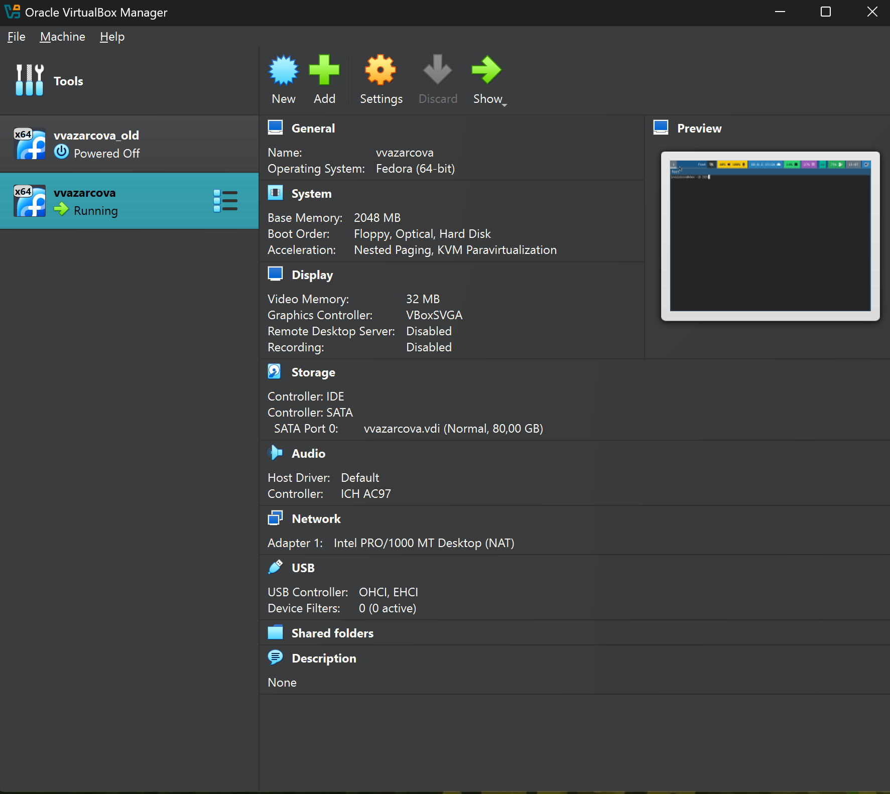
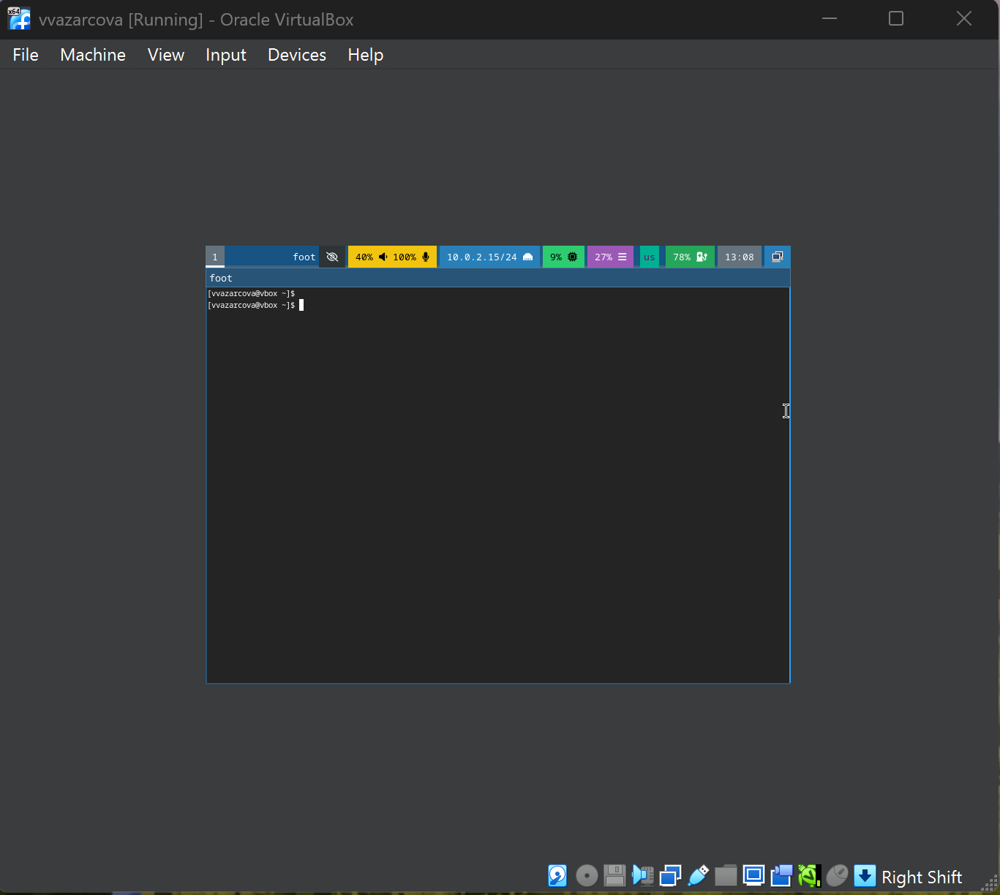
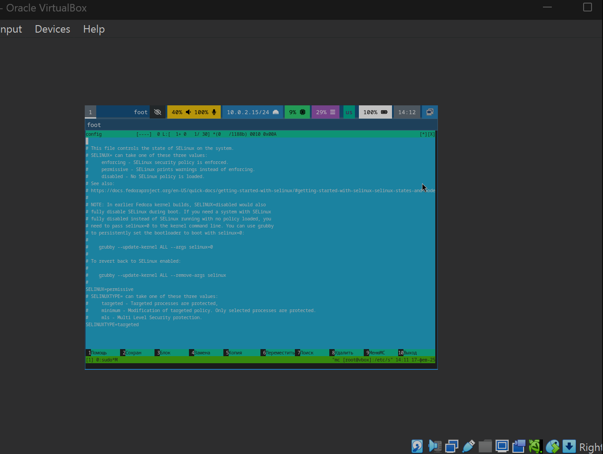
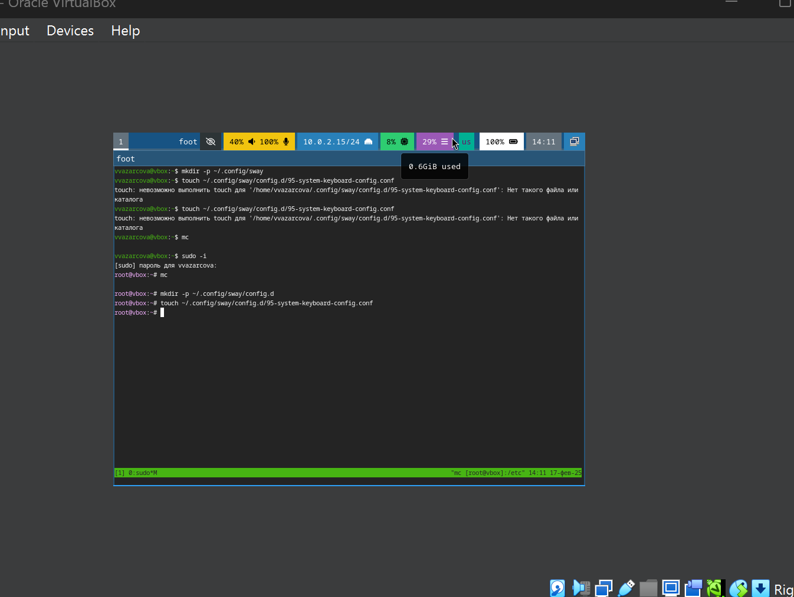
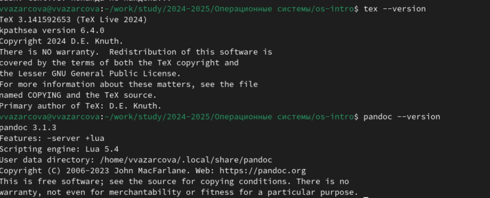
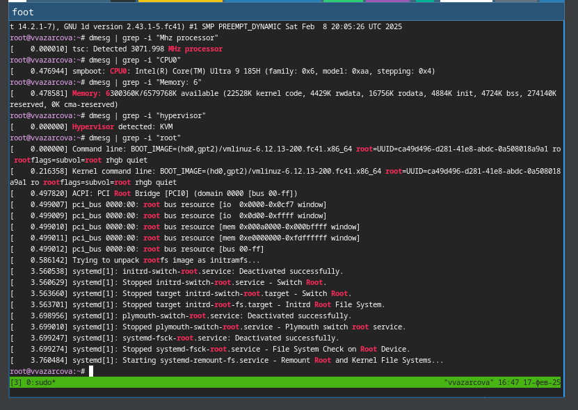

---
## Front matter
lang: ru-RU
title: Лабораторная работа №1
subtitle: Дисциплина - Операционные Системы
author:
  - Азарцова В. В.
institute:
  - Российский университет дружбы народов, Москва, Россия
  - Преподаватель Кулябов Д. С.
date: 6 марта 2025

## i18n babel
babel-lang: russian
babel-otherlangs: english

## Formatting pdf
toc: false
toc-title: Содержание
slide_level: 2
aspectratio: 169
section-titles: true
theme: metropolis
header-includes:
 - \metroset{progressbar=frametitle,sectionpage=progressbar,numbering=fraction}
---

# Информация

## Докладчик

:::::::::::::: {.columns align=center}
::: {.column width="70%"}

  * Азарцова Вероника Валерьевна
  * НКАбд-01-24, студ. билет №1132246751
  * Российский университет дружбы народов
  * [1132246751@pfur.ru](mailto:1132246751@pfur.ru)
  * <https://github.com/vvazarcova>

:::
::::::::::::::

## Цели работы

- Приобретение навыков установки операционной системы на ВМ
- Настройка минимально необходимых для дальнейшей работы сервисов

## Задачи

1. Установка Linux на Virtualbox

2. Установка операционной системы

3. Настройка системы после установки

4. Установка программного обеспечения для создания документации

## Теоретическое введение

Лабораторная работа подразумевало установку на виртуальную машину VirtualBox операционной системы Linux (дистрибутив Fedora) со следующими характеристиками техники:

1. Intel Core i3-550 3.2 GHz, 4 GB оперативной памяти, 80 GB свободного места на жёстком диске;

2. ОС Linux Gentoo (http://www.gentoo.ru/);

3. VirtualBox версии 7.0 или новее.

# Выполнение лабораторной работы

## Установка Linux на Virtualbox

Используя скачанный с официального сайта образ, создаю новую виртуальную машину в VirtualBox с указанными в ходе выполнения параметрами.

{#fig:1 width=70%}

## Установка операционной системы

Успешно устанавливаю систему и открываю терминал с помощью сочетания клавиш host (win) + enter.

{#fig:2 width=70%}

## Настройка системы после установки

Меняю параметры SELinux в его файле конфигураций, т.к. в курсе он не изучается.

{#fig:3 width=70%}

Обновляю все пакеты, устанавливаю средства разработки, провожу прочие действия для повышения комфорта работы и настраиваю раскладку клавиатуры.

{#fig:4 width=70%}

## Установка программного обеспечения для создания документации

Устанавливаю Pandoc и Texlive и проверяю успешность их установки.

{#fig:5 width=70%}

## Домашнее задание

Домашнее задание состоит в том, чтобы получить следующую информацию:

1. Версия ядра Linux (Linux version).

2. Частота процессора (Detected Mhz processor).

3. Модель процессора (CPU0).

4. Объём доступной оперативной памяти (Memory available).

5. Тип обнаруженного гипервизора (Hypervisor detected).

6. Тип файловой системы корневого раздела.

7. Последовательность монтирования файловых систем.

## Выполнение домашнего задания

По очереди выполняю данные шаги.

{#fig:6 width=70%}

# Выводы

- Я прибрела практические навыки установки операционной системы на виртуальную машину 
- Я настроила её системы для дальнейшей работы

## Итоговый слайд

Если вам понравилось - посмотрите остальные мои презентации!

