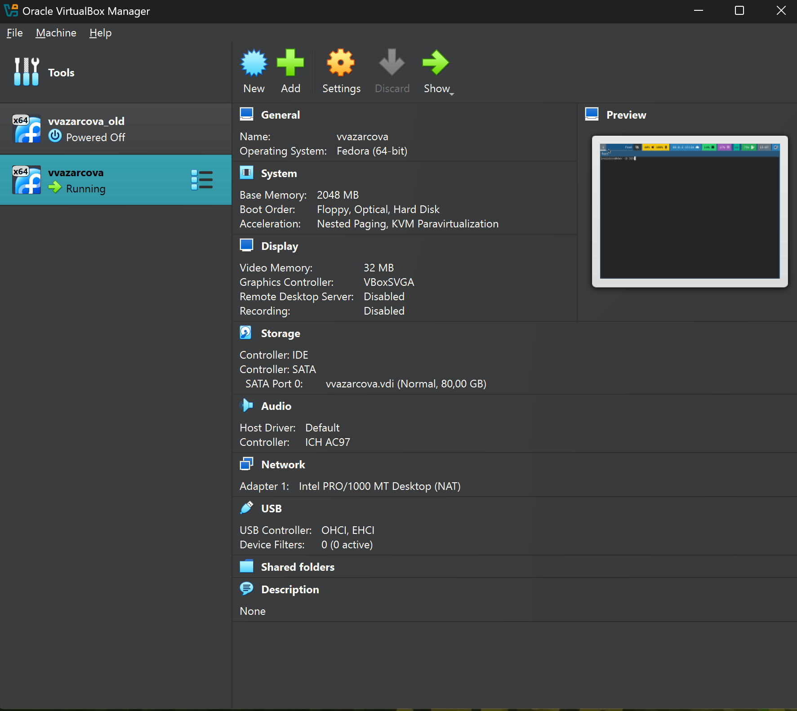
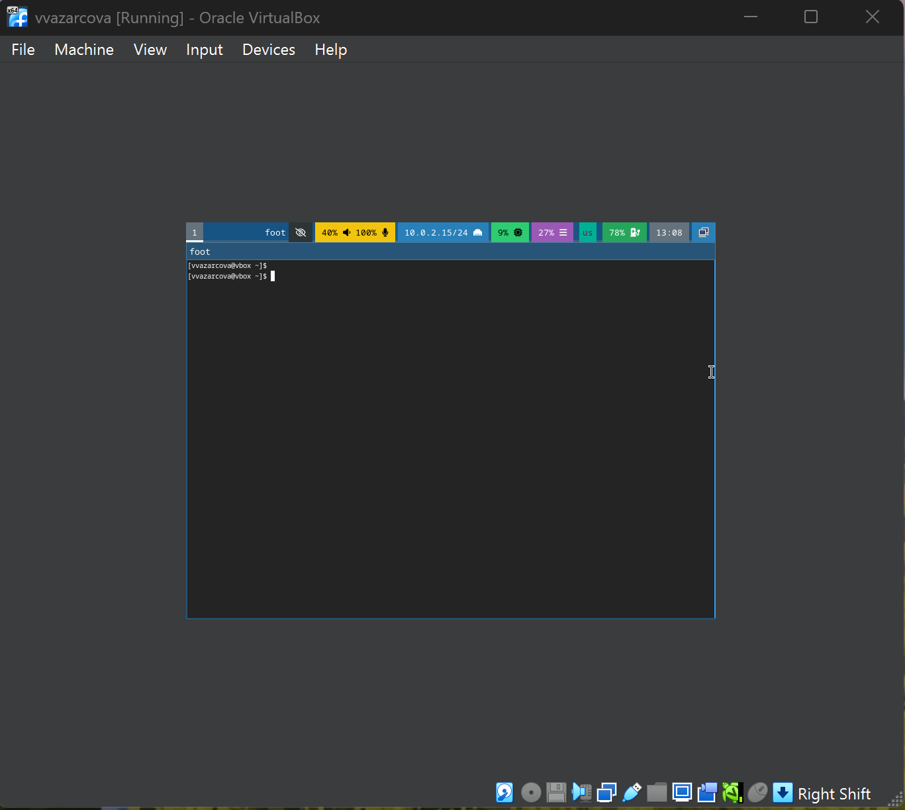
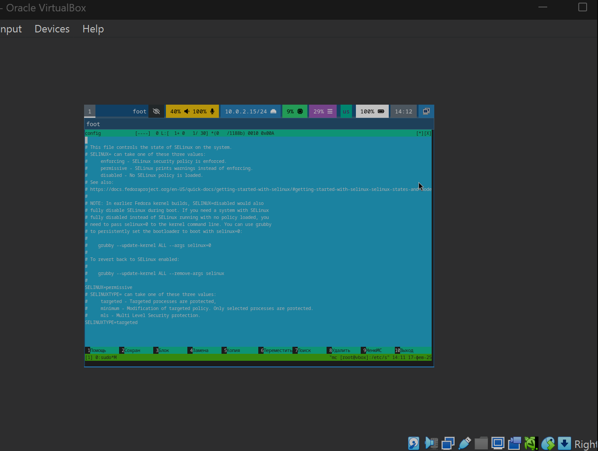
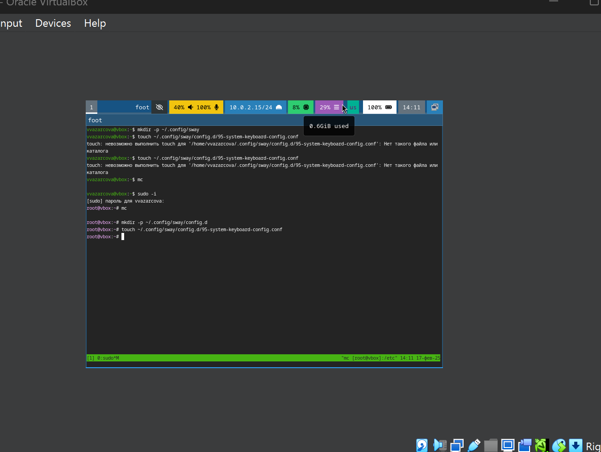
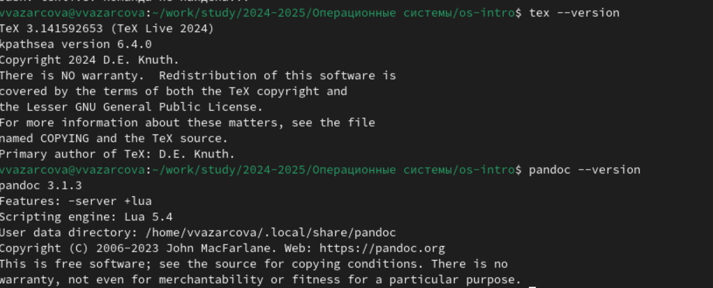
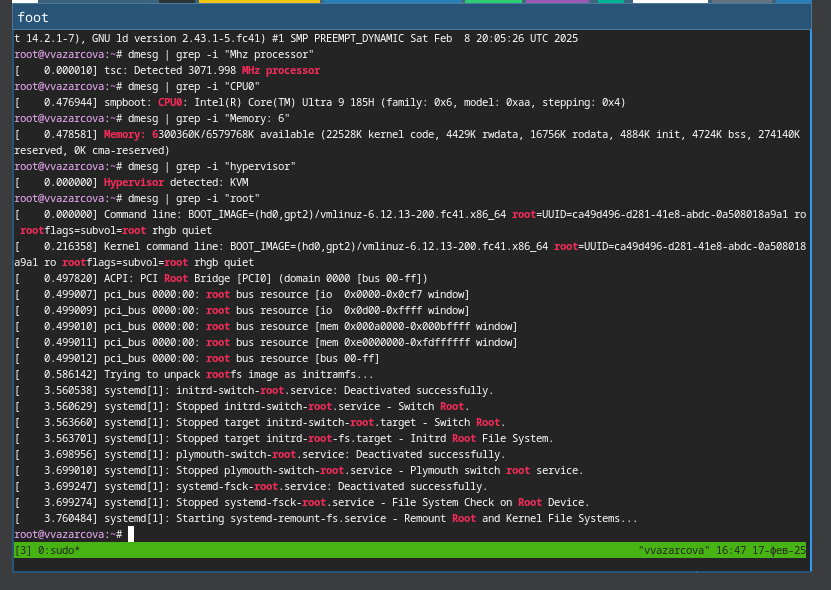

---
## Front matter
title: "Отчёт по лабораторной работе №1"
subtitle: "Дисциплина: Операционные Системы"
author: "Азарцова Вероника Валерьевна"

## Generic otions
lang: ru-RU
toc-title: "Содержание"

## Bibliography
bibliography: bib/cite.bib
csl: pandoc/csl/gost-r-7-0-5-2008-numeric.csl

## Pdf output format
toc: true # Table of contents
toc-depth: 2
lof: true # List of figures
lot: true # List of tables
fontsize: 12pt
linestretch: 1.5
papersize: a4
documentclass: scrreprt
## I18n polyglossia
polyglossia-lang:
  name: russian
  options:
	- spelling=modern
	- babelshorthands=true
polyglossia-otherlangs:
  name: english
## I18n babel
babel-lang: russian
babel-otherlangs: english
## Fonts
mainfont: IBM Plex Serif
romanfont: IBM Plex Serif
sansfont: IBM Plex Sans
monofont: IBM Plex Mono
mathfont: STIX Two Math
mainfontoptions: Ligatures=Common,Ligatures=TeX,Scale=0.94
romanfontoptions: Ligatures=Common,Ligatures=TeX,Scale=0.94
sansfontoptions: Ligatures=Common,Ligatures=TeX,Scale=MatchLowercase,Scale=0.94
monofontoptions: Scale=MatchLowercase,Scale=0.94,FakeStretch=0.9
mathfontoptions:
## Biblatex
biblatex: true
biblio-style: "gost-numeric"
biblatexoptions:
  - parentracker=true
  - backend=biber
  - hyperref=auto
  - language=auto
  - autolang=other*
  - citestyle=gost-numeric
## Pandoc-crossref LaTeX customization
figureTitle: "Рис."
tableTitle: "Таблица"
listingTitle: "Листинг"
lofTitle: "Список иллюстраций"
lotTitle: "Список таблиц"
lolTitle: "Листинги"
## Misc options
indent: true
header-includes:
  - \usepackage{indentfirst}
  - \usepackage{float} # keep figures where there are in the text
  - \floatplacement{figure}{H} # keep figures where there are in the text
---

# Цель работы

Целью данной работы является приобретение практических навыков установки операционной системы на виртуальную машину, настройки минимально необходимых для дальнейшей работы сервисов.

# Задание

1. Установка Linux на Virtualbox

2. Установка операционной системы

3. Настройка системы после установки

4. Установка программного обеспечения для создания документации

5. Домашнее задание

6. Контрольные вопросы

# Теоретическое введение

Лабораторная работа подразумевает установку на виртуальную машину VirtualBox операционной системы Linux (дистрибутив Fedora).  

Описание выполнения работы приведено для дисплейного класса со следующими характеристиками техники: 

1. Intel Core i3-550 3.2 GHz, 4 GB оперативной памяти, 80 GB свободного места на жёстком диске;

2. ОС Linux Gentoo (http://www.gentoo.ru/);

3. VirtualBox версии 7.0 или новее.

# Выполнение лабораторной работы

## Установка Linux на Virtualbox

Используя скачанный с официального сайта образ, создаю новую виртуальную машину в VirtualBox с указанными в ходе выполнения параметрами (рис. [-@fig:1]).

{#fig:1 width=70%}

## Установка операционной системы

Успешно устанавливаю систему и открываю терминал с помощью сочетания клавиш host (win) + enter (рис. [-@fig:2]).

{#fig:2 width=70%}

## Настройка системы после установки

Меняю параметры SELinux в его файле конфигураций, т.к. в курсе он не изучается (рис. [-@fig:3]).

{#fig:3 width=70%}

Обновляю все пакеты, устанавливаю средства разработки, провожу прочие действия для повышения комфорта работы и настраиваю раскладку клавиатуры (рис. [-@fig:4]).

{#fig:4 width=70%}

## Установка программного обеспечения для создания документации

Устанавливаю Pandoc и Texlive и проверяю успешность их установки (рис. [-@fig:5]).

{#fig:5 width=70%}

## Домашнее задание

Домашнее задание состоит в том, чтобы получить следующую информацию:

1. Версия ядра Linux (Linux version).

2. Частота процессора (Detected Mhz processor).

3. Модель процессора (CPU0).

4. Объём доступной оперативной памяти (Memory available).

5. Тип обнаруженного гипервизора (Hypervisor detected).

6. Тип файловой системы корневого раздела.

7. Последовательность монтирования файловых систем.

По очереди выполняю данные шаги (рис. [-@fig:6]).

{#fig:6 width=70%}

## Контрольные вопросы

1. Какую информацию содержит учётная запись пользователя?  

Учетная запись содержит необходимые для идентификации пользователя при подключении к системе данные, а так же информацию для авторизации и учета: системного имени (username), идентификатор пользователя (UID), идентификатор группы (CID), полное имя (full name), домашний каталог (home directory), начальная оболочка (login shell).  

2. Укажите команды терминала и приведите примеры:  

для получения справки по команде; --help  
для перемещения по файловой системе; cd  
для просмотра содержимого каталога; ls  
для определения объёма каталога; du  
для создания / удаления каталогов / файлов; mkdir, rmdir, touch, rm  
для задания определённых прав на файл / каталог; chmod  
для просмотра истории команд; history  

3. Что такое файловая система? Приведите примеры с краткой характеристикой.  

Файловая система - это порядок, определяющий способ организации, хранения и именования данных на различных носителях. Примеры: FAT32 представляет собой пространство, разделенное на три части: одна область для служебных структур, форма указателей в виде таблиц и зона для хранения самих файлов. ext3/ext4 - журналируемая файловая система, используемая в основном в ОС с ядром Linux.  

4. Как посмотреть, какие файловые системы подмонтированы в ОС?  

С помощью команды df. Также посмотреть подмонтированные файловые системы можно с помощью утилиты mount.

5. Как удалить зависший процесс?

Узнаем id процессса: комманда ps. Далее комманда kill < id > чтобы "убить" этот процесс; Или killall без id, что "убьет" все процессы, которые есть в данный момент, для этого не нужно знать id процесса.

# Выводы

Подводя итоги лабораторной работы, я прибрела практические навыки установки операционной системы на виртуальную машину и настройки её системы для дальнейшей работы.

# Список литературы{.unnumbered}

::: {#refs}
:::
Dash P. Getting started with oracle vm virtualbox. Packt Publishing Ltd, 2013. 86 p.
Colvin H. Virtualbox: An ultimate guide book on virtualization with virtualbox. CreateSpace Independent Publishing Platform, 2015. 70 p.
van Vugt S. Red hat rhcsa/rhce 7 cert guide : Red hat enterprise linux 7 (ex200 and ex300). Pearson IT Certification, 2016. 1008 p.
Робачевский А., Немнюгин С., Стесик О. Операционная система unix. 2-е изд. Санкт-Петербург: БХВ-Петербург, 2010. 656 p.
