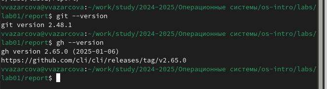
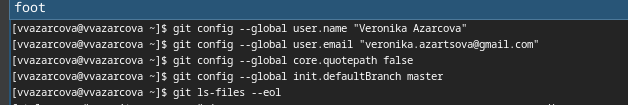
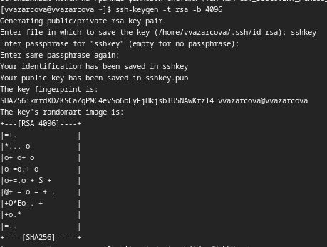
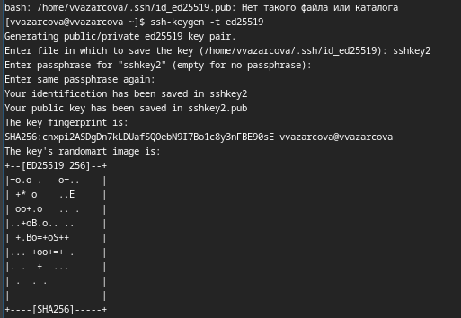
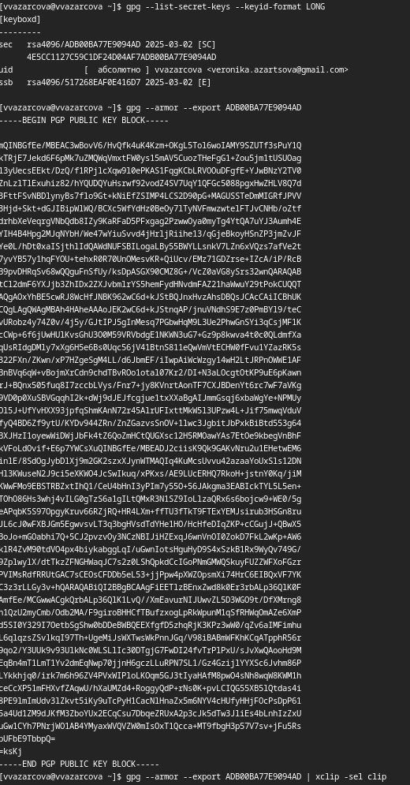
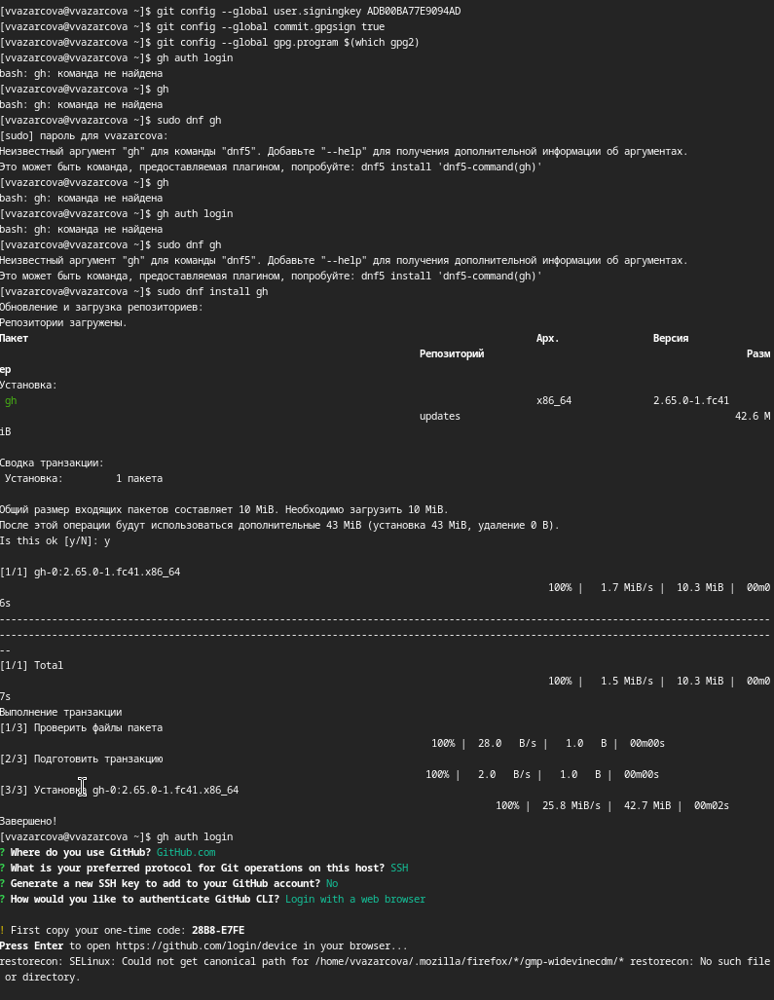
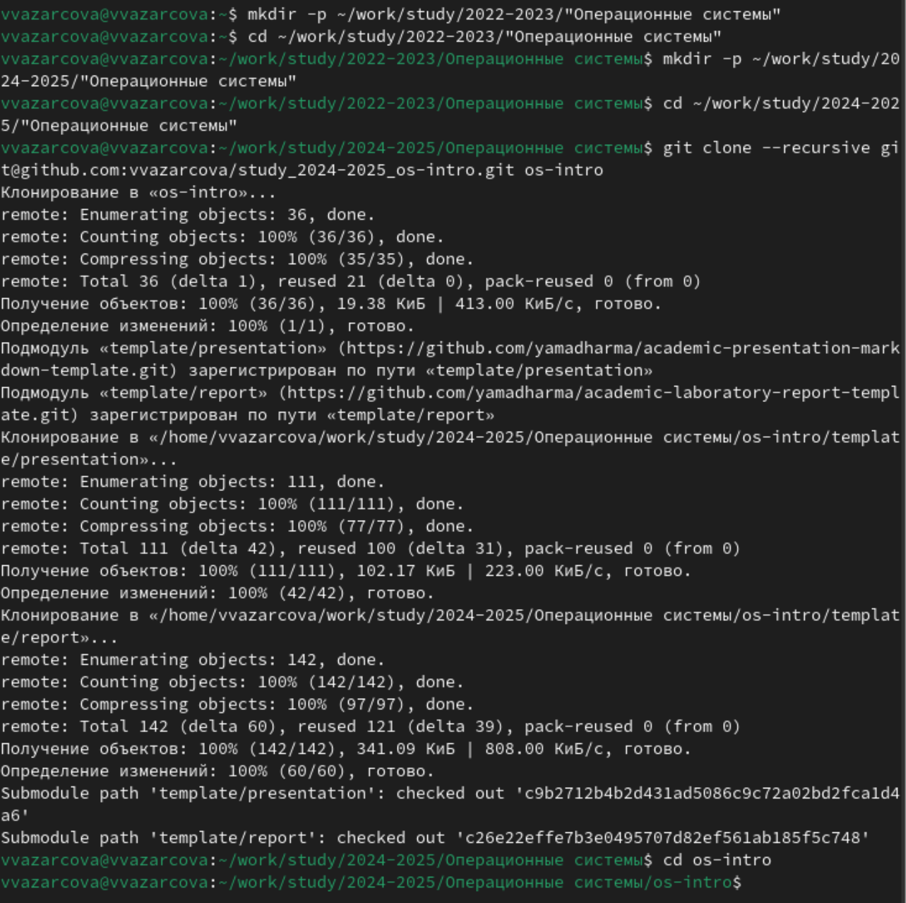
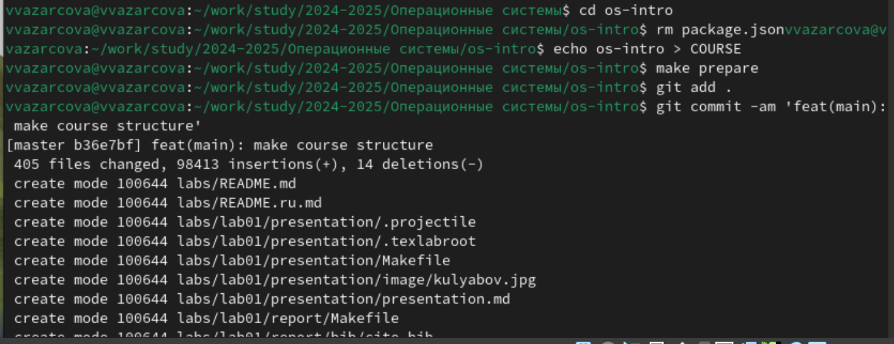
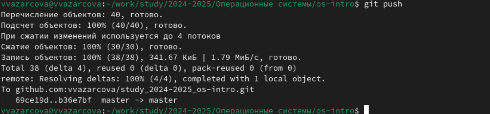

---
## Front matter
lang: ru-RU
title: Лабораторная работа №2
subtitle: Дисциплина - Операционные Системы
author:
  - Азарцова В. В.
institute:
  - Российский университет дружбы народов, Москва, Россия
  - Преподаватель Кулябов Д. С.
date: 6 марта 2025

## i18n babel
babel-lang: russian
babel-otherlangs: english

## Formatting pdf
toc: false
toc-title: Содержание
slide_level: 2
aspectratio: 169
section-titles: true
theme: metropolis
header-includes:
 - \metroset{progressbar=frametitle,sectionpage=progressbar,numbering=fraction}
---

# Информация

## Докладчик

:::::::::::::: {.columns align=center}
::: {.column width="70%"}

  * Азарцова Вероника Валерьевна
  * НКАбд-01-24, студ. билет №1132246751
  * Российский университет дружбы народов
  * [1132246751@pfur.ru](mailto:1132246751@pfur.ru)
  * <https://github.com/vvazarcova>

:::
::::::::::::::

## Цели работы

- Изучить идеологию и применение средств контроля версий
- Освоить умения по работе с git

## Задачи

1. Создать базовую конфигурацию для работы с git.
2. Создать ключ SSH.
3. Создать ключ PGP.
4. Настроить подписи git.
5. Зарегистрироваться на Github.
6. Создать локальный каталог для выполнения заданий по предмету.

## Теоретическое введение

Системы контроля версий (Version Control System, VCS) применяются при работе нескольких человек над одним проектом.  
Они также могут обеспечивать дополнительные возможности: поддерживать работу с несколькими версиями одного файла, сохраняя историю изменений.Кроме того, обычно доступна информация о том, кто из участников, когда и какие изменения вносил.  
В отличие от классических, в распределённых системах контроля версий центральный репозиторий не является обязательным.  

## Теоретическое введение

Основные команды git:

1. git init (создать основное древо)

2. git pull (получить обновления)

3. git push (отправить изменения)

4. git status (посмотреть список измененных файлов)

5. git diff (посмотреть текущие изменения)

6. git add {file_name} (добавить измененные файлы, чтобы добавить все - .)

7. git rm {file_name} (удалить измененные файлы)

8. git commit -am 'Описание коммита' (сохранить добавленные изменения в коммит)

# Выполнение лабораторной работы

## Базовая конфигурация для работы с Git

У меня уже установлен git и gh, так что проверяю, что они установлены и что они последней версии.

{#fig:1 width=70%}

## Базовая конфигурация для работы с Git

Задаю имя и электронную почту владельца репозитория, настраиваю верификацию и подписание коммитов git и задаю имя начальной ветки - master.

{#fig:2 width=70%}

## Ключ SSH

Генерирую ключ SSH.  
По алгоритму rsa с ключём размером 4096 бит:

{#fig:3 width=70%}

## Ключ SSH

По алгоритму ed25519:

{#fig:4 width=70%}

## Ключ PGP

Генерирую PGP ключ типа RSA and RSA размера 4096 байт с бесконечным сроком действия, введя свою личную информацию, и вывожу на экран список ключей.

{#fig:5 width=70%}

## Настройка подписи Git

Настраиваю автоматические подписи git используя электронную почту, которую я использовала для создания ключа, и авторизуюсь в и настраиваю gh.

{#fig:6 width=70%}

## Регистрация на Github

Я уже зарегистрирована на github с той электронной почты, которую использовала для двух прошлых шагов. Далее буду использовать свой уже готовый аккаунт.

## Создание локального каталога для работы по предмету

Создаю шаблон рабочего пространства для предмета Операционные системы, перехожу в каталог курса и удаляю лишний файл package.json.

{#fig:7 width=70%}

## Создание локального каталога для работы по предмету

Создаю нужные каталоги и добавляю их в коммит.

{#fig:8 width=70%}

## Создание локального каталога для работы по предмету

Отправляю файлы на сервер.

{#fig:9 width=70%}

## Контрольные вопросы

1. Что такое системы контроля версий (VCS) и для решения каких задач они предназначаются?  
VCS (Version Control System) — это система управления изменениями в файлах и коде. Она позволяет отслеживать историю изменений, управлять версиями, работать в команде и откатываться к предыдущим состояниям.  

2. Объясните следующие понятия VCS и их отношения: хранилище, commit, история, рабочая копия.  
   - хранилище (репозиторий) — место, где хранятся все версии проекта  
   - commit — фиксированное изменение в коде с комментарием  
   - история — последовательность commit'ов, отражающая эволюцию проекта  
   - рабочая копия — текущая версия файлов, с которой работает разработчик  

## Контрольные вопросы

3. Что представляют собой и чем отличаются централизованные и децентрализованные VCS? Приведите примеры VCS каждого вида.  
   - централизованные VCS (CVCS): один сервер содержит репозиторий, разработчики получают и отправляют изменения туда. Пример: SVN  
   - децентрализованные VCS (DVCS): каждый разработчик имеет полный репозиторий, можно работать без подключения к серверу. Пример: Git, Mercurial  


4. Опишите действия с VCS при единоличной работе с хранилищем.  
   - Создать репозиторий  
   - Добавить файлы и сделать commit  
   - Вносить изменения и фиксировать их (commit'ы)  
   - Использовать историю для отката при необходимости  
   - Создавать ветки для изоляции работы  

## Контрольные вопросы

5. Опишите порядок работы с общим хранилищем VCS.  
   - Клонировать (скопировать) удалённый репозиторий  
   - Внести изменения, сделать commit  
   - Обновить локальные данные (pull)  
   - Разрешить возможные конфликты  
   - Отправить изменения в репозиторий (push)  
   - Использовать ветки для разделения работы  

## Контрольные вопросы

6. Каковы основные задачи, решаемые инструментальным средством Git?  
   - Хранение версий проекта  
   - Работа с ветками и параллельной разработкой  
   - Совместная работа команды  
   - Откат и восстановление изменений  
   - Работа с локальными и удалёнными репозиториями  

## Контрольные вопросы

7. Назовите и дайте краткую характеристику командам Git.  
   - `git init` — создать новый репозиторий  
   - `git clone` — клонировать репозиторий с сервера  
   - `git add` — добавить файлы в область подготовки  
   - `git commit` — сохранить изменения  
   - `git status` — проверить статус файлов  
   - `git log` — показать историю коммитов  
   - `git branch` — работа с ветками  
   - `git checkout` или `git switch` — переключение между ветками  
   - `git merge` — объединение веток  
   - `git pull` — получение изменений из репозитория на сервере  
   - `git push` — отправка изменений в репозиторий на сервере  

## Контрольные вопросы

8. Приведите примеры использования при работе с локальным и удалённым репозиториями.  
   - Локальный репозиторий:  
     ```sh
     git init  
     git add .  
     git commit -m "Первый коммит"
     ```  
   - Удалённый репозиторий:  
     ```sh
     git clone https://github.com/user/repo.git  
     git pull origin main  
     git push origin main
     ```  

## Контрольные вопросы

9. Что такое и зачем могут быть нужны ветви (branches)?  
   Ветви — это разные линии разработки в репозитории. С ними можно:  
   - Работать над новыми функциями не меняя основного кода  
   - Параллельно создавать новые возможности  
   - Объединять изменения с основной веткой только после тестирования  

10. Как и зачем можно игнорировать некоторые файлы при commit?  
Для исключения временных, служебных и ненужных файлов. Чтобы это сделать, создаётся файл `.gitignore`, где указываются файлы и каталоги, которые не должны быть в репозиторий.  

# Выводы

Что мне удалось:

- Получить практические навыки в работе с системой контроля версий git 
- Создать и настроить рабочее пространство для выполнения заданий по дисциплине Операционные системы.

## Итоговый слайд

Если вам понравилось - посмотрите остальные мои презентации!


