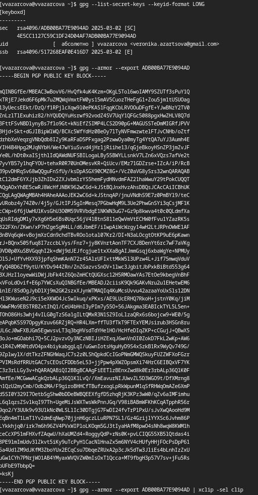

---
## Front matter
title: "Отчёт по лабораторной работе №2"
subtitle: "Дисциплина: Операционные Системы"
author: "Азарцова Вероника Валерьевна"

## Generic otions
lang: ru-RU
toc-title: "Содержание"

## Bibliography
bibliography: bib/cite.bib
csl: pandoc/csl/gost-r-7-0-5-2008-numeric.csl

## Pdf output format
toc: true # Table of contents
toc-depth: 2
lof: true # List of figures
lot: true # List of tables
fontsize: 12pt
linestretch: 1.5
papersize: a4
documentclass: scrreprt
## I18n polyglossia
polyglossia-lang:
  name: russian
  options:
	- spelling=modern
	- babelshorthands=true
polyglossia-otherlangs:
  name: english
## I18n babel
babel-lang: russian
babel-otherlangs: english
## Fonts
mainfont: IBM Plex Serif
romanfont: IBM Plex Serif
sansfont: IBM Plex Sans
monofont: IBM Plex Mono
mathfont: STIX Two Math
mainfontoptions: Ligatures=Common,Ligatures=TeX,Scale=0.94
romanfontoptions: Ligatures=Common,Ligatures=TeX,Scale=0.94
sansfontoptions: Ligatures=Common,Ligatures=TeX,Scale=MatchLowercase,Scale=0.94
monofontoptions: Scale=MatchLowercase,Scale=0.94,FakeStretch=0.9
mathfontoptions:
## Biblatex
biblatex: true
biblio-style: "gost-numeric"
biblatexoptions:
  - parentracker=true
  - backend=biber
  - hyperref=auto
  - language=auto
  - autolang=other*
  - citestyle=gost-numeric
## Pandoc-crossref LaTeX customization
figureTitle: "Рис."
tableTitle: "Таблица"
listingTitle: "Листинг"
lofTitle: "Список иллюстраций"
lotTitle: "Список таблиц"
lolTitle: "Листинги"
## Misc options
indent: true
header-includes:
  - \usepackage{indentfirst}
  - \usepackage{float} # keep figures where there are in the text
  - \floatplacement{figure}{H} # keep figures where there are in the text
---

# Цель работы

Цель данной лабораторной работы - изучить идеологию и применение средств контроля версий и освоить умения по работе с git.

# Задание

1. Создать базовую конфигурацию для работы с git.
2. Создать ключ SSH.
3. Создать ключ PGP.
4. Настроить подписи git.
5. Зарегистрироваться на Github.
6. Создать локальный каталог для выполнения заданий по предмету.

# Теоретическое введение

Системы контроля версий (Version Control System, VCS) применяются при работе нескольких человек над одним проектом. Обычно основное дерево проекта хранится в локальном или удалённом репозитории, к которому настроен доступ для участников проекта. При внесении изменений в содержание проекта система контроля версий позволяет их фиксировать, совмещать изменения, произведённые разными участниками проекта, производить откат к любой более ранней версии проекта, если это требуется.  

В классических системах контроля версий используется централизованная модель, предполагающая наличие единого репозитория для хранения файлов. Выполнение большинства функций по управлению версиями осуществляется специальным сервером. Участник проекта (пользователь) перед началом работы посредством определённых команд получает нужную ему версию файлов. После внесения изменений, пользователь размещает новую версию в хранилище. При этом предыдущие версии не удаляются из центрального хранилища и к ним можно вернуться в любой момент. Сервер может сохранять не полную версию изменённых файлов, а производить так называемую дельта-компрессию — сохранять только изменения между последовательными версиями, что позволяет уменьшить объём хранимых данных.  

Системы контроля версий поддерживают возможность отслеживания и разрешения конфликтов, которые могут возникнуть при работе нескольких человек над одним файлом. Можно объединить (слить) изменения, сделанные разными участниками (автоматически или вручную), вручную выбрать нужную версию, отменить изменения вовсе или заблокировать файлы для изменения. В зависимости от настроек блокировка не позволяет другим пользователям получить рабочую копию или препятствует изменению рабочей копии файла средствами файловой системы ОС, обеспечивая таким образом, привилегированный доступ только одному пользователю, работающему с файлом.  

Системы контроля версий также могут обеспечивать дополнительные, более гибкие функциональные возможности. Например, они могут поддерживать работу с несколькими версиями одного файла, сохраняя общую историю изменений до точки ветвления версий и собственные истории изменений каждой ветви. Кроме того, обычно доступна информация о том, кто из участников, когда и какие изменения вносил. Обычно такого рода информация хранится в журнале изменений, доступ к которому можно ограничить.  

В отличие от классических, в распределённых системах контроля версий центральный репозиторий не является обязательным.  

Среди классических VCS наиболее известны CVS, Subversion, а среди распределённых — Git, Bazaar, Mercurial. Принципы их работы схожи, отличаются они в основном синтаксисом используемых в работе команд.  

Система контроля версий Git представляет собой набор программ командной строки. Доступ к ним можно получить из терминала посредством ввода команды git с различными опциями.  
Благодаря тому, что Git является распределённой системой контроля версий, резервную копию локального хранилища можно сделать простым копированием или архивацией.  
Основные команды git:

1. git init (создать основное древо)

2. git pull (получить обновления)

3. git push (отправить изменения)

4. git status (посмотреть список измененных файлов)

5. git diff (посмотреть текущие изменения)

6. git add {file_name} (добавить измененные файлы, чтобы добавить все - .)

7. git rm {file_name} (удалить измененные файлы)

8. git commit -am 'Описание коммита' (сохранить добавленные изменения в коммит)

9. git checkout {branch_name} (переключится на ветку, -b чтобы создать новую, -d чтобы удалить, -D чтобы принудительно удалить)

# Выполнение лабораторной работы

## Базовая конфигурация для работы с Git

У меня уже установлен git и gh, так что проверяю, что они установлены и что они последней версии (рис. [-@fig:1]).

{#fig:1 width=70%}

Задаю имя и электронную почту владельца репозитория, настраиваю верификацию и подписание коммитов git и задаю имя начальной ветки - master (рис. [-@fig:2]).

{#fig:2 width=70%}

## Ключ SSH

Генерирую ключ SSH.  
По алгоритму rsa с ключём размером 4096 бит: (рис. [-@fig:3])

{#fig:3 width=70%}

По алгоритму ed25519: (рис. [-@fig:4])

{#fig:4 width=70%}

## Ключ PGP

Генерирую PGP ключ типа RSA and RSA размера 4096 байт с бесконечным сроком действия, введя свою личную информацию, и вывожу на экран список ключей (рис. [-@fig:5]).

{#fig:5 width=70%}

## Настройка подписи Git

Настраиваю автоматические подписи git используя электронную почту, которую я использовала для создания ключа, и авторизуюсь в и настраиваю gh (рис. [-@fig:6]).

{#fig:6 width=70%}

## Регистрация на Github

Я уже зарегистрирована на github с той электронной почты, которую использовала для двух прошлых шагов. Далее буду использовать свой уже готовый аккаунт.

## Создание локального каталога для работы по предмету

Создаю шаблон рабочего пространства для предмета Операционные системы, перехожу в каталог курса и удаляю лишний файл package.json (рис. [-@fig:7]).

{#fig:7 width=70%}

Создаю нужные каталоги и добавляю их в коммит (рис. [-@fig:8]).

{#fig:8 width=70%}

Отправляю файлы на сервер (рис. [-@fig:9]).

{#fig:9 width=70%}

## Контрольные вопросы

1. Что такое системы контроля версий (VCS) и для решения каких задач они предназначаются?  
VCS (Version Control System) — это система управления изменениями в файлах и коде. Она позволяет отслеживать историю изменений, управлять версиями, работать в команде и откатываться к предыдущим состояниям.  

2. Объясните следующие понятия VCS и их отношения: хранилище, commit, история, рабочая копия.  
   - хранилище (репозиторий) — место, где хранятся все версии проекта  
   - commit — фиксированное изменение в коде с комментарием  
   - история — последовательность commit'ов, отражающая эволюцию проекта  
   - рабочая копия — текущая версия файлов, с которой работает разработчик  

3. Что представляют собой и чем отличаются централизованные и децентрализованные VCS? Приведите примеры VCS каждого вида.  
   - централизованные VCS (CVCS): один сервер содержит репозиторий, разработчики получают и отправляют изменения туда. Пример: SVN  
   - децентрализованные VCS (DVCS): каждый разработчик имеет полный репозиторий, можно работать без подключения к серверу. Пример: Git, Mercurial  

4. Опишите действия с VCS при единоличной работе с хранилищем.  
   - Создать репозиторий  
   - Добавить файлы и сделать commit  
   - Вносить изменения и фиксировать их (commit'ы)  
   - Использовать историю для отката при необходимости  
   - Создавать ветки для изоляции работы  

5. Опишите порядок работы с общим хранилищем VCS.  
   - Клонировать (скопировать) удалённый репозиторий  
   - Внести изменения, сделать commit  
   - Обновить локальные данные (pull)  
   - Разрешить возможные конфликты  
   - Отправить изменения в репозиторий (push)  
   - Использовать ветки для разделения работы  

6. Каковы основные задачи, решаемые инструментальным средством Git?  
   - Хранение версий проекта  
   - Работа с ветками и параллельной разработкой  
   - Совместная работа команды  
   - Откат и восстановление изменений  
   - Работа с локальными и удалёнными репозиториями  

7. Назовите и дайте краткую характеристику командам Git.  
   - `git init` — создать новый репозиторий  
   - `git clone` — клонировать репозиторий с сервера  
   - `git add` — добавить файлы в область подготовки  
   - `git commit` — сохранить изменения  
   - `git status` — проверить статус файлов  
   - `git log` — показать историю коммитов  
   - `git branch` — работа с ветками  
   - `git checkout` или `git switch` — переключение между ветками  
   - `git merge` — объединение веток  
   - `git pull` — получение изменений из репозитория на сервере  
   - `git push` — отправка изменений в репозиторий на сервере  

8. Приведите примеры использования при работе с локальным и удалённым репозиториями.  
   - Локальный репозиторий:  
     ```sh
     git init  
     git add .  
     git commit -m "Первый коммит"
     ```  
   - Удалённый репозиторий:  
     ```sh
     git clone https://github.com/user/repo.git  
     git pull origin main  
     git push origin main
     ```  

9. Что такое и зачем могут быть нужны ветви (branches)?  
   Ветви — это разные линии разработки в репозитории. С ними можно:  
   - Работать над новыми функциями не меняя основного кода  
   - Параллельно создавать новые возможности  
   - Объединять изменения с основной веткой только после тестирования  

10. Как и зачем можно игнорировать некоторые файлы при commit?  
Для исключения временных, служебных и ненужных файлов. Чтобы это сделать, создаётся файл `.gitignore`, где указываются файлы и каталоги, которые не должны быть в репозиторий.  
 
# Выводы

Подводя итоги выполненной лабораторной работе, я получила практические навыки в работе с системой контроля версий git и создала и настроила рабочее пространство для выполнения заданий по предмету Операционные системы.

# Список литературы{.unnumbered}

::: {#refs}
:::
1. GDB: The GNU Project Debugger. — URL: https://www.gnu.org/software/gdb/.
2. GNU Bash Manual. — 2016. — URL: https://www.gnu.org/software/bash/manual/.
3. Midnight Commander Development Center. — 2021. — URL: https://midnight-commander.org/.
4. NASM Assembly Language Tutorials. — 2021. — URL: https://asmtutor.com/.
5. Newham C. Learning the bash Shell: Unix Shell Programming. — O’Reilly Media, 2005. —354 с. — (In a Nutshell). — ISBN 0596009658. — URL: http://www.amazon.com/Learningbash-Shell-Programming-Nutshell/dp/0596009658.
6. Robbins A. Bash Pocket Reference. — O’Reilly Media, 2016. — 156 с. — ISBN 978-1491941591.
7. The NASM documentation. — 2021. — URL: https://www.nasm.us/docs.php.
8. Zarrelli G. Mastering Bash. — Packt Publishing, 2017. — 502 с. — ISBN 9781784396879.
9. Колдаев В. Д., Лупин С. А. Архитектура ЭВМ. — М. : Форум, 2018.
