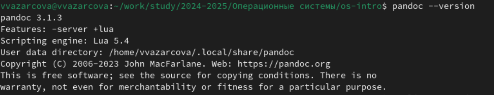
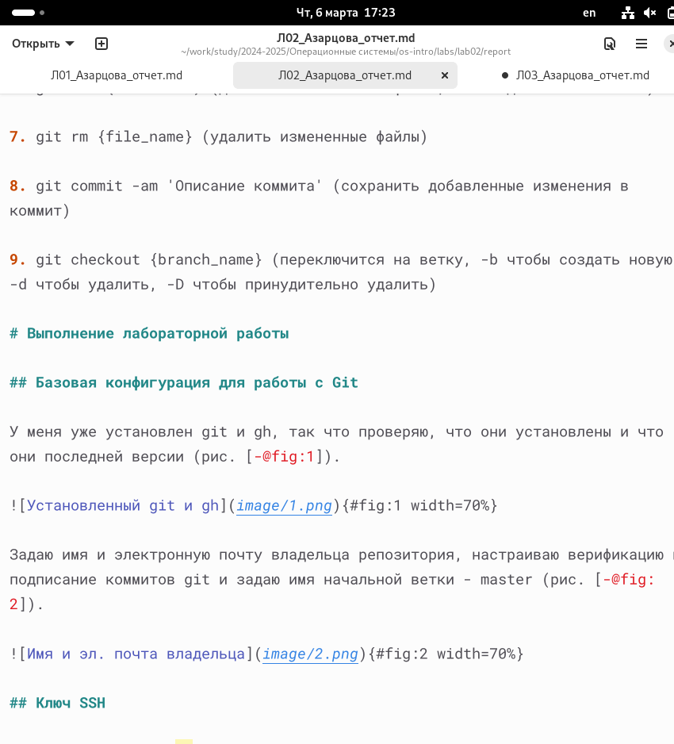
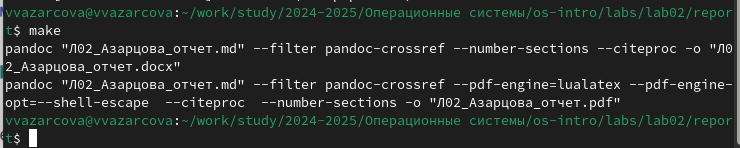
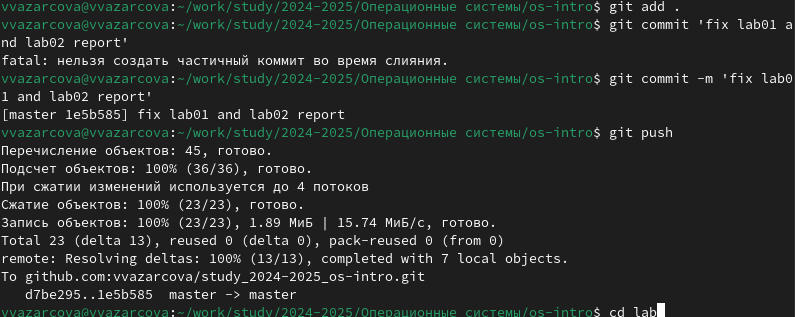

---
## Front matter
lang: ru-RU
title: Лабораторная работа №3
subtitle: Дисциплина - Операционные Системы
author:
  - Азарцова В. В.
institute:
  - Российский университет дружбы народов, Москва, Россия
  - Преподаватель Кулябов Д. С.
date: 6 марта 2025

## i18n babel
babel-lang: russian
babel-otherlangs: english

## Formatting pdf
toc: false
toc-title: Содержание
slide_level: 2
aspectratio: 169
section-titles: true
theme: metropolis
header-includes:
 - \metroset{progressbar=frametitle,sectionpage=progressbar,numbering=fraction}
---

# Информация

## Докладчик

:::::::::::::: {.columns align=center}
::: {.column width="70%"}

  * Азарцова Вероника Валерьевна
  * НКАбд-01-24, студ. билет №1132246751
  * Российский университет дружбы народов
  * [1132246751@pfur.ru](mailto:1132246751@pfur.ru)
  * <https://github.com/vvazarcova>

:::
::::::::::::::

## Цели работы

- Научиться оформлять отчёты с помощью легковесного языка разметки Markdown.

## Задачи

- Сделать отчёт по предыдущей лабораторной работе в формате Markdown.
- Предоставить отчёты в 3 форматах: pdf, docx и md.

## Теоретическое введение

Markdown (md) - легковесный язык разметки. Файлы в формате Markdown имеют расширение .md.  
Чтобы создать заголовок, используется знак #. Для жирного или курсивного текста используются звездочки. Цитирование осуществляется с помощью знака >.  
Неупорядоченный список форматируется с помощью звездочек или тире.  
Синтаксис Markdown для встроенной ссылки состоит из части [link text] , представляющей текст гиперссылки, и части (file-name.md) – URL-адреса или имени файла, на который дается ссылка.  
[link text](file-name.md)  

## Теоретическое введение

Markdown поддерживает как встраивание фрагментов кода в предложение, так и их размещение между предложениями в виде отдельных огражденных блоков. Огражденныеблоки кода — это простой способ выделить синтаксис для фрагментов кода. Общий формат огражденных блоков кода:  
''' language  
your code goes in here  
'''  
Верхние и нижние индексы записываются как x~2~0 или x^2^ (x по двум или в степени два)  

## Теоретическое введение

Для обработки файлов в формате Markdown будем использовать Pandoc, используя Makefile. Конкретно, нам понадобится программа pandoc, pandoc-citeproc https://github.com/jgm/pandoc/releases, pandoc-crossref https://github.com/lierdakil/pandoc-crossref/releases.

# Выполнение лабораторной работы

Устанавливаю на своё устройство Pandoc и Pandoc-crossref одинаковой версии.

{#fig:1 width=70%}

## Выполнение лабораторной работы

Составляю отчет по лабораторной работе 2, используя теоретическое введение при оформлении текста.

{#fig:2 width=70%}

## Выполнение лабораторной работы

После завершения отчета, сохраняю изменения и компилирую файл Markdown в файлы pdf и docx с помощью команды make и файла MAKEFILE.

{#fig:3 width=70%}

## Выполнение лабораторной работы

Загружаю скриншоты в нужную папку, и отправляю файлы скриншотов и отчета на сервер командой git add, git commit и git push.

{#fig:4 width=70%}

# Выводы

Что мне удалось:

- Получить практические навыки работы с легквесным языком разметки Markdown 
- Составить отчет по предыдущей лабораторной работе 

## Итоговый слайд

Если вам понравилось - посмотрите остальные мои презентации!

