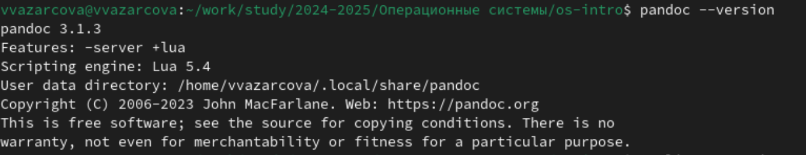
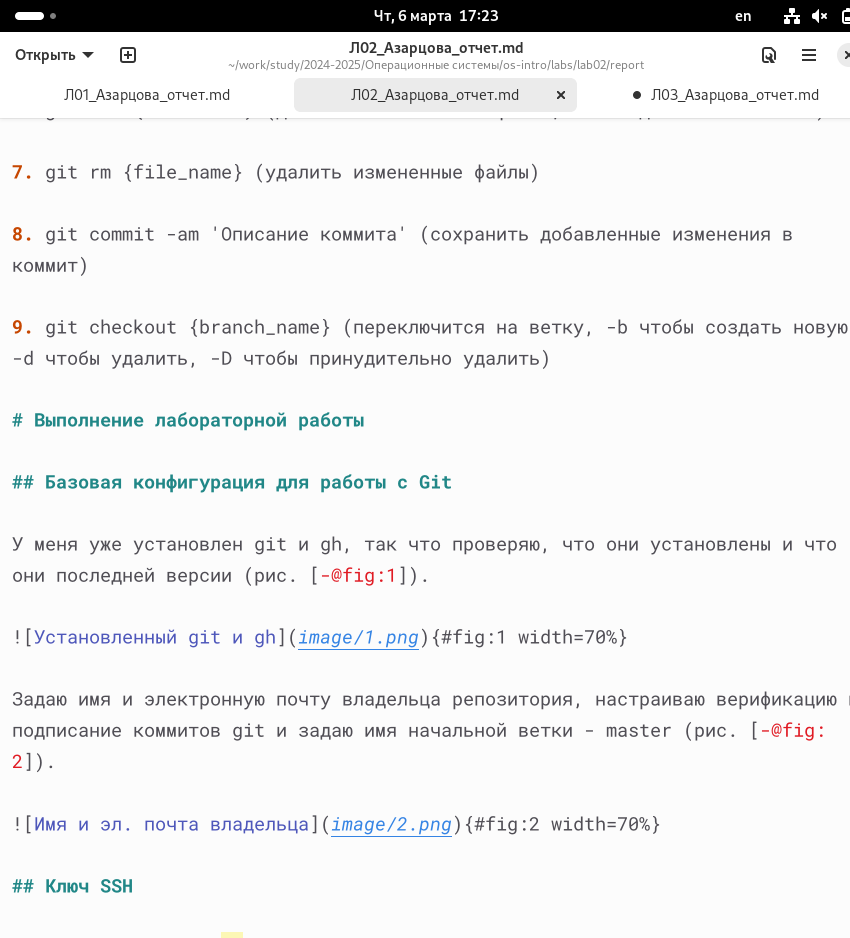
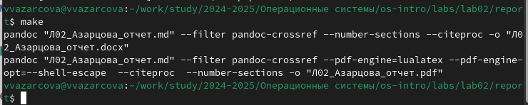
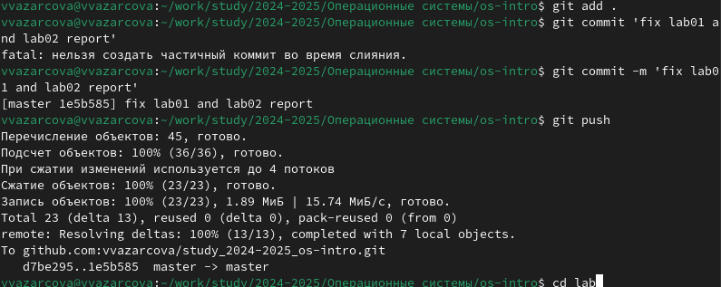

---
## Front matter
title: "Отчёт по лабораторной работе №3"
subtitle: "Дисциплина: Операционные Системы"
author: "Азарцова Вероника Валерьевна"

## Generic otions
lang: ru-RU
toc-title: "Содержание"

## Bibliography
bibliography: bib/cite.bib
csl: pandoc/csl/gost-r-7-0-5-2008-numeric.csl

## Pdf output format
toc: true # Table of contents
toc-depth: 2
lof: true # List of figures
lot: true # List of tables
fontsize: 12pt
linestretch: 1.5
papersize: a4
documentclass: scrreprt
## I18n polyglossia
polyglossia-lang:
  name: russian
  options:
	- spelling=modern
	- babelshorthands=true
polyglossia-otherlangs:
  name: english
## I18n babel
babel-lang: russian
babel-otherlangs: english
## Fonts
mainfont: IBM Plex Serif
romanfont: IBM Plex Serif
sansfont: IBM Plex Sans
monofont: IBM Plex Mono
mathfont: STIX Two Math
mainfontoptions: Ligatures=Common,Ligatures=TeX,Scale=0.94
romanfontoptions: Ligatures=Common,Ligatures=TeX,Scale=0.94
sansfontoptions: Ligatures=Common,Ligatures=TeX,Scale=MatchLowercase,Scale=0.94
monofontoptions: Scale=MatchLowercase,Scale=0.94,FakeStretch=0.9
mathfontoptions:
## Biblatex
biblatex: true
biblio-style: "gost-numeric"
biblatexoptions:
  - parentracker=true
  - backend=biber
  - hyperref=auto
  - language=auto
  - autolang=other*
  - citestyle=gost-numeric
## Pandoc-crossref LaTeX customization
figureTitle: "Рис."
tableTitle: "Таблица"
listingTitle: "Листинг"
lofTitle: "Список иллюстраций"
lotTitle: "Список таблиц"
lolTitle: "Листинги"
## Misc options
indent: true
header-includes:
  - \usepackage{indentfirst}
  - \usepackage{float} # keep figures where there are in the text
  - \floatplacement{figure}{H} # keep figures where there are in the text
---

# Цель работы

Цель данной лабораторной работы - научиться оформлять отчёты с помощью легковесного языка разметки Markdown.

# Задание

1. Сделать отчёт по предыдущей лабораторной работе в формате Markdown.
2. В качестве отчёта просьба предоставить отчёты в 3 форматах: pdf, docx и md.

# Теоретическое введение

## Оформление текста в Markdown

Markdown (md) - легковесный язык разметки. Файлы в формате Markdown имеют расширение .md.  
Чтобы создать заголовок, используется знак #. Для жирного или курсивного текста используются звездочки. Цитирование осуществляется с помощью знака >.  
Неупорядоченный список форматируется с помощью звездочек или тире.  
Синтаксис Markdown для встроенной ссылки состоит из части [link text] , представляющей текст гиперссылки, и части (file-name.md) – URL-адреса или имени файла, на который дается ссылка.  
[link text](file-name.md)  
Markdown поддерживает как встраивание фрагментов кода в предложение, так и их размещение между предложениями в виде отдельных огражденных блоков. Огражденныеблоки кода — это простой способ выделить синтаксис для фрагментов кода. Общий формат огражденных блоков кода:  
''' language  
your code goes in here  
'''  
Верхние и нижние индексы записываются как x~2~0 или x^2^ (x по двум или в степени два)  

## Обработка файлов в формате Markdown

Для обработки файлов в формате Markdown будем использовать Pandoc, используя Makefile. Конкретно, нам понадобится программа pandoc, pandoc-citeproc https://github.com/jgm/pandoc/releases, pandoc-crossref https://github.com/lierdakil/pandoc-crossref/releases.

# Выполнение лабораторной работы

Устанавливаю на своё устройство Pandoc и Pandoc-crossref одинаковой версии (рис. [-@fig:1]).

{#fig:1 width=70%}

Составляю отчет по лабораторной работе 2, используя теоретическое введение при оформлении текста (рис. [-@fig:2]).

{#fig:2 width=70%}

После завершения отчета, сохраняю изменения и компилирую файл Markdown в файлы pdf и docx с помощью команды make и файла MAKEFILE (рис. [-@fig:3]).

{#fig:3 width=70%}

Загружаю скриншоты в нужную папку, и отправляю файлы скриншотов и отчета на сервер командой git add, git commit и git push (рис. [-@fig:4]).

{#fig:4 width=70%}

# Выводы

Подводя итоги проведенной лабораторной работе, я получила практические навыки работы с легквесным языком разметки Markdown и составила отчет по предыдущей лабораторной работе, содержащий в себе все необходимые элементы. 

# Список литературы{.unnumbered}

::: {#refs}
:::
1. GDB: The GNU Project Debugger. — URL: https://www.gnu.org/software/gdb/.
2. GNU Bash Manual. — 2016. — URL: https://www.gnu.org/software/bash/manual/.
3. Midnight Commander Development Center. — 2021. — URL: https://midnight-commander.org/.
4. NASM Assembly Language Tutorials. — 2021. — URL: https://asmtutor.com/.
5. Newham C. Learning the bash Shell: Unix Shell Programming. — O’Reilly Media, 2005. —354 с. — (In a Nutshell). — ISBN 0596009658. — URL: http://www.amazon.com/Learningbash-Shell-Programming-Nutshell/dp/0596009658.
6. Robbins A. Bash Pocket Reference. — O’Reilly Media, 2016. — 156 с. — ISBN 978-1491941591.
7. The NASM documentation. — 2021. — URL: https://www.nasm.us/docs.php.
8. Zarrelli G. Mastering Bash. — Packt Publishing, 2017. — 502 с. — ISBN 9781784396879.
9. Колдаев В. Д., Лупин С. А. Архитектура ЭВМ. — М. : Форум, 2018.
