---
## Front matter
lang: ru-RU
title: Лабораторная работа №4
subtitle: Дисциплина - Операционные Системы
author:
  - Азарцова В. В.
institute:
  - Российский университет дружбы народов, Москва, Россия
  - Преподаватель Кулябов Д. С.
date: 6 марта 2025

## i18n babel
babel-lang: russian
babel-otherlangs: english

## Formatting pdf
toc: false
toc-title: Содержание
slide_level: 2
aspectratio: 169
section-titles: true
theme: metropolis
header-includes:
 - \metroset{progressbar=frametitle,sectionpage=progressbar,numbering=fraction}
---

# Информация

## Докладчик

:::::::::::::: {.columns align=center}
::: {.column width="70%"}

  * Азарцова Вероника Валерьевна
  * НКАбд-01-24, студ. билет №1132246751
  * Российский университет дружбы народов
  * [1132246751@pfur.ru](mailto:1132246751@pfur.ru)
  * <https://github.com/vvazarcova>

:::
::::::::::::::

## Цели работы

- Получить практических навыков правильной работы с репозиториями git
- Опробовать работу с git-flow на тестовом репозитории

## Задачи

1. Выполнить работу для тестового репозитория.

2. Преобразовать рабочий репозиторий в репозиторий с git-flow и conventional commits.

## Теоретическое введение

Gitflow Workflow опубликована и популяризована Винсентом Дриссеном.
Gitflow Workflow предполагает выстраивание строгой модели ветвления с учётом выпуска проекта.
Данная модель отлично подходит для организации рабочего процесса на основе релизов.
Работа по модели Gitflow включает создание отдельной ветки для исправлений ошибок в рабочей среде.

## Теоретическое введение

Последовательность действий при работе по модели Gitflow:

1. Из ветки master создаётся ветка develop.

2. Из ветки develop создаётся ветка release.

3. Из ветки develop создаются ветки feature.

4. Когда работа над веткой feature завершена, она сливается с веткой develop.

5. Когда работа над веткой релиза release завершена, она сливается в ветки develop и master.

6. Если в master обнаружена проблема, из master создаётся ветка hotfix.

7. Когда работа над веткой исправления hotfix завершена, она сливается в ветки develop и master.

# Выполнение лабораторной работы

Устанавливаю git-flow из коллекции репозиториев copr.

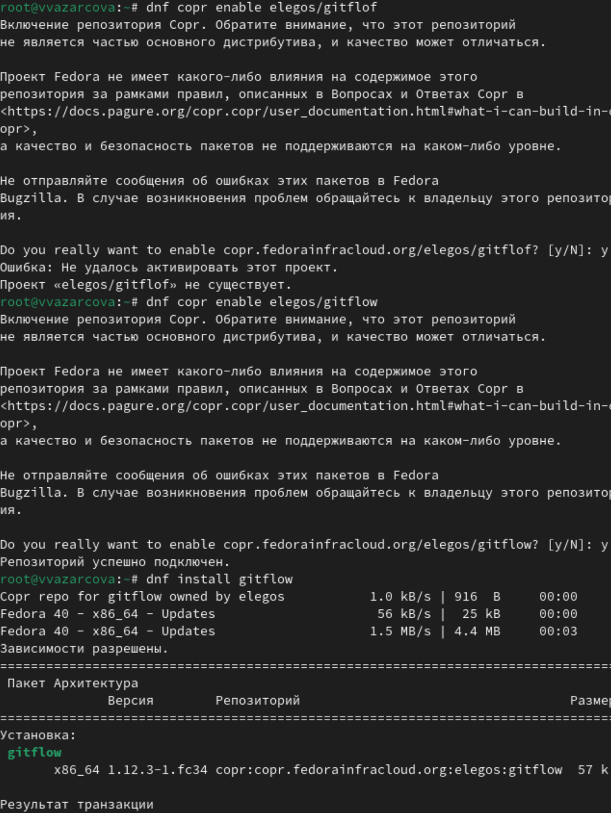{#fig:1 width=70%}

## Выполнение лабораторной работы

Устанавливаю Node.js для семантического версионирования и общепринятых коммитов.

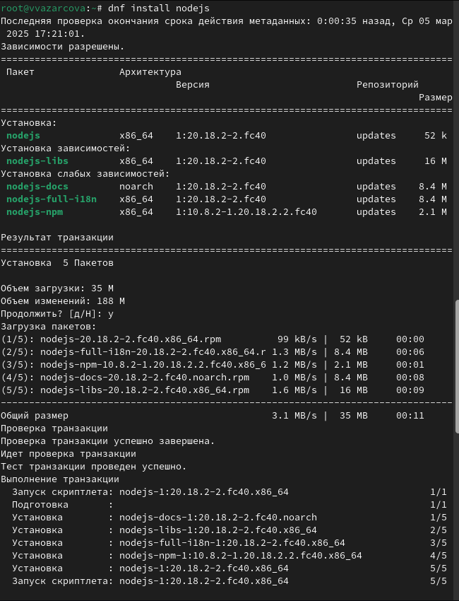{#fig:2 width=70%}

## Выполнение лабораторной работы

Настраиваю Node.js, добавив каталог с исполняемыми файлами, устанавливаемыми yarn, в переменную PATH.

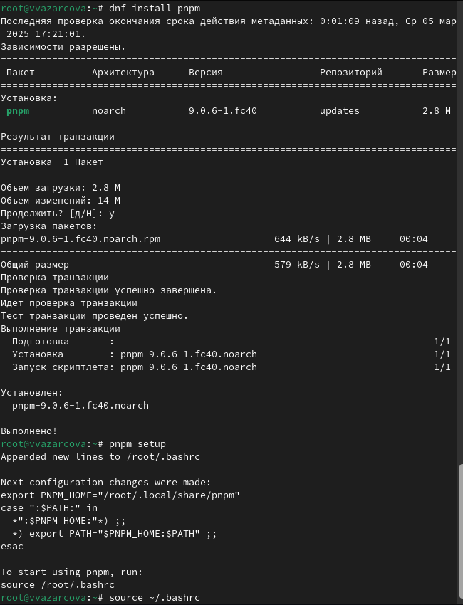{#fig:3 width=70%}

## Выполнение лабораторной работы

Устанавливаю commitizen для помощи в форматировании коммитов.

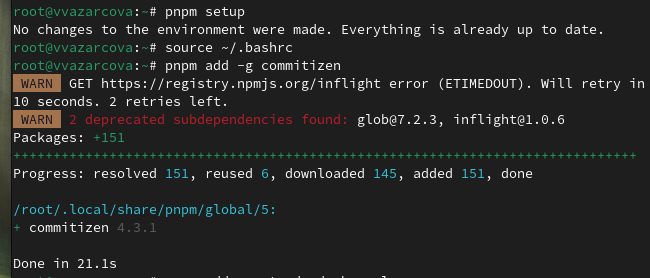{#fig:4 width=70%}

## Выполнение лабораторной работы

Устанавливаю standard-changelog для помощи в создании логов.

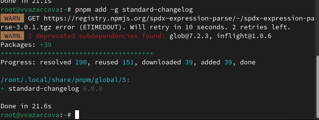{#fig:5 width=70%}

## Выполнение лабораторной работы

Создаю репозиторий git-extended на github и клонирую его на устройство.

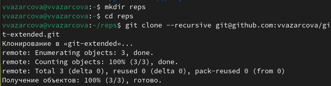{#fig:6 width=70%}

## Выполнение лабораторной работы

Создаю пустой файл 123.txt, делаю первый коммит.

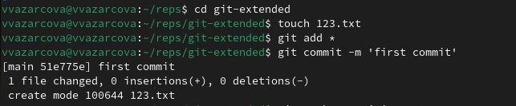{#fig:7 width=70%}

## Выполнение лабораторной работы

Отправляю коммит на сервер github.

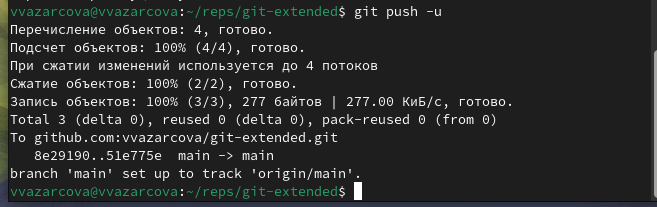{#fig:8 width=70%}

## Выполнение лабораторной работы

Создаю файл конфигурации для пакетов Node.js, открываю и редактирую его соответственно примеру в задании лабораторной работы.

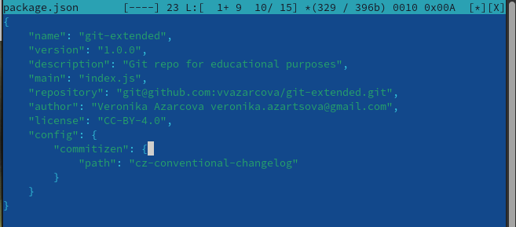{#fig:9 width=70%}

## Выполнение лабораторной работы

Добавляю новые файлы, выполняю коммит и отправляю его на сервер github.

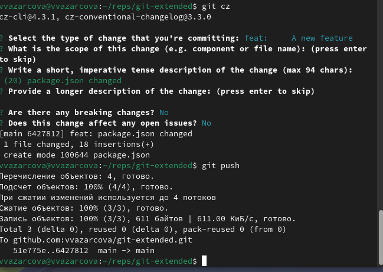{#fig:10 width=70%}

## Выполнение лабораторной работы

Инициализирую git-flow и проверяю, что я на ветке develop.

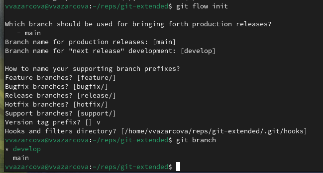{#fig:11 width=70%}

## Выполнение лабораторной работы

Создаю релиз с версией 1.0.0, журнал изменений. Добавляю журнал изменений в индекс и заливаю релизную ветку в основную ветку.

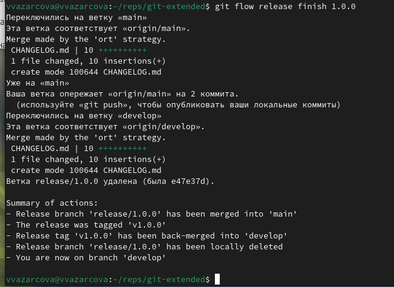{#fig:12 width=70%}

## Выполнение лабораторной работы

Создаю ветку для новой функциональности, далее, продолжаю работу c git как обычно. По окончании разработки новой функциональности следующим шагом объединяю ветку feature_branch c develop.

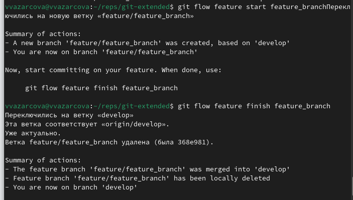{#fig:13 width=70%}

## Выполнение лабораторной работы

Обновляю номер версии в файле package.json до 1.2.3. Создаю журнал изменений и добавляю его в индекс. Заливаю релизную ветку в основную ветку и отправляю данные на github. Создаю релиз на github с комментарием из журнала изменений.

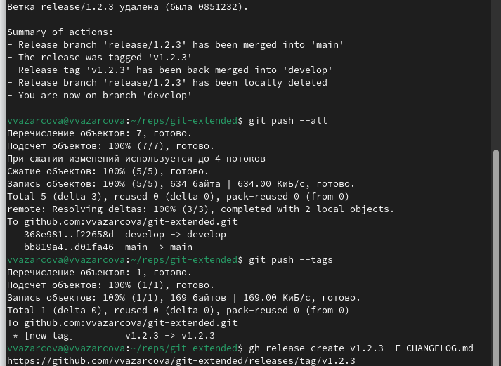{#fig:14 width=70%}

# Выводы

Что мне удалось:

- получить практические навыки правильной работы с репозиториями git
- выполнила работу для тестового репозитория

## Итоговый слайд

Если вам понравилось - посмотрите остальные мои презентации!

