---
## Front matter
title: "Отчёт по лабораторной работе №4"
subtitle: "Дисциплина: Операционные Системы"
author: "Азарцова Вероника Валерьевна"

## Generic otions
lang: ru-RU
toc-title: "Содержание"

## Bibliography
bibliography: bib/cite.bib
csl: pandoc/csl/gost-r-7-0-5-2008-numeric.csl

## Pdf output format
toc: true # Table of contents
toc-depth: 2
lof: true # List of figures
lot: true # List of tables
fontsize: 12pt
linestretch: 1.5
papersize: a4
documentclass: scrreprt
## I18n polyglossia
polyglossia-lang:
  name: russian
  options:
	- spelling=modern
	- babelshorthands=true
polyglossia-otherlangs:
  name: english
## I18n babel
babel-lang: russian
babel-otherlangs: english
## Fonts
mainfont: IBM Plex Serif
romanfont: IBM Plex Serif
sansfont: IBM Plex Sans
monofont: IBM Plex Mono
mathfont: STIX Two Math
mainfontoptions: Ligatures=Common,Ligatures=TeX,Scale=0.94
romanfontoptions: Ligatures=Common,Ligatures=TeX,Scale=0.94
sansfontoptions: Ligatures=Common,Ligatures=TeX,Scale=MatchLowercase,Scale=0.94
monofontoptions: Scale=MatchLowercase,Scale=0.94,FakeStretch=0.9
mathfontoptions:
## Biblatex
biblatex: true
biblio-style: "gost-numeric"
biblatexoptions:
  - parentracker=true
  - backend=biber
  - hyperref=auto
  - language=auto
  - autolang=other*
  - citestyle=gost-numeric
## Pandoc-crossref LaTeX customization
figureTitle: "Рис."
tableTitle: "Таблица"
listingTitle: "Листинг"
lofTitle: "Список иллюстраций"
lotTitle: "Список таблиц"
lolTitle: "Листинги"
## Misc options
indent: true
header-includes:
  - \usepackage{indentfirst}
  - \usepackage{float} # keep figures where there are in the text
  - \floatplacement{figure}{H} # keep figures where there are in the text
---

# Цель работы

Цель данной лабораторной работы - получение практических навыков правильной работы с репозиториями git.

# Задание

1. Выполнить работу для тестового репозитория.

2. Преобразовать рабочий репозиторий в репозиторий с git-flow и conventional commits.

# Теоретическое введение

## Общая информация

Gitflow Workflow опубликована и популяризована Винсентом Дриссеном.
Gitflow Workflow предполагает выстраивание строгой модели ветвления с учётом выпуска проекта.
Данная модель отлично подходит для организации рабочего процесса на основе релизов.
Работа по модели Gitflow включает создание отдельной ветки для исправлений ошибок в рабочей среде.

## Последовательность действий при работе по модели Gitflow

1. Из ветки master создаётся ветка develop.

2. Из ветки develop создаётся ветка release.

3. Из ветки develop создаются ветки feature.

4. Когда работа над веткой feature завершена, она сливается с веткой develop.

5. Когда работа над веткой релиза release завершена, она сливается в ветки develop и master.

6. Если в master обнаружена проблема, из master создаётся ветка hotfix.

7. Когда работа над веткой исправления hotfix завершена, она сливается в ветки develop и master.

## Краткое описание семантического версионирования

Семантическое версионирование описывается в манифесте семантического версионирования.  

Кратко его можно описать следующим образом:  

Версия задаётся в виде кортежа МАЖОРНАЯ_ВЕРСИЯ.МИНОРНАЯ_ВЕРСИЯ.ПАТЧ. Номер версии следует увеличивать:  
МАЖОРНУЮ версию, когда сделаны обратно несовместимые изменения API.  
МИНОРНУЮ версию, когда вы добавляете новую функциональность, не нарушая обратной совместимости.  
ПАТЧ-версию, когда вы делаете обратно совместимые исправления.  
Дополнительные обозначения для предрелизных и билд-метаданных возможны как дополнения к МАЖОРНАЯ.МИНОРНАЯ.ПАТЧ формату.  

# Выполнение лабораторной работы

Устанавливаю git-flow из коллекции репозиториев copr (рис. [-@fig:1]).

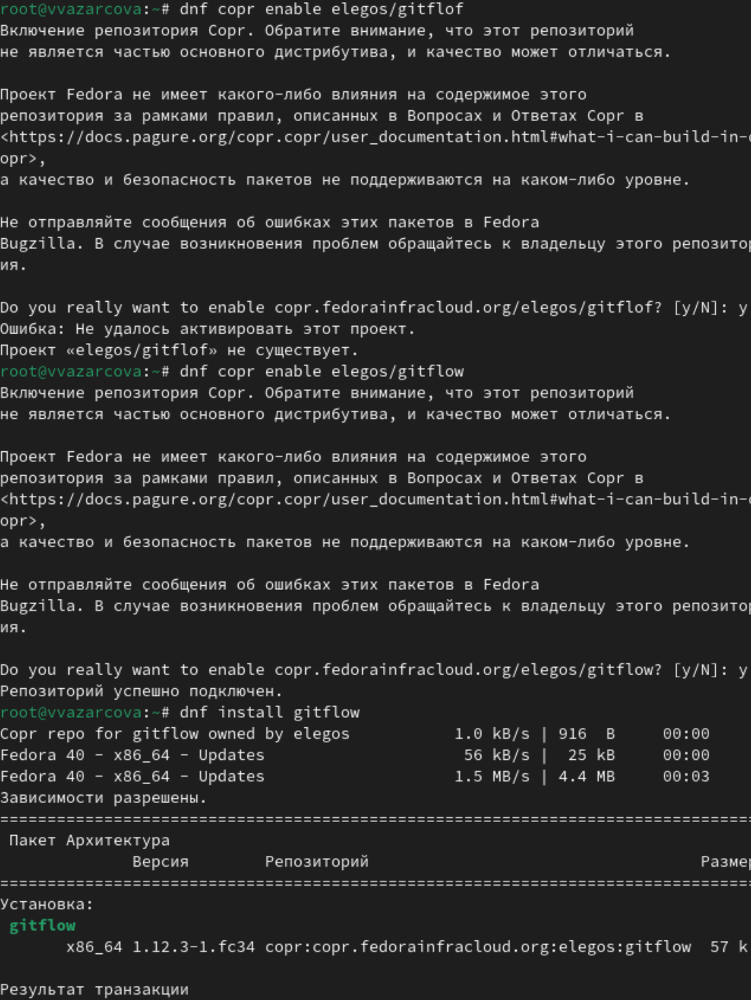{#fig:1 width=70%}

Устанавливаю Node.js для семантического версионирования и общепринятых коммитов (рис. [-@fig:2]).

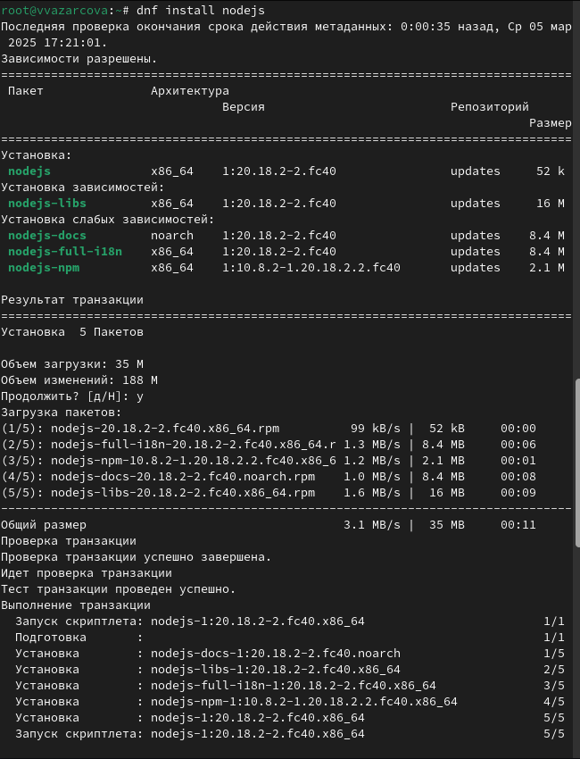{#fig:2 width=70%}

Настраиваю Node.js, добавив каталог с исполняемыми файлами, устанавливаемыми yarn, в переменную PATH (рис. [-@fig:3]).

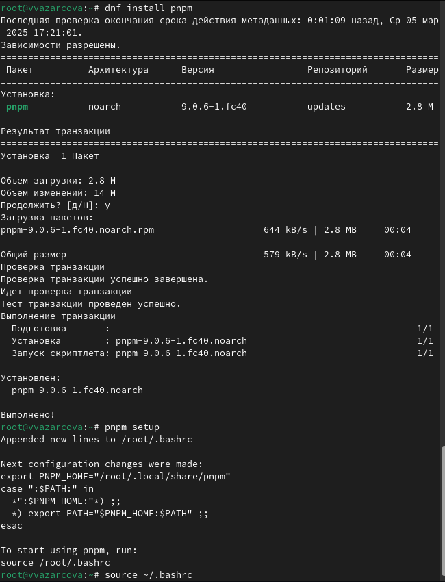{#fig:3 width=70%}

Устанавливаю commitizen для помощи в форматировании коммитов (рис. [-@fig:4]).

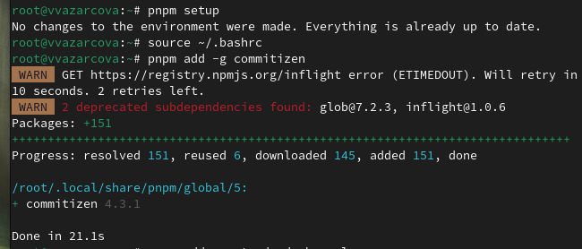{#fig:4 width=70%}

Устанавливаю standard-changelog для помощи в создании логов (рис. [-@fig:5]).

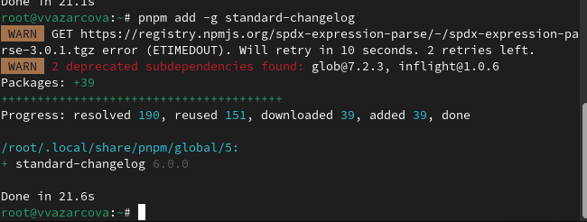{#fig:5 width=70%}

Создаю репозиторий git-extended на github и клонирую его на устройство (рис. [-@fig:6]).

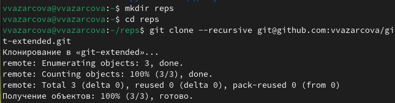{#fig:6 width=70%}

Создаю пустой файл 123.txt, делаю первый коммит (рис. [-@fig:7]).

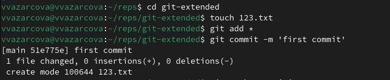{#fig:7 width=70%}

Отправляю коммит на сервер github (рис. [-@fig:8]).

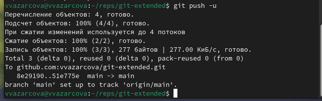{#fig:8 width=70%}

Создаю файл конфигурации для пакетов Node.js, открываю и редактирую его соответственно примеру в задании лабораторной работы (рис. [-@fig:9]).

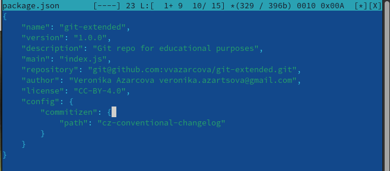{#fig:9 width=70%}

Добавляю новые файлы, выполняю коммит и отправляю его на сервер github (рис. [-@fig:10]).

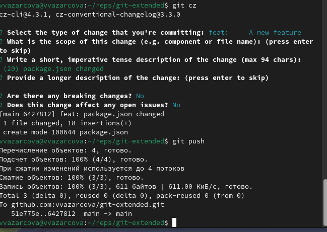{#fig:10 width=70%}

Инициализирую git-flow и проверяю, что я на ветке develop (рис. [-@fig:11]).

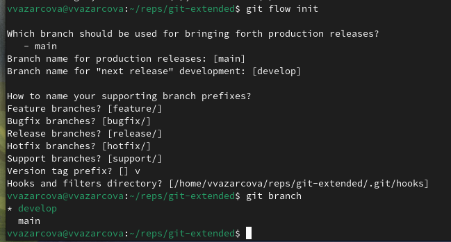{#fig:11 width=70%}

Создаю релиз с версией 1.0.0, журнал изменений. Добавляю журнал изменений в индекс и заливаю релизную ветку в основную ветку (рис. [-@fig:12]).

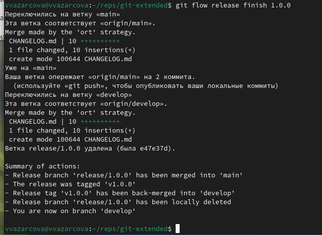{#fig:12 width=70%}

Создаю ветку для новой функциональности, далее, продолжаю работу c git как обычно. По окончании разработки новой функциональности следующим шагом объединяю ветку feature_branch c develop (рис. [-@fig:13]).

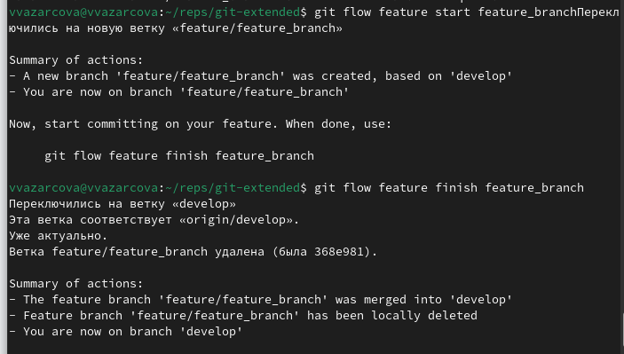{#fig:13 width=70%}

Обновляю номер версии в файле package.json до 1.2.3. Создаю журнал изменений и добавляю его в индекс. Заливаю релизную ветку в основную ветку и отправляю данные на github. Создаю релиз на github с комментарием из журнала изменений (рис. [-@fig:14]).

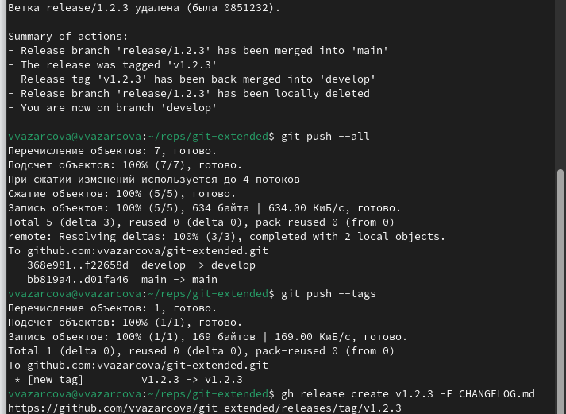{#fig:14 width=70%}

# Выводы

Подводя итоги проведенной лабораторной работе, я получила практические навыки правильной работы с репозиториями git, выполнила работу для тестового репозитория и преобразовала рабочий репозиторий в репозиторий с git-flow и conventional commits.

# Список литературы{.unnumbered}

::: {#refs}
:::
1. GDB: The GNU Project Debugger. — URL: https://www.gnu.org/software/gdb/.
2. GNU Bash Manual. — 2016. — URL: https://www.gnu.org/software/bash/manual/.
3. Midnight Commander Development Center. — 2021. — URL: https://midnight-commander.org/.
4. NASM Assembly Language Tutorials. — 2021. — URL: https://asmtutor.com/.
5. Newham C. Learning the bash Shell: Unix Shell Programming. — O’Reilly Media, 2005. —354 с. — (In a Nutshell). — ISBN 0596009658. — URL: http://www.amazon.com/Learningbash-Shell-Programming-Nutshell/dp/0596009658.
6. Robbins A. Bash Pocket Reference. — O’Reilly Media, 2016. — 156 с. — ISBN 978-1491941591.
7. The NASM documentation. — 2021. — URL: https://www.nasm.us/docs.php.
8. Zarrelli G. Mastering Bash. — Packt Publishing, 2017. — 502 с. — ISBN 9781784396879.
9. Колдаев В. Д., Лупин С. А. Архитектура ЭВМ. — М. : Форум, 2018.
