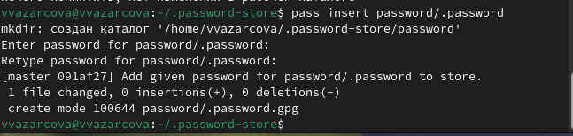

---
## Front matter
lang: ru-RU
title: Лабораторная работа №5
subtitle: Дисциплина - Операционные Системы
author:
  - Азарцова В. В.
institute:
  - Российский университет дружбы народов, Москва, Россия
  - Преподаватель Кулябов Д. С.
date: 13 марта 2025

## i18n babel
babel-lang: russian
babel-otherlangs: english

## Formatting pdf
toc: false
toc-title: Содержание
slide_level: 2
aspectratio: 169
section-titles: true
theme: metropolis
header-includes:
 - \metroset{progressbar=frametitle,sectionpage=progressbar,numbering=fraction}
---

# Информация

## Докладчик

:::::::::::::: {.columns align=center}
::: {.column width="70%"}

  * Азарцова Вероника Валерьевна
  * НКАбд-01-24, студ. билет №1132246751
  * Российский университет дружбы народов
  * [1132246751@pfur.ru](mailto:1132246751@pfur.ru)
  * <https://github.com/vvazarcova>

:::
::::::::::::::

## Цели работы

Цели данной лабораторной работы:

- Научиться пользоваться менеджером пароля pass
- Научиться пользоваться chezmoi

## Задачи

- Установить менеджер паролей pass
- Настроить менеджер паролей pass
- Настроить интерфейс с броузером
- Установить дополнительное программное обеспечение
- Использовать chezmoi

## Теоретическое введение

Менеджер паролей pass — программа, сделанная в рамках идеологии Unix. Также носит название стандартного менеджера паролей для Unix (The standard Unix password manager).  
Данные хранятся в файловой системе в виде каталогов и файлов. Файлы шифруются с помощью GPG-ключа.

# Выполнение лабораторной работы

## Менеджер паролей pass

Устанавливаю pass.

{#fig:1 width=70%}

## Менеджер паролей pass

Устанавливаю gopass.

{#fig:2 width=70%}

## Менеджер паролей pass

Вывожу список ключей, нахожу id моего ключа, и использую его чтобы инициализировать хранилище.

{#fig:3 width=70%}

## Менеджер паролей pass

Создаю структуру git и задаю адрес репозитория на хостинге, предварительно создав его и назвав его git-new.

{#fig:4 width=70%}

## Менеджер паролей pass

Синхронизирую с помощью команд pass git pull и push.

{#fig:5 width=70%}

## Менеджер паролей pass

Изменения сделаны непосредственно на файловой системе, следовательно вручную добавляю в коммит и выкладываю изменения.

{#fig:6 width=70%}

## Настройка интерфейса с броузером

Устанавливаю интерфейс для взаимодействия с броузером (native messaging).

{#fig:7 width=70%}

## Сохранение пароля

Добавляю новый пароль.

{#fig:8 width=70%}

## Дополнительное программное обеспечение

Устанавливаю дополнительное программное обеспечение.

{#fig:9 width=70%}

## Дополнительное программное обеспечение

Устанавливаю шрифты.

{#fig:10 width=70%}

## Chezmoi

Создаю репозиторий и подключаю его к своей системе с помощью chezmoi.

{#fig:11 width=70%}

## Использование chezmoi на нескольких машинах

Использую chezmoi на второй машине - инициализирую его с новым репозиторием и вношу изменения.

{#fig:12 width=70%}

# Выводы

Мне удалось:

- Получить практические навыки работы с менеджером пароля pass
- Установить и настроить всё нужное дополнительное программное обеспечение

## Итоговый слайд

Если вам понравилось - посмотрите остальные мои презентации!

