---
## Front matter
title: "Отчёт по лабораторной работе №4"
subtitle: "Дисциплина: Операционные Системы"
author: "Азарцова Вероника Валерьевна"

## Generic otions
lang: ru-RU
toc-title: "Содержание"

## Bibliography
bibliography: bib/cite.bib
csl: pandoc/csl/gost-r-7-0-5-2008-numeric.csl

## Pdf output format
toc: true # Table of contents
toc-depth: 2
lof: true # List of figures
lot: true # List of tables
fontsize: 12pt
linestretch: 1.5
papersize: a4
documentclass: scrreprt
## I18n polyglossia
polyglossia-lang:
  name: russian
  options:
	- spelling=modern
	- babelshorthands=true
polyglossia-otherlangs:
  name: english
## I18n babel
babel-lang: russian
babel-otherlangs: english
## Fonts
mainfont: IBM Plex Serif
romanfont: IBM Plex Serif
sansfont: IBM Plex Sans
monofont: IBM Plex Mono
mathfont: STIX Two Math
mainfontoptions: Ligatures=Common,Ligatures=TeX,Scale=0.94
romanfontoptions: Ligatures=Common,Ligatures=TeX,Scale=0.94
sansfontoptions: Ligatures=Common,Ligatures=TeX,Scale=MatchLowercase,Scale=0.94
monofontoptions: Scale=MatchLowercase,Scale=0.94,FakeStretch=0.9
mathfontoptions:
## Biblatex
biblatex: true
biblio-style: "gost-numeric"
biblatexoptions:
  - parentracker=true
  - backend=biber
  - hyperref=auto
  - language=auto
  - autolang=other*
  - citestyle=gost-numeric
## Pandoc-crossref LaTeX customization
figureTitle: "Рис."
tableTitle: "Таблица"
listingTitle: "Листинг"
lofTitle: "Список иллюстраций"
lotTitle: "Список таблиц"
lolTitle: "Листинги"
## Misc options
indent: true
header-includes:
  - \usepackage{indentfirst}
  - \usepackage{float} # keep figures where there are in the text
  - \floatplacement{figure}{H} # keep figures where there are in the text
---

# Цель работы

Цель данной лабораторной работы - научиться пользоваться менеджером пароля pass, установить его на машину и настроить.

# Задание

- Установить менеджер паролей pass
- Настроить менеджер паролей pass
- Настроить интерфейс с броузером
- Установить дополнительное программное обеспечение
- Научиться пользоваться chezmoi

# Теоретическое введение

## Менеджер паролей pass

Менеджер паролей pass — программа, сделанная в рамках идеологии Unix. Также носит название стандартного менеджера паролей для Unix (The standard Unix password manager).  
Данные хранятся в файловой системе в виде каталогов и файлов. Файлы шифруются с помощью GPG-ключа.

## Структура базы паролей

Структура базы может быть произвольной, если Вы собираетесь использовать её напрямую, без промежуточного программного обеспечения. Тогда семантику структуры базы данных Вы держите в своей голове.  
Если же необходимо использовать дополнительное программное обеспечение, необходимо семантику заложить в структуру базы паролей.  

## Семантическая структура базы паролей

Рассмотрим пользователя user в домене example.com, порт 22.  
Отсутствие имени пользователя или порта в имени файла означает, что любое имя пользователя и порт будут совпадать:  

example.com.pgp  
Соответствующее имя пользователя может быть именем файла внутри каталога, имя которого совпадает с хостом. Это полезно, если в базе есть пароли для нескольких пользователей на одном хосте:  

example.com/user.pgp  
Имя пользователя также может быть записано в виде префикса, отделенного от хоста знаком @:  

user@example.com.pgp  
Соответствующий порт может быть указан после хоста, отделённый двоеточием (:):  

example.com:22.pgp  
example.com:22/user.pgp  
user@example.com:22.pgp  
Эти все записи могут быть расположены в произвольных каталогах, задающих Вашу собственную иерархию.  

# Выполнение лабораторной работы

## Менеджер паролей pass

Устанавливаю pass (рис. [-@fig:1]).

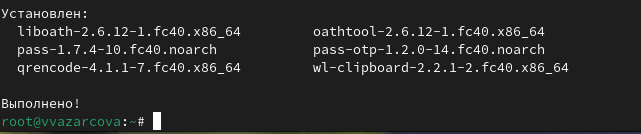{#fig:1 width=70%}

Устанавливаю gopass (рис. [-@fig:2]).

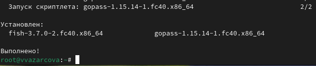{#fig:2 width=70%}

Вывожу список ключей, нахожу id моего ключа, и использую его чтобы инициализировать хранилище (рис. [-@fig:3]).

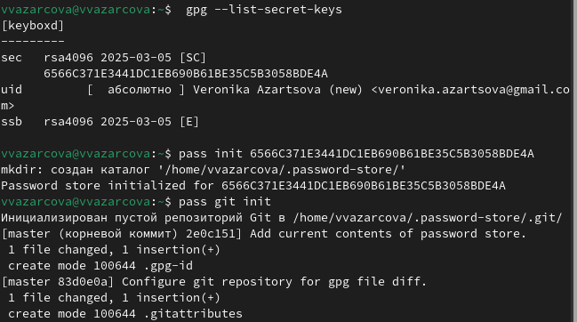{#fig:3 width=70%}

Создаю структуру git и задаю адрес репозитория на хостинге, предварительно создав его и назвав его git-new (рис. [-@fig:4]).

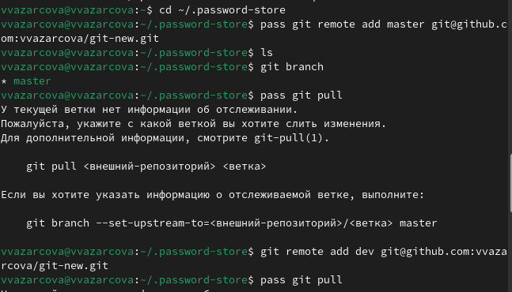{#fig:4 width=70%}

Синхронизирую с помощью команд pass git pull и push (рис. [-@fig:5]).

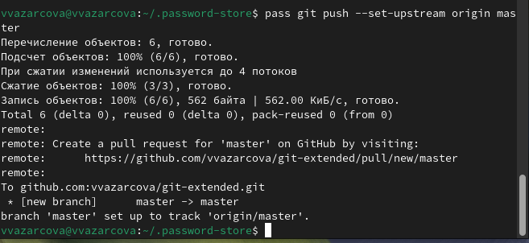{#fig:5 width=70%}

Изменения сделаны непосредственно на файловой системе, следовательно вручную добавляю в коммит и выкладываю изменения (рис. [-@fig:6]).

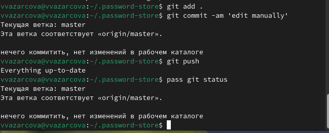{#fig:6 width=70%}

## Настройка интерфейса с броузером

Устанавливаю интерфейс для взаимодействия с броузером (native messaging) (рис. [-@fig:7]).

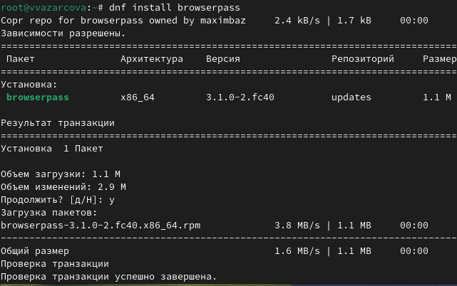{#fig:7 width=70%}

## Сохранение пароля

Добавляю новый пароль (рис. [-@fig:8]).

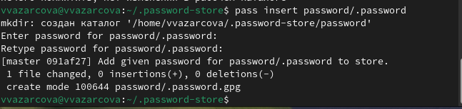{#fig:8 width=70%}

## Дополнительное программное обеспечение

Устанавливаю дополнительное программное обеспечение (рис. [-@fig:9]).

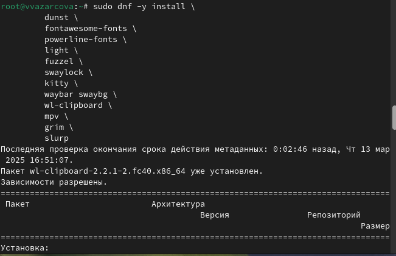{#fig:9 width=70%}

Устанавливаю шрифты (рис. [-@fig:10]).

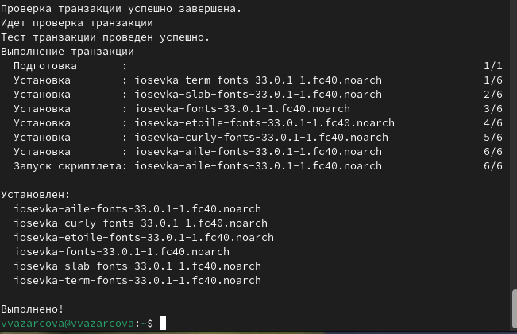{#fig:10 width=70%}

## Chezmoi

Создаю репозиторий и подключаю его к своей системе с помощью chezmoi (рис. [-@fig:11]).

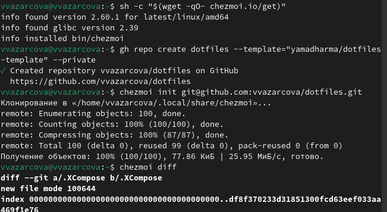{#fig:11 width=70%}

## Использование chezmoi на нескольких машинах

Использую chezmoi на второй машине - инициализирую его с новым репозиторием и вношу изменения (рис. [-@fig:12]).

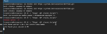{#fig:12 width=70%}

# Выводы

Подводя итоги проведенной лабораторной работе, я получила практические навыки работы с менеджером пароля pass и установила и настроила всё нужное дополнительное программное обеспечение.

# Список литературы{.unnumbered}

::: {#refs}
:::
1. GDB: The GNU Project Debugger. — URL: https://www.gnu.org/software/gdb/.
2. GNU Bash Manual. — 2016. — URL: https://www.gnu.org/software/bash/manual/.
3. Midnight Commander Development Center. — 2021. — URL: https://midnight-commander.org/.
4. NASM Assembly Language Tutorials. — 2021. — URL: https://asmtutor.com/.
5. Newham C. Learning the bash Shell: Unix Shell Programming. — O’Reilly Media, 2005. —354 с. — (In a Nutshell). — ISBN 0596009658. — URL: http://www.amazon.com/Learningbash-Shell-Programming-Nutshell/dp/0596009658.
6. Robbins A. Bash Pocket Reference. — O’Reilly Media, 2016. — 156 с. — ISBN 978-1491941591.
7. The NASM documentation. — 2021. — URL: https://www.nasm.us/docs.php.
8. Zarrelli G. Mastering Bash. — Packt Publishing, 2017. — 502 с. — ISBN 9781784396879.
9. Колдаев В. Д., Лупин С. А. Архитектура ЭВМ. — М. : Форум, 2018.
