---
## Front matter
lang: ru-RU
title: Лабораторная работа №6
subtitle: Дисциплина - Операционные Системы
author:
  - Азарцова В. В.
institute:
  - Российский университет дружбы народов, Москва, Россия
  - Преподаватель Кулябов Д. С.
date: 15 марта 2025

## i18n babel
babel-lang: russian
babel-otherlangs: english

## Formatting pdf
toc: false
toc-title: Содержание
slide_level: 2
aspectratio: 169
section-titles: true
theme: metropolis
header-includes:
 - \metroset{progressbar=frametitle,sectionpage=progressbar,numbering=fraction}
---

# Информация

## Докладчик

:::::::::::::: {.columns align=center}
::: {.column width="70%"}

  * Азарцова Вероника Валерьевна
  * НКАбд-01-24, студ. билет №1132246751
  * Российский университет дружбы народов
  * [1132246751@pfur.ru](mailto:1132246751@pfur.ru)
  * <https://github.com/vvazarcova>

:::
::::::::::::::

## Цели работы

Целью данной лабораторной работы было приобрести практические навыки взаимодействия пользователя с системой посредством командной строки.

## Задачи

Задачи лабораторной работы: 

- Изучить теоретическое введение
- Самостоятельно выполнить задания по созданию и удалению каталогов
- Использовать функцию man

## Теоретическое введение

Краткое описание команд, нужных для выполнения лабораторной работы:

- man:  Просмотр руководства по основным командам Linux
- cd: Перемещение по файловой системе
- pwd: Определение абсолютного пути к текущему каталогу (print working directory)
- ls: Просмотр содержимого каталога
- mkdir: Создание каталогов
- rm: Удаление файлов (или каталогов, с параметрами)
- history: Вывод на экран списка ранее выполненных команд

# Выполнение лабораторной работы

Выполняю все шаги лабораторной работы по порядку:  

1. Определите полное имя вашего домашнего каталога. Далее относительно этого каталога будут выполняться последующие упражнения.
 
2. Перейдите в каталог /tmp.

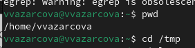{#fig:1 width=70%}

## Выполнение лабораторной работы

3. Выведите на экран содержимое каталога /tmp. Для этого используйте команду ls с различными опциями. Поясните разницу в выводимой на экран информации.  
Вывожу tmp без опций.

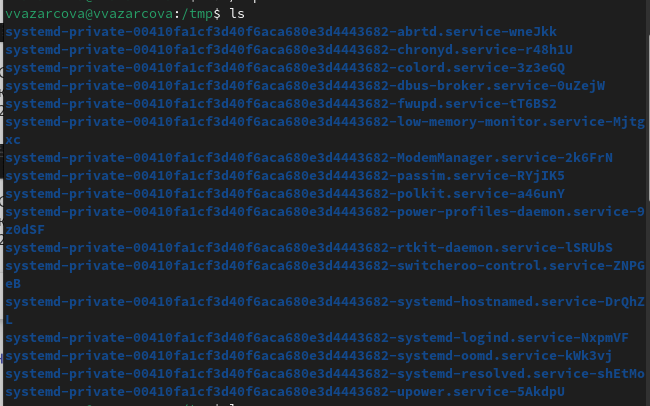{#fig:2 width=70%}

## Выполнение лабораторной работы

Вывожу tmp с опцией -a. Это выводит не только обычные, но и скрытые файлы.

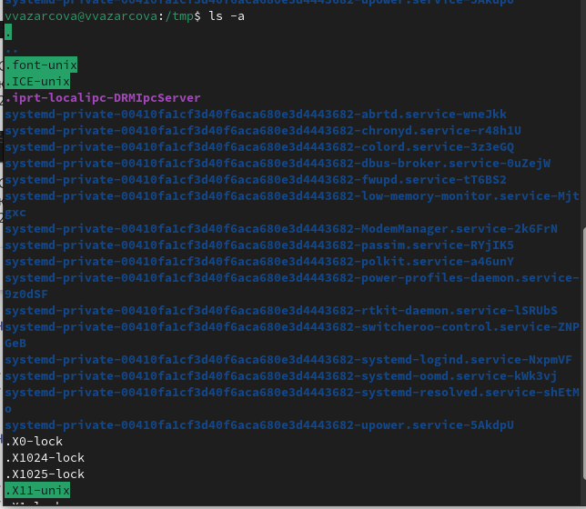{#fig:3 width=70%}

## Выполнение лабораторной работы

4. Определите, есть ли в каталоге /var/spool подкаталог с именем cron.

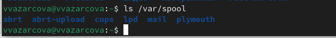{#fig:4 width=70%}

Его нет.  

## Выполнение лабораторной работы

5. Перейдите в Ваш домашний каталог и выведите на экран его содержимое. Определите, кто является владельцем файлов и подкаталогов?  
Делаю это с помощью опции -l (long).

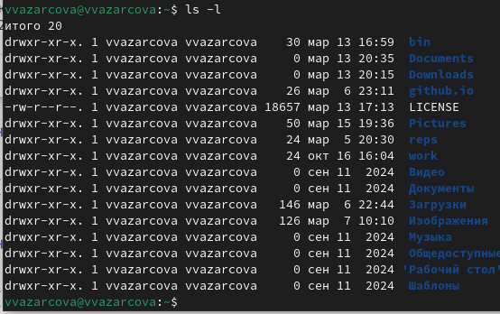{#fig:5 width=70%}

## Выполнение лабораторной работы

6. В домашнем каталоге создайте новый каталог с именем newdir.  
7. В каталоге ~/newdir создайте новый каталог с именем morefun.

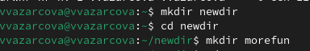{#fig:6 width=70%}

## Выполнение лабораторной работы

8. В домашнем каталоге создайте одной командой три новых каталога с именами
letters, memos, misk. Затем удалите эти каталоги одной командой.

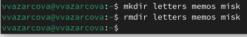{#fig:7 width=70%}

## Выполнение лабораторной работы

9. Попробуйте удалить ранее созданный каталог ~/newdir командой rm. Проверьте, был ли каталог удалён.

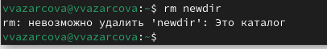{#fig:8 width=70%}

Каталог не удаляется, т.к. команда rm не удаляет каталоги без опций.

## Выполнение лабораторной работы

10. Удалите каталог ~/newdir/morefun из домашнего каталога. Проверьте, был ли
каталог удалён.

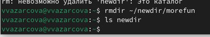{#fig:9 width=70%}

## Выполнение лабораторной работы

11. С помощью команды man определите, какую опцию команды ls нужно использовать для просмотра содержимое не только указанного каталога, но и подкаталогов, входящих в него. Нужная опция: -r.

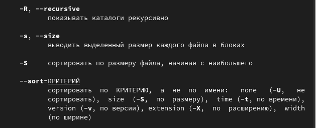{#fig:10 width=70%}

## Выполнение лабораторной работы

Проверяю использование опции -r. Всё работает правильно.

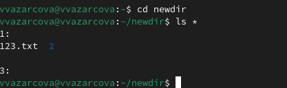{#fig:11 width=70%}

## Выполнение лабораторной работы

12. С помощью команды man определите набор опций команды ls, позволяющий отсортировать по времени последнего изменения выводимый список содержимого каталога с развёрнутым описанием файлов. Нужные опции: --sort:time и -l.

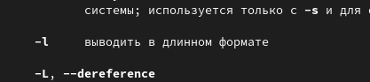{#fig:12 width=70%}

## Выполнение лабораторной работы

Проверяю использование опции --sort:time и -l. Всё работает правильно.

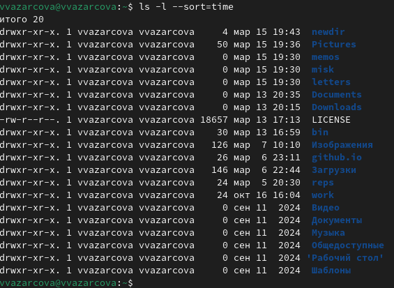{#fig:13 width=70%}

## Выполнение лабораторной работы

13. Используйте команду man для просмотра описания следующих команд: cd, pwd, mkdir, rmdir, rm. Поясните основные опции этих команд.  

## Команда man

rm: Удаление файлов (или каталогов, с параметрами).

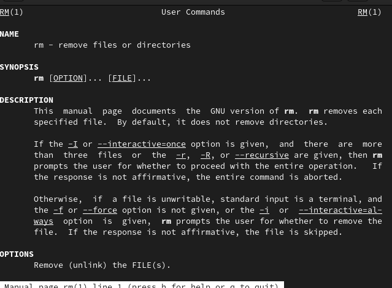{#fig:14 width=70%}

## Команда man

rmdir: Удаление каталогов.

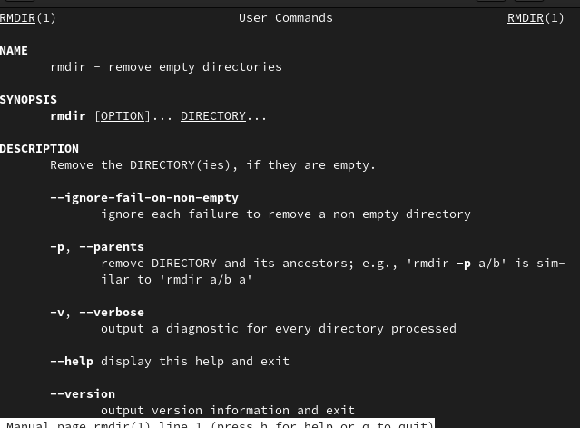{#fig:15 width=70%}

## Команда man

mkdir: Создание каталогов.

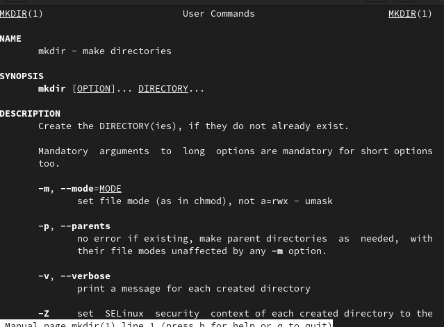{#fig:16 width=70%}

## Команда man

pwd: Определение абсолютного пути к текущему каталогу.

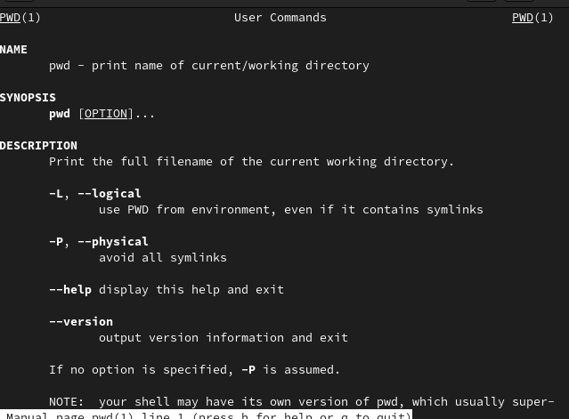{#fig:17 width=70%}

## Команда man

cd: Перемещение по файловой системе.

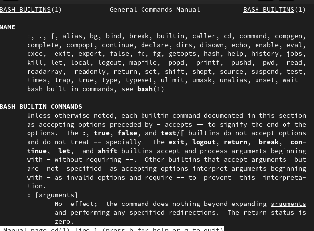{#fig:18 width=70%}

## Выполнение лабораторной работы

14. Используя информацию, полученную при помощи команды history, выполните модификацию и исполнение нескольких команд из буфера команд.

{#fig:19 width=70%}

# Выводы

Мне удалось:  

- Приобрести практические навыки взаимодействия пользователя с системой посредством командной строки

- Самостоятельно выполнить задания по созданию и удалению каталогов\

- Использовать функцию man и history

## Итоговый слайд

Если вам понравилось - посмотрите остальные мои презентации!

