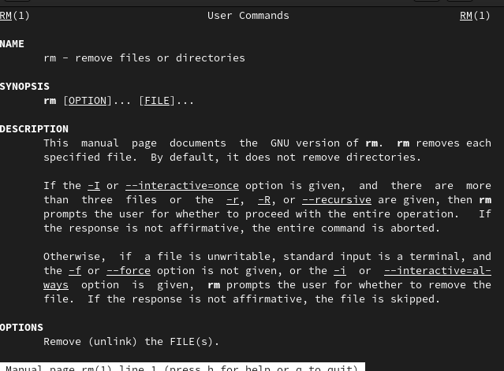

---
## Front matter
title: "Отчёт по лабораторной работе №6"
subtitle: "Дисциплина: Операционные Системы"
author: "Азарцова Вероника Валерьевна"

## Generic otions
lang: ru-RU
toc-title: "Содержание"

## Bibliography
bibliography: bib/cite.bib
csl: pandoc/csl/gost-r-7-0-5-2008-numeric.csl

## Pdf output format
toc: true # Table of contents
toc-depth: 2
lof: true # List of figures
lot: true # List of tables
fontsize: 12pt
linestretch: 1.5
papersize: a4
documentclass: scrreprt
## I18n polyglossia
polyglossia-lang:
  name: russian
  options:
	- spelling=modern
	- babelshorthands=true
polyglossia-otherlangs:
  name: english
## I18n babel
babel-lang: russian
babel-otherlangs: english
## Fonts
mainfont: IBM Plex Serif
romanfont: IBM Plex Serif
sansfont: IBM Plex Sans
monofont: IBM Plex Mono
mathfont: STIX Two Math
mainfontoptions: Ligatures=Common,Ligatures=TeX,Scale=0.94
romanfontoptions: Ligatures=Common,Ligatures=TeX,Scale=0.94
sansfontoptions: Ligatures=Common,Ligatures=TeX,Scale=MatchLowercase,Scale=0.94
monofontoptions: Scale=MatchLowercase,Scale=0.94,FakeStretch=0.9
mathfontoptions:
## Biblatex
biblatex: true
biblio-style: "gost-numeric"
biblatexoptions:
  - parentracker=true
  - backend=biber
  - hyperref=auto
  - language=auto
  - autolang=other*
  - citestyle=gost-numeric
## Pandoc-crossref LaTeX customization
figureTitle: "Рис."
tableTitle: "Таблица"
listingTitle: "Листинг"
lofTitle: "Список иллюстраций"
lotTitle: "Список таблиц"
lolTitle: "Листинги"
## Misc options
indent: true
header-includes:
  - \usepackage{indentfirst}
  - \usepackage{float} # keep figures where there are in the text
  - \floatplacement{figure}{H} # keep figures where there are in the text
---

# Цель работы

Цель данной лабораторной работы - приобрести практические навыки взаимодействия пользователя с системой посредством командной строки.

# Задание

1. Изучить теоретическое введение
2. Самостоятельно выполнить задания по созданию и удалению каталогов
3. Использовать функцию man и history

# Теоретическое введение

Краткое описание команд, нужных для выполнения лабораторной работы:

- man:  Просмотр руководства по основным командам Linux
- cd: Перемещение по файловой системе
- pwd: Определение абсолютного пути к текущему каталогу (print working directory)
- ls: Просмотр содержимого каталога
- mkdir: Создание каталогов
- rm: Удаление файлов (или каталогов, с параметрами)
- history: Вывод на экран списка ранее выполненных команд

# Выполнение лабораторной работы

Выполняю все шаги лабораторной работы по порядку:  

1. Определите полное имя вашего домашнего каталога. Далее относительно этого каталога будут выполняться последующие упражнения.
 
2. Перейдите в каталог /tmp. (рис. [-@fig:1]).

{#fig:1 width=70%}

3. Выведите на экран содержимое каталога /tmp. Для этого используйте команду ls с различными опциями. Поясните разницу в выводимой на экран информации.  
Вывожу ls без опций (рис. [-@fig:2]).

{#fig:2 width=70%}

Вывожу ls с опцией -a. Это выводит не только обычные, но и скрытые файлы (рис. [-@fig:3]).

{#fig:3 width=70%}

4. Определите, есть ли в каталоге /var/spool подкаталог с именем cron? (рис. [-@fig:4]).

{#fig:4 width=70%}

Его нет.  

5. Перейдите в Ваш домашний каталог и выведите на экран его содержимое. Определите, кто является владельцем файлов и подкаталогов?  
Делаю это с помощью опции -l (long) (рис. [-@fig:5]).

{#fig:5 width=70%}

6. В домашнем каталоге создайте новый каталог с именем newdir.  
7. В каталоге ~/newdir создайте новый каталог с именем morefun. (рис. [-@fig:6]).

{#fig:6 width=70%}

8. В домашнем каталоге создайте одной командой три новых каталога с именами
letters, memos, misk. Затем удалите эти каталоги одной командой. (рис. [-@fig:7]).

{#fig:7 width=70%}

9. Попробуйте удалить ранее созданный каталог ~/newdir командой rm. Проверьте, был ли каталог удалён (рис. [-@fig:8]).

{#fig:8 width=70%}

Каталог не удаляется, т.к. команда rm не удаляет каталоги без опций.

10. Удалите каталог ~/newdir/morefun из домашнего каталога. Проверьте, был ли
каталог удалён (рис. [-@fig:9]).

{#fig:9 width=70%}

11. С помощью команды man определите, какую опцию команды ls нужно использовать для просмотра содержимое не только указанного каталога, но и подкаталогов, входящих в него. Нужная опция: -r (рис. [-@fig:10]).

{#fig:10 width=70%}

Проверяю использование опции -r. Всё работает правильно (рис. [-@fig:11]).

{#fig:11 width=70%}

12. С помощью команды man определите набор опций команды ls, позволяющий отсортировать по времени последнего изменения выводимый список содержимого каталога с развёрнутым описанием файлов. Нужные опции: --sort:time и -l (рис. [-@fig:12]).

{#fig:12 width=70%}

Проверяю использование опции --sort:time и -l. Всё работает правильно (рис. [-@fig:13]).

{#fig:13 width=70%}

13. Используйте команду man для просмотра описания следующих команд: cd, pwd, mkdir, rmdir, rm. Поясните основные опции этих команд.  

rm: Удаление файлов (или каталогов, с параметрами) (рис. [-@fig:14]).

{#fig:14 width=70%}

rmdir: Удаление каталогов (рис. [-@fig:15]).

{#fig:15 width=70%}

mkdir: Создание каталогов (рис. [-@fig:16]).

{#fig:16 width=70%}

pwd: Определение абсолютного пути к текущему каталогу(рис. [-@fig:17]).

{#fig:17 width=70%}

cd: Перемещение по файловой системе (рис. [-@fig:18]).

{#fig:18 width=70%}

14. Используя информацию, полученную при помощи команды history, выполните модификацию и исполнение нескольких команд из буфера команд (рис. [-@fig:19]).

{#fig:19 width=70%}

# Контрольные вопросы

1. Что такое командная строка?  
Командная строка (или «консоль») – это текстовый интерфейс между человеком и компьютером, в котором инструкции компьютеру даются путём ввода с клавиатуры текстовых строк (команд). Интерфейс командной строки противопоставляется управлению программами на основе меню, а также различным реализациям графического интерфейса. Команды, введённые пользователем, интерпретируются и выполняются специальной программой — командной оболочкой (или «shell» по-английски).
2. При помощи какой команды можно определить абсолютный путь текущего каталога? Приведите пример.  
Для определения абсолютного пути к текущему каталогу используется команда pwd (print working directory). Пример (абсолютное имя текущего каталога пользователя dharma): (pwd результат: /afs/dk.sci.pfu.edu.ru/home/d/h/dharma)
3. При помощи какой команды и каких опций можно определить только тип файлов и их имена в текущем каталоге?  
Приведите примеры. При помощи команды ls -F. (ls -F install-tl-unx/ newdir/ work/ Видео/ Документы/ Загрузки/ Изображения/ Музыка/ Общедоступные/ 'Рабочий стол'/ Шаблоны/)
4. Каким образом отобразить информацию о скрытых файлах? Приведите примеры.  
С помощью команды ls -a. (ls -a . .bash_logout .cache .gnupg .local .pki .var .vboxclient-draganddrop.pid .wget-hsts Документы Музыка Шаблоны .. .bash_profile .config install-tl-unx .mozilla .ssh .vboxclient-clipboard.pid .vboxclient-seamless.pid work Загрузки Общедоступные .bash_history .bashrc .gitconfig .lesshst newdir .texlive2022 .vboxclient-display-svga-x11.pid .vscode Видео Изображения 'Рабочий стол')
5. При помощи каких команд можно удалить файл и каталог?   
Можно ли это сделать одной и той же командой? Приведите примеры. Команда rm используется для удаления файлов и/или каталогов. Чтобы удалить каталог, содержащий файлы, нужно использовать опцию r. Без указания этой опции команда не будет выполняться (rm -r abc). Если каталог пуст, то можно воспользоваться командой rmdir. Если удаляемый каталог содержит файлы, то команда не будет выполнена — нужно использовать rm - r имя_каталога.
6. Каким образом можно вывести информацию о последних выполненных пользователем командах? работы?  
С помощью команды history.
7. Как воспользоваться историей команд для их модифицированного выполнения? Приведите примеры.  
Можно модифицировать команду из выведенного на экран списка при помощи следующей конструкции: !<номер_команды>:s/<что_меняем>/<на_что_меняем> (!3:s/a/F ls -F)
8. Приведите примеры запуска нескольких команд в одной строке.  
Если требуется выполнить последовательно несколько команд, записанный в одной строке, то для этого используется символ точка с запятой. (cd; ls)
9. Дайте определение и приведите примера символов экранирования.  
Если в заданном контексте встречаются специальные символы (типа «.», «/», «*» и т.д.), надо перед ними поставить символ экранирования \ (обратный слэш).
10. Охарактеризуйте вывод информации на экран после выполнения команды ls с опцией l.  
Чтобы вывести на экран подробную информацию о файлах и каталогах, необходимо использовать опцию l. При этом о каждом файле и каталоге будет выведена следующая информация: – тип файла, – право доступа, – число ссылок, – владелец, – размер, – дата последней ревизии, – имя файла или каталога.
11. Что такое относительный путь к файлу? Приведите примеры использования относительного и абсолютного пути при выполнении какой-либо команды.  
Относительный путь — это ссылка, указывающая на другие страницы вашего сайта относительно веб-страницы, на которой эта ссылка уже находится. Пример относительно пути: ./docs/files/file.txt Пример абсолютного пути: cd /home/dmbelicheva/work/study
12. Как получить информацию об интересующей вас команде?  
С помощью команды man или опции --help.
13. Какая клавиша или комбинация клавиш служит для автоматического дополнения вводимых команд?  
Клавиша Tab.

# Выводы

Подводя итоги проведенной лабораторной работе, я приобрела практические навыки взаимодействия пользователя с системой посредством командной строки.

# Список литературы{.unnumbered}

::: {#refs}
:::
1. GDB: The GNU Project Debugger. — URL: https://www.gnu.org/software/gdb/.
2. GNU Bash Manual. — 2016. — URL: https://www.gnu.org/software/bash/manual/.
3. Midnight Commander Development Center. — 2021. — URL: https://midnight-commander.org/.
4. NASM Assembly Language Tutorials. — 2021. — URL: https://asmtutor.com/.
5. Newham C. Learning the bash Shell: Unix Shell Programming. — O’Reilly Media, 2005. —354 с. — (In a Nutshell). — ISBN 0596009658. — URL: http://www.amazon.com/Learningbash-Shell-Programming-Nutshell/dp/0596009658.
6. Robbins A. Bash Pocket Reference. — O’Reilly Media, 2016. — 156 с. — ISBN 978-1491941591.
7. The NASM documentation. — 2021. — URL: https://www.nasm.us/docs.php.
8. Zarrelli G. Mastering Bash. — Packt Publishing, 2017. — 502 с. — ISBN 9781784396879.
9. Колдаев В. Д., Лупин С. А. Архитектура ЭВМ. — М. : Форум, 2018.
