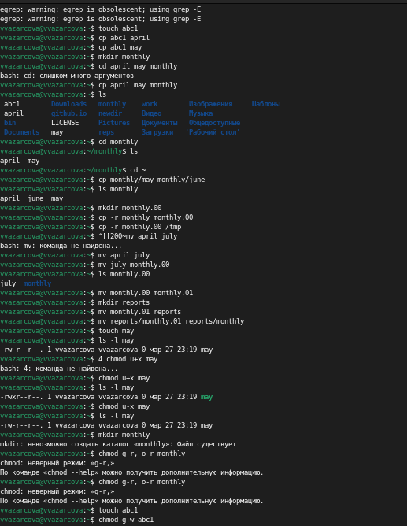
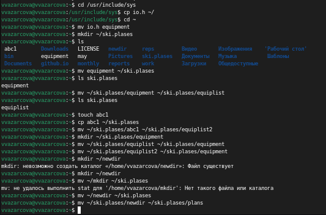
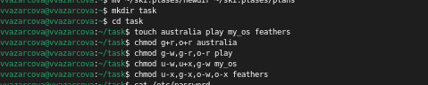
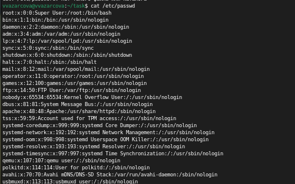
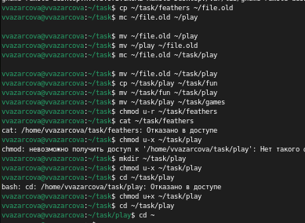
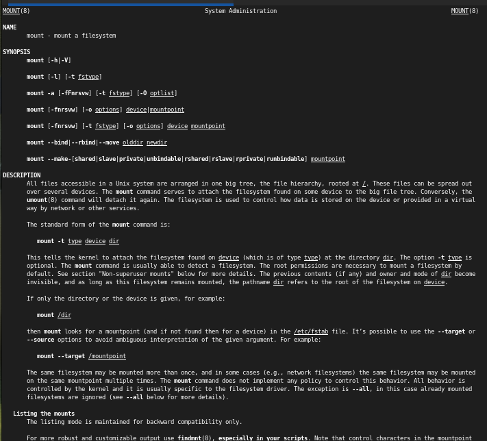
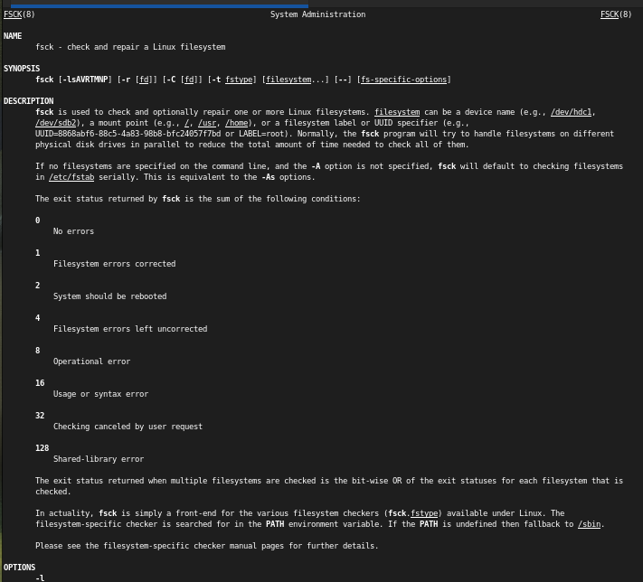
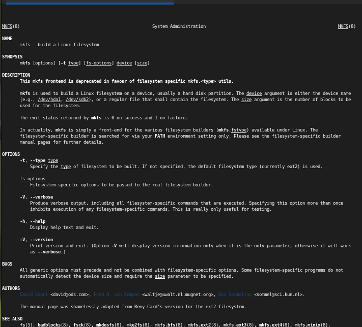
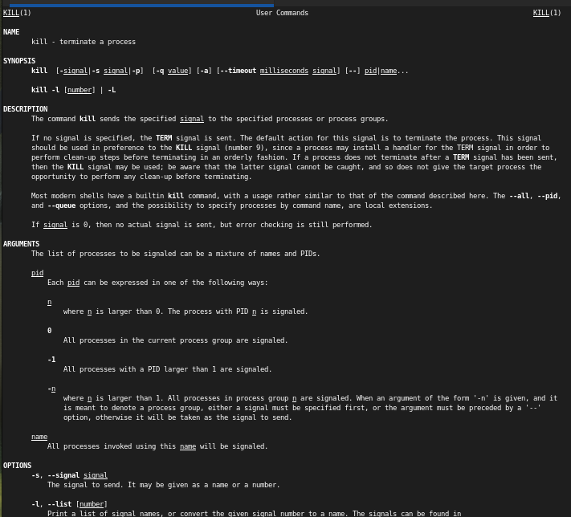

---
## Front matter
lang: ru-RU
title: Лабораторная работа №7
subtitle: Дисциплина - Операционные Системы
author:
  - Азарцова В. В.
institute:
  - Российский университет дружбы народов, Москва, Россия
  - Преподаватель Кулябов Д. С.
date: 28 марта 2025

## i18n babel
babel-lang: russian
babel-otherlangs: english

## Formatting pdf
toc: false
toc-title: Содержание
slide_level: 2
aspectratio: 169
section-titles: true
theme: metropolis
header-includes:
 - \metroset{progressbar=frametitle,sectionpage=progressbar,numbering=fraction}
---

# Информация

## Докладчик

:::::::::::::: {.columns align=center}
::: {.column width="70%"}

  * Азарцова Вероника Валерьевна
  * НКАбд-01-24, студ. билет №1132246751
  * Российский университет дружбы народов
  * [1132246751@pfur.ru](mailto:1132246751@pfur.ru)
  * <https://github.com/vvazarcova>

:::
::::::::::::::

## Цели работы

Целью данной лабораторной работы было ознакомление с файловой системой Linux, её структурой, именами и содержанием каталогов. Приобретение практических навыков по применению команд для работы с файлами и каталогами, по управлению процессами (и работами), по проверке использования диска и обслуживанию файловой системы.

## Задачи

Задачи лабораторной работы: 

1. Выполнить все примеры в первой части лабораторной работы
2. Выполнить действия по копированию и перемещению файлов
3. Определить опции команды chmod для присваивания прав доступа
4. Проделать дополнительные упражнения
5. Ответить на контрольные вопросы

# Теоретическое введение

## Краткое описание команд

Краткое описание команд, нужных для выполнения лабораторной работы:

- man:  Просмотр руководства по основным командам Linux
- cd: Перемещение по файловой системе
- ls: Просмотр содержимого каталога
- mkdir: Создание каталогов
- rm: Удаление файлов (или каталогов, с параметрами)
- cp: Копирование файлов или каталогов
- chmod: Установка прав доступа к файлу или каталогу

## Анализ файловой системы

Файловая система в Linux состоит из фалов и каталогов. Каждому физическому носителю соответствует своя файловая система.  
Существует несколько типов файловых систем. Перечислим наиболее часто встречающиеся типы:

- ext2fs (second extended filesystem);
- ext2fs (third extended file system);
- ext4 (fourth extended file system);
- ReiserFS;
- xfs;
- fat (file allocation table);
- ntfs (new technology file system).

Для просмотра используемых в операционной системе файловых систем можно воспользоваться командой mount без параметров.

## Права доступа

Каждый файл или каталог имеет права доступа.
В сведениях о файле или каталоге указываются:
- тип файла (символ (-) обозначает файл, а символ (d) — каталог);
- права для владельца файла (r — разрешено чтение, w — разрешена запись, x — разрешено выполнение, - — право доступа отсутствует);
- права для членов группы (r — разрешено чтение, w — разрешена запись, x — разрешено выполнение, - — право доступа отсутствует);
- права для всех остальных (r — разрешено чтение, w — разрешена запись, x — разрешено выполнение, - — право доступа отсутствует).

## Изменение прав доступа

Права доступа к файлу или каталогу можно изменить, воспользовавшись командой chmod. Сделать это может владелец файла (или каталога) или пользователь с правами администратора.  
Режим (в формате команды) имеет следующие компоненты структуры и способ записи:

* = установить право
* - лишить права
* + дать право
* r чтение
* w запись
* x выполнение
* u (user) владелец файла
* g (group) группа, к которой принадлежит владелец файла
* o (others) все остальные

В работе с правами доступа можно использовать их цифровую запись (восьмеричное значение) вместо символьной.

# Выполнение лабораторной работы

1. Выполняю все примеры, приведённые в первой части описания лабораторной работы 

{#fig:1 width=70%}

## Выполнение лабораторной работы

2. Выполняю действия, приведенные в последовательности выполнения лабораторной работы:

- Скопируйте файл /usr/include/sys/io.h в домашний каталог и назовите его equipment. Если файла io.h нет, то используйте любой другой файл в каталоге /usr/include/sys/ вместо него.
- В домашнем каталоге создайте директорию ~/ski.plases.
- Переместите файл equipment в каталог ~/ski.plases.
- Переименуйте файл ~/ski.plases/equipment в ~/ski.plases/equiplist.
- Создайте в домашнем каталоге файл abc1 и скопируйте его в каталог ~/ski.plases, назовите его equiplist2.
- Создайте каталог с именем equipment в каталоге ~/ski.plases.
- Переместите файлы ~/ski.plases/equiplist и equiplist2 в каталог ~/ski.plases/equipment.
- Создайте и переместите каталог ~/newdir в каталог ~/ski.plases и назовите его plans 

## Выполнение лабораторной работы

{#fig:2 width=70%}

## Выполнение лабораторной работы

3. Определяю опции команды chmod, необходимые для того, чтобы присвоить перечисленным ниже файлам выделенные права доступа, считая, что в начале таких прав нет: australia, play, my_os, feathers.  
Сначала создаю нужные файлы 

{#fig:3 width=70%}

## Выполнение лабораторной работы

4. Проделываю приведённые ниже упражнения: 

- Просмотрите содержимое файла /etc/password 

{#fig:4 width=70%}

## Выполнение лабораторной работы

- Скопируйте файл ~/feathers в файл ~/file.old.
- Переместите файл ~/file.old в каталог ~/play.
- Скопируйте каталог ~/play в каталог ~/fun.
- Переместите каталог ~/fun в каталог ~/play и назовите его games.
- Лишите владельца файла ~/feathers права на чтение.
- Что произойдёт, если вы попытаетесь просмотреть файл ~/feathers командой cat?
- Что произойдёт, если вы попытаетесь скопировать файл ~/feathers?
- Дайте владельцу файла ~/feathers право на чтение.
- Лишите владельца каталога ~/play права на выполнение.
- Перейдите в каталог ~/play. Что произошло?
- Дайте владельцу каталога ~/play право на выполнение

## Выполнение лабораторной работы

{#fig:5 width=70%}

## Выполнение лабораторной работы

5. Прочитываю man по некоторым командам:

- mount 
{#fig:6 width=70%}

## Выполнение лабораторной работы

- fsck 

{#fig:7 width=70%}

## Выполнение лабораторной работы

- mkfs 

{#fig:8 width=70%}

## Выполнение лабораторной работы

- kill 

{#fig:9 width=70%}

# Выводы

Подводя итоги проведенной лабораторной работе, мне удалось:

- Ознакомиться с файловой системой Linux, её структурой, именами и содержанием каталогов. 
- Приобрести практические навыки по: 
 1. Применению команд для работы с файлами и каталогами
 2. Управлению процессами (и работами)
 3. Проверке использования диска и обслуживанию файловой системы

## Итоговый слайд

Если вам понравилось - посмотрите остальные мои презентации!

