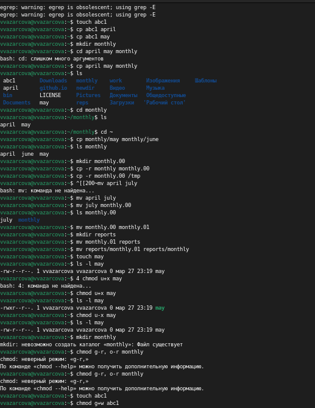
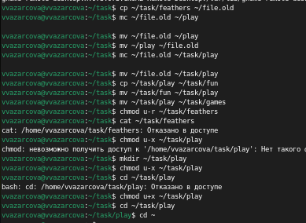

---
## Front matter
title: "Отчёт по лабораторной работе №7"
subtitle: "Дисциплина: Операционные Системы"
author: "Азарцова Вероника Валерьевна"

## Generic otions
lang: ru-RU
toc-title: "Содержание"

## Bibliography
bibliography: bib/cite.bib
csl: pandoc/csl/gost-r-7-0-5-2008-numeric.csl

## Pdf output format
toc: true # Table of contents
toc-depth: 2
lof: true # List of figures
lot: true # List of tables
fontsize: 12pt
linestretch: 1.5
papersize: a4
documentclass: scrreprt
## I18n polyglossia
polyglossia-lang:
  name: russian
  options:
	- spelling=modern
	- babelshorthands=true
polyglossia-otherlangs:
  name: english
## I18n babel
babel-lang: russian
babel-otherlangs: english
## Fonts
mainfont: IBM Plex Serif
romanfont: IBM Plex Serif
sansfont: IBM Plex Sans
monofont: IBM Plex Mono
mathfont: STIX Two Math
mainfontoptions: Ligatures=Common,Ligatures=TeX,Scale=0.94
romanfontoptions: Ligatures=Common,Ligatures=TeX,Scale=0.94
sansfontoptions: Ligatures=Common,Ligatures=TeX,Scale=MatchLowercase,Scale=0.94
monofontoptions: Scale=MatchLowercase,Scale=0.94,FakeStretch=0.9
mathfontoptions:
## Biblatex
biblatex: true
biblio-style: "gost-numeric"
biblatexoptions:
  - parentracker=true
  - backend=biber
  - hyperref=auto
  - language=auto
  - autolang=other*
  - citestyle=gost-numeric
## Pandoc-crossref LaTeX customization
figureTitle: "Рис."
tableTitle: "Таблица"
listingTitle: "Листинг"
lofTitle: "Список иллюстраций"
lotTitle: "Список таблиц"
lolTitle: "Листинги"
## Misc options
indent: true
header-includes:
  - \usepackage{indentfirst}
  - \usepackage{float} # keep figures where there are in the text
  - \floatplacement{figure}{H} # keep figures where there are in the text
---

# Цель работы

Цель данной работы - ознакомление с файловой системой Linux, её структурой, именами и содержанием каталогов. Приобретение практических навыков по применению команд для работы с файлами и каталогами, по управлению процессами (и работами), по проверке использования диска и обслуживанию файловой системы.

# Задание

1. Выполнить все примеры в первой части лабораторной работы
2. Выполнить действия по копированию и перемещению файлов
3. Определить опции команды chmod для присваивания прав доступа
4. Проделать дополнительные упражнения
5. Ответить на контрольные вопросы

# Теоретическое введение

## Краткое описание команд

Краткое описание команд, нужных для выполнения лабораторной работы:

- man:  Просмотр руководства по основным командам Linux
- cd: Перемещение по файловой системе
- ls: Просмотр содержимого каталога
- mkdir: Создание каталогов
- rm: Удаление файлов (или каталогов, с параметрами)
- cp: Копирование файлов или каталогов
- chmod: Установка прав доступа к файлу или каталогу

## Анализ файловой системы

Файловая система в Linux состоит из фалов и каталогов. Каждому физическому носителю соответствует своя файловая система.  
Существует несколько типов файловых систем. Перечислим наиболее часто встречающиеся типы:

- ext2fs (second extended filesystem);
- ext2fs (third extended file system);
- ext4 (fourth extended file system);
- ReiserFS;
- xfs;
- fat (file allocation table);
- ntfs (new technology file system).

Для просмотра используемых в операционной системе файловых систем можно воспользоваться командой mount без параметров.

## Права доступа

Каждый файл или каталог имеет права доступа.
В сведениях о файле или каталоге указываются:
- тип файла (символ (-) обозначает файл, а символ (d) — каталог);
- права для владельца файла (r — разрешено чтение, w — разрешена запись, x — разрешено выполнение, - — право доступа отсутствует);
- права для членов группы (r — разрешено чтение, w — разрешена запись, x — разрешено выполнение, - — право доступа отсутствует);
- права для всех остальных (r — разрешено чтение, w — разрешена запись, x — разрешено выполнение, - — право доступа отсутствует).

## Изменение прав доступа

Права доступа к файлу или каталогу можно изменить, воспользовавшись командой chmod. Сделать это может владелец файла (или каталога) или пользователь с правами администратора.  
Режим (в формате команды) имеет следующие компоненты структуры и способ записи:

* = установить право
* - лишить права
* + дать право
* r чтение
* w запись
* x выполнение
* u (user) владелец файла
* g (group) группа, к которой принадлежит владелец файла
* o (others) все остальные

В работе с правами доступа можно использовать их цифровую запись (восьмеричное значение) вместо символьной.

# Выполнение лабораторной работы

1. Выполняю все примеры, приведённые в первой части описания лабораторной работы (рис. [-@fig:1]).

{#fig:1 width=70%}

2. Выполняю действия, приведенные в последовательности выполнения лабораторной работы:

- Скопируйте файл /usr/include/sys/io.h в домашний каталог и назовите его equipment. Если файла io.h нет, то используйте любой другой файл в каталоге /usr/include/sys/ вместо него.
- В домашнем каталоге создайте директорию ~/ski.plases.
- Переместите файл equipment в каталог ~/ski.plases.
- Переименуйте файл ~/ski.plases/equipment в ~/ski.plases/equiplist.
- Создайте в домашнем каталоге файл abc1 и скопируйте его в каталог ~/ski.plases, назовите его equiplist2.
- Создайте каталог с именем equipment в каталоге ~/ski.plases.
- Переместите файлы ~/ski.plases/equiplist и equiplist2 в каталог ~/ski.plases/equipment.
- Создайте и переместите каталог ~/newdir в каталог ~/ski.plases и назовите его plans (рис. [-@fig:2]).

{#fig:2 width=70%}

3. Определяю опции команды chmod, необходимые для того, чтобы присвоить перечисленным ниже файлам выделенные права доступа, считая, что в начале таких прав нет: australia, play, my_os, feathers.  
Сначала создаю нужные файлы (рис. [-@fig:3]).

{#fig:3 width=70%}

4. Проделываю приведённые ниже упражнения: 

- Просмотрите содержимое файла /etc/password (рис. [-@fig:4])

{#fig:4 width=70%}

- Скопируйте файл ~/feathers в файл ~/file.old.
- Переместите файл ~/file.old в каталог ~/play.
- Скопируйте каталог ~/play в каталог ~/fun.
- Переместите каталог ~/fun в каталог ~/play и назовите его games.
- Лишите владельца файла ~/feathers права на чтение.
- Что произойдёт, если вы попытаетесь просмотреть файл ~/feathers командой cat?
- Что произойдёт, если вы попытаетесь скопировать файл ~/feathers?
- Дайте владельцу файла ~/feathers право на чтение.
- Лишите владельца каталога ~/play права на выполнение.
- Перейдите в каталог ~/play. Что произошло?
- Дайте владельцу каталога ~/play право на выполнение (рис. [-@fig:5]).

{#fig:5 width=70%}

5. Прочитываю man по некоторым командам:

- mount (рис. [-@fig:6]).

{#fig:6 width=70%}

- fsck (рис. [-@fig:7]).

{#fig:7 width=70%}

- mkfs (рис. [-@fig:8]).

{#fig:8 width=70%}

- kill (рис. [-@fig:9]).

{#fig:9 width=70%}

# Контрольные вопросы

1. Дайте характеристику каждой файловой системе, существующей на жёстком диске компьютера, на котором вы выполняли лабораторную работу.
Ext2, Ext3, Ext4 или Extended Filesystem - это стандартная файловая система для Linux. Она была разработана еще для Minix. Она самая стабильная из всех существующих, кодовая база изменяется очень редко и эта файловая система содержит больше всего функций. Версия ext2 была разработана уже именно для Linux и получила много улучшений. В 2001 году вышла ext3, которая добавила еще больше стабильности благодаря использованию журналирования. В 2006 была выпущена версия ext4, которая используется во всех дистрибутивах Linux до сегодняшнего дня. В ней было внесено много улучшений, в том числе увеличен максимальный размер раздела до одного экзабайта.

NTFS — это файловая система по умолчанию, используемая операционными системами на базе Windows NT, начиная с 1993 года с Windows NT 3.1 и вплоть до Windows 11 включительно. Она предлагает расширенные функции, такие как права доступа к файлам, шифрование, сжатие и ведение журнала.

2. Приведите общую структуру файловой системы и дайте характеристику каждой директории первого уровня этой структуры.

/ — root каталог. Содержит в себе всю иерархию системы;  

/bin — здесь находятся двоичные исполняемые файлы. Основные общие команды, хранящиеся отдельно от других программ в системе (прим.: pwd, ls, cat, ps);  

/boot — тут расположены файлы, используемые для загрузки системы (образ initrd, ядро vmlinuz);  

/dev — в данной директории располагаются файлы устройств (драйверов). С помощью этих файлов можно взаимодействовать с устройствами. К примеру, если это жесткий диск, можно подключить его к файловой системе. В файл принтера же можно написать напрямую и отправить задание на печать;  

/etc — в этой директории находятся файлы конфигураций программ. Эти файлы позволяют настраивать системы, сервисы, скрипты системных демонов;  

/home — каталог, аналогичный каталогу Users в Windows. Содержит домашние каталоги учетных записей пользователей (кроме root). При создании нового пользователя здесь создается одноименный каталог с аналогичным именем и хранит личные файлы этого пользователя;  

/lib — содержит системные библиотеки, с которыми работают программы и модули ядра;  

/lost+found — содержит файлы, восстановленные после сбоя работы системы. Система проведет проверку после сбоя и найденные файлы можно будет посмотреть в данном каталоге;  

/media — точка монтирования внешних носителей. Например, когда вы вставляете диск в дисковод, он будет автоматически смонтирован в директорию /media/cdrom;  

/mnt — точка временного монтирования. Файловые системы подключаемых устройств обычно монтируются в этот каталог для временного использования;  

/opt — тут расположены дополнительные (необязательные) приложения. Такие программы обычно не подчиняются принятой иерархии и хранят свои файлы в одном подкаталоге (бинарные, библиотеки, конфигурации);  

/proc — содержит файлы, хранящие информацию о запущенных процессах и о состоянии ядра ОС;  

/root — директория, которая содержит файлы и личные настройки суперпользователя;  

/run — содержит файлы состояния приложений. Например, PID-файлы или UNIX-сокеты;  

/sbin — аналогично /bin содержит бинарные файлы. Утилиты нужны для настройки и администрирования системы суперпользователем;  

/srv — содержит файлы сервисов, предоставляемых сервером (прим. FTP или Apache HTTP);  

/sys — содержит данные непосредственно о системе. Тут можно узнать информацию о ядре, драйверах и устройствах;  

/tmp — содержит временные файлы. Данные файлы доступны всем пользователям на чтение и запись. Стоит отметить, что данный каталог очищается при перезагрузке;  

/usr — содержит пользовательские приложения и утилиты второго уровня, используемые пользователями, а не системой. Содержимое доступно только для чтения (кроме root). Каталог имеет вторичную иерархию и похож на корневой;  

/var — содержит переменные файлы. Имеет подкаталоги, отвечающие за отдельные переменные. Например, логи будут храниться в /var/log, кэш в /var/cache, очереди заданий в /var/spool/ и так далее.  

3. Какая операция должна быть выполнена, чтобы содержимое некоторой файловой системы было доступно операционной системе? Монтирование тома.  

4. Назовите основные причины нарушения целостности файловой системы. Как устранить повреждения файловой системы? Отсутствие синхронизации между образом файловой системы в памяти и ее данными на диске в случае аварийного останова может привести к появлению следующих ошибок:  

- Один блок адресуется несколькими mode (принадлежит нескольким файлам).

- Блок помечен как свободный, но в то же время занят (на него ссылается onode).

- Блок помечен как занятый, но в то же время свободен (ни один inode на него не ссылается).

- Неправильное число ссылок в inode (недостаток или избыток ссылающихся записей в каталогах).

- Несовпадение между размером файла и суммарным размером адресуемых inode блоков.

- Недопустимые адресуемые блоки (например, расположенные за пределами файловой системы).

- "Потерянные" файлы (правильные inode, на которые не ссылаются записи каталогов).

- Недопустимые или неразмещенные номера inode в записях каталогов.

5. Как создаётся файловая система?

mkfs - позволяет создать файловую систему Linux.

6. Дайте характеристику командам для просмотра текстовых файлов.

Cat - выводит содержимое файла на стандартное устройство вывода

7. Приведите основные возможности команды cp в Linux.

Cp – копирует или перемещает директорию, файлы.

8. Приведите основные возможности команды mv в Linux.

Mv - переименовать или переместить файл или директорию

9. Что такое права доступа? Как они могут быть изменены?

Права доступа к файлу или каталогу можно изменить, воспользовавшись командой chmod. Сделать это может владелец файла (или каталога) или пользователь с правами администратора.

# Выводы

Подводя итоги проведенной лабораторной работе, я приобрела практические навыки по применению команд для работы с файлами и каталогами, по управлению процессами (и работами), по проверке использования диска и обслуживанию файловой системы и ознакомилась с файловой системой Linux, её структурой, именами и содержанием каталогов. 

# Список литературы{.unnumbered}

::: {#refs}
:::
1. GDB: The GNU Project Debugger. — URL: https://www.gnu.org/software/gdb/.
2. GNU Bash Manual. — 2016. — URL: https://www.gnu.org/software/bash/manual/.
3. Midnight Commander Development Center. — 2021. — URL: https://midnight-commander.org/.
4. NASM Assembly Language Tutorials. — 2021. — URL: https://asmtutor.com/.
5. Newham C. Learning the bash Shell: Unix Shell Programming. — O’Reilly Media, 2005. —354 с. — (In a Nutshell). — ISBN 0596009658. — URL: http://www.amazon.com/Learningbash-Shell-Programming-Nutshell/dp/0596009658.
6. Robbins A. Bash Pocket Reference. — O’Reilly Media, 2016. — 156 с. — ISBN 978-1491941591.
7. The NASM documentation. — 2021. — URL: https://www.nasm.us/docs.php.
8. Zarrelli G. Mastering Bash. — Packt Publishing, 2017. — 502 с. — ISBN 9781784396879.
9. Колдаев В. Д., Лупин С. А. Архитектура ЭВМ. — М. : Форум, 2018.
