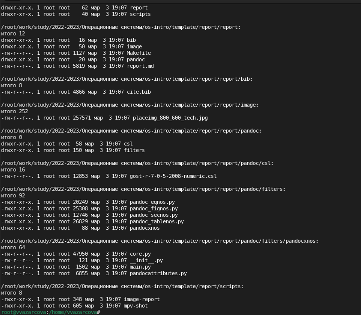
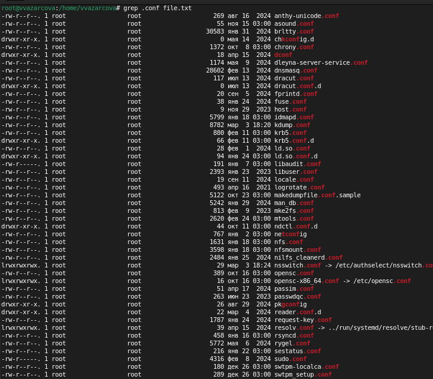
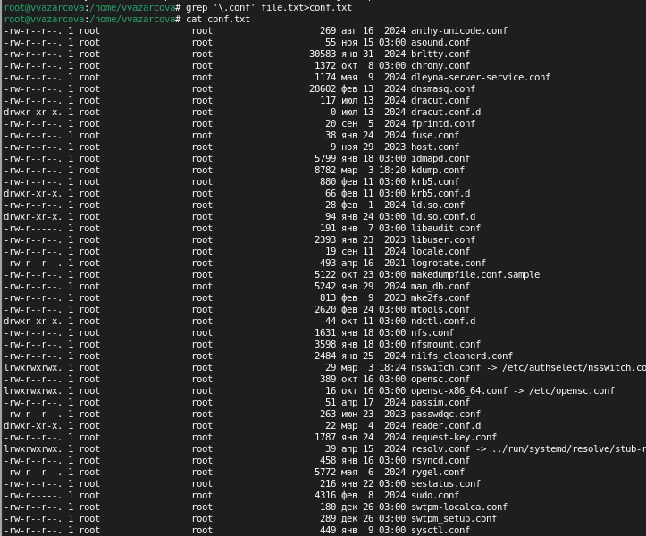
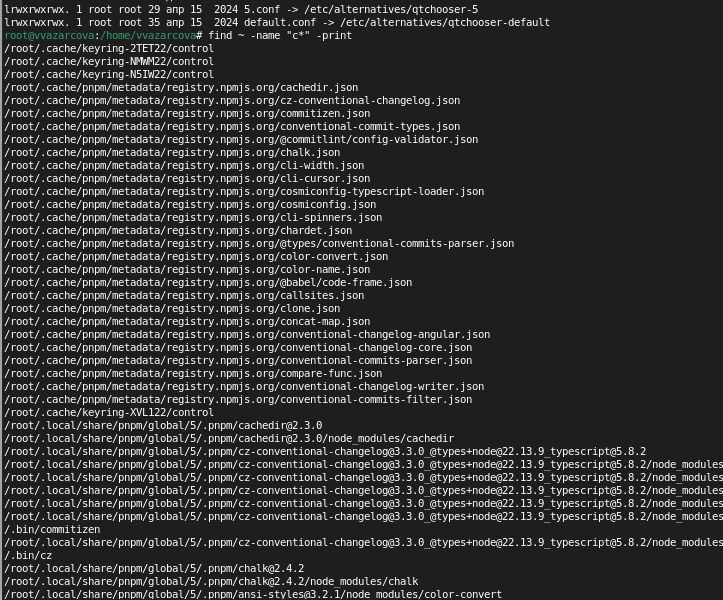
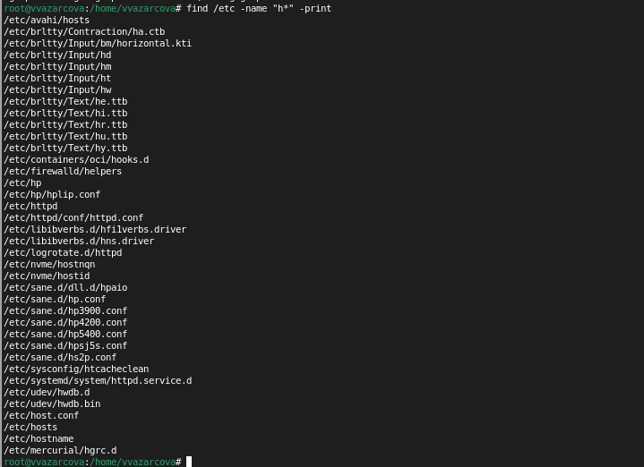
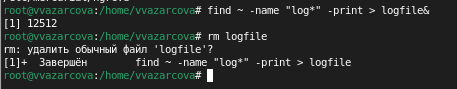
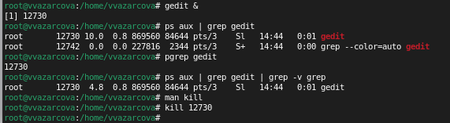
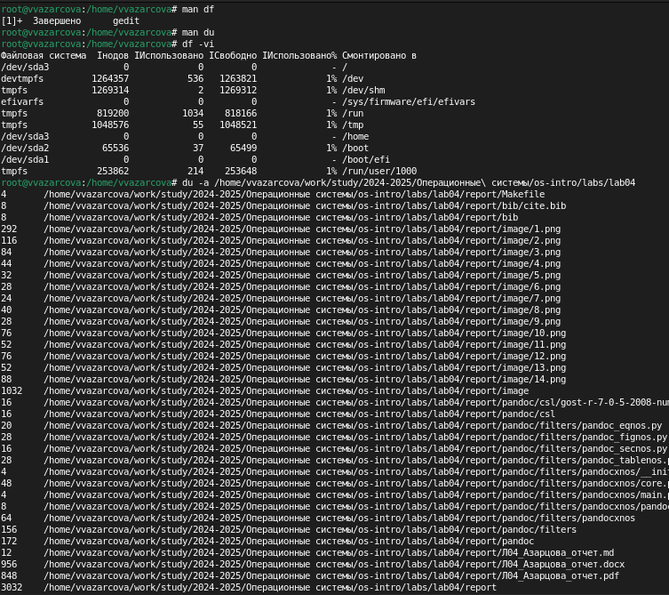
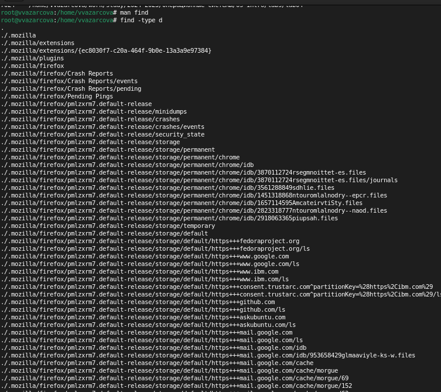

---
## Front matter
lang: ru-RU
title: Лабораторная работа №8
subtitle: Дисциплина - Операционные Системы
author:
  - Азарцова В. В.
institute:
  - Российский университет дружбы народов, Москва, Россия
  - Преподаватель Кулябов Д. С.
date: 15 марта 2025

## i18n babel
babel-lang: russian
babel-otherlangs: english

## Formatting pdf
toc: false
toc-title: Содержание
slide_level: 2
aspectratio: 169
section-titles: true
theme: metropolis
header-includes:
 - \metroset{progressbar=frametitle,sectionpage=progressbar,numbering=fraction}
---

# Информация

## Докладчик

:::::::::::::: {.columns align=center}
::: {.column width="70%"}

  * Азарцова Вероника Валерьевна
  * НКАбд-01-24, студ. билет №1132246751
  * Российский университет дружбы народов
  * [1132246751@pfur.ru](mailto:1132246751@pfur.ru)
  * <https://github.com/vvazarcova>

:::
::::::::::::::

## Цели работы

Целью данной лабораторной работы было ознакомление с инструментами поиска файлов и фильтрации текстовых данных, приобретение практических навыков: по управлению процессами (и заданиями), по проверке использования диска и обслуживанию файловых систем.

## Задачи

Задачи лабораторной работы: 

1. Ознакомиться с теоретическим введением
2. Выполнить лабораторную работу
3. Ответить на контрольные вопросы

## Теоретическое введение

В системе по умолчанию открыто три специальных потока:

- stdin — стандартный поток ввода (по умолчанию: клавиатура), файловый дескриптор 0;
- stdout — стандартный поток вывода (по умолчанию: консоль), файловый дескриптор 1;
- stderr — стандартный поток вывод сообщений об ошибках (по умолчанию: консоль), файловый дескриптор 2.

## Теоретическое введение

Большинство используемых в консоли команд и программ записывают результаты своей работы в стандартный поток вывода stdout. Например, команда ls выводит в стандартный поток вывода (консоль) список файлов в текущей директории. Потоки вывода и ввода можно перенаправлять на другие файлы или устройства. Проще всего это делается с помощью символов >, >>, <, <<.   

## Теоретическое введение

Любой команде, выполняемой в системе, присваивается идентификатор процесса (process ID). Получить информацию о процессе и управлять им, пользуясь идентификатором процесса, можно из любого окна командного интерпретатора.

# Выполнение лабораторной работы

## Выполнение лабораторной работы

1. Осуществите вход в систему, используя соответствующее имя пользователя. 

2. Запишите в файл file.txt названия файлов, содержащихся в каталоге /etc. Допишите в этот же файл названия файлов, содержащихся в вашем домашнем каталоге.

{#fig:1 width=70%}

## Выполнение лабораторной работы

3. Выведите имена всех файлов из file.txt, имеющих расширение .conf, после чего запишите их в новый текстовой файл conf.txt.

{#fig:2 width=70%}

## Выполнение лабораторной работы

{#fig:3 width=70%}

## Выполнение лабораторной работы

4. Определите, какие файлы в вашем домашнем каталоге имеют имена, начинавшиеся с символа c.

{#fig:4 width=70%}

## Выполнение лабораторной работы

5. Выведите на экран (по странично) имена файлов из каталога /etc, начинающиеся с символа h.

{#fig:5 width=70%}

## Выполнение лабораторной работы

6. Запустите в фоновом режиме процесс, который будет записывать в файл ~/logfile файлы, имена которых начинаются с log;

7. Удалите файл ~/logfile.

{#fig:6 width=70%}

## Выполнение лабораторной работы

8. Запустите из консоли в фоновом режиме редактор gedit;

9. Определите идентификатор процесса gedit, используя команду ps, конвейер и фильтр grep;

10. Прочтите справку (man) команды kill, после чего используйте её для завершения процесса gedit.

{#fig:7 width=70%}

## Выполнение лабораторной работы

11. Выполните команды df и du, предварительно получив более подробную информацию об этих командах, с помощью команды man.

{#fig:8 width=70%}

## Выполнение лабораторной работы

12. Воспользовавшись справкой команды find, выведите имена всех директорий, имеющихся в вашем домашнем каталоге.

{#fig:9 width=70%}

# Выводы

Подводя итоги проведенной лабораторной работе, я ознакомилась с инструментами поиска файлов и фильтрации текстовых данных и приобрела практические навыки по управлению процессами (и заданиями), по проверке использования диска и обслуживанию файловых систем.

## Итоговый слайд

Если вам понравилось - посмотрите остальные мои презентации!

