---
## Front matter
lang: ru-RU
title: Лабораторная работа №9
subtitle: Дисциплина - Операционные Системы
author:
  - Азарцова В. В.
institute:
  - Российский университет дружбы народов, Москва, Россия
  - Преподаватель Кулябов Д. С.
date: 15 марта 2025

## i18n babel
babel-lang: russian
babel-otherlangs: english

## Formatting pdf
toc: false
toc-title: Содержание
slide_level: 2
aspectratio: 169
section-titles: true
theme: metropolis
header-includes:
 - \metroset{progressbar=frametitle,sectionpage=progressbar,numbering=fraction}
---

# Информация

## Докладчик

:::::::::::::: {.columns align=center}
::: {.column width="70%"}

  * Азарцова Вероника Валерьевна
  * НКАбд-01-24, студ. билет №1132246751
  * Российский университет дружбы народов
  * [1132246751@pfur.ru](mailto:1132246751@pfur.ru)
  * <https://github.com/vvazarcova>

:::
::::::::::::::

## Цели работы

Целью данной лабораторной работы было освоение основных возможностей командной оболочки Midnight Commander, приобретение навыков практической работы по просмотру каталогов и файлов и манипуляций с ними.

## Задачи

1. Изучить теоретическое введение
2. Выполнить задание по MC
3. Выполнить задание по встроенному редактору MC

## Теоретическое введение

Командная оболочка — интерфейс взаимодействия пользователя с операционной системой и программным обеспечением посредством команд.  
Midnight Commander (или mc) — псевдографическая командная оболочка для UNIX/Linux систем. Для запуска mc необходимо в командной строке набрать mc и нажать Enter. Рабочее пространство mc имеет две панели, отображающие по умолчанию списки файлов двух каталогов.

# Выполнение лабораторной работы

1. Изучите информацию о mc, вызвав в командной строке man mc

{#fig:1 width=70%}

## Выполнение лабораторной работы

2. Запустите из командной строки mc, изучите его структуру и меню

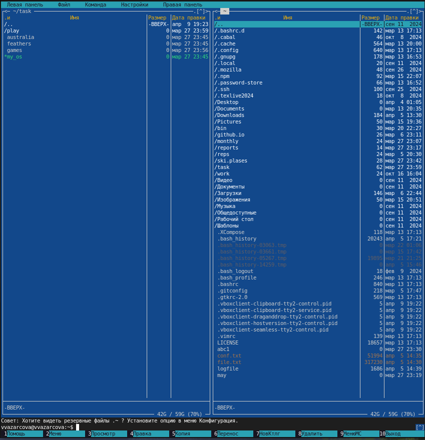{#fig:2 width=70%}

## Выполнение лабораторной работы

3. Выполните несколько операций в mc, используя управляющие клавиши (операции с панелями; выделение/отмена выделения файлов, копирование/перемещение файлов, получение информации о размере и правах доступа на файлы и/или каталоги и т.п.)

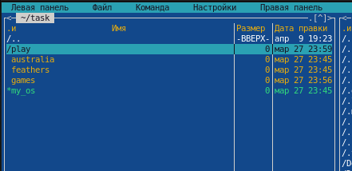{#fig:3 width=70%}

## Выполнение лабораторной работы

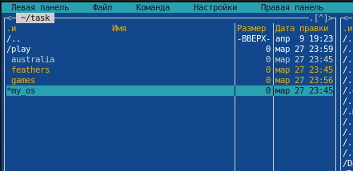{#fig:4 width=70%}

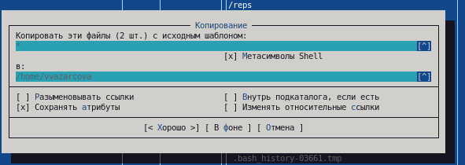{#fig:5 width=70%}

## Выполнение лабораторной работы

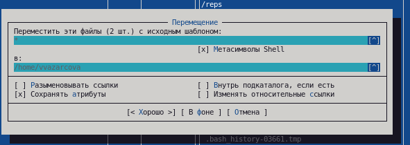{#fig:6 width=70%}

## Выполнение лабораторной работы

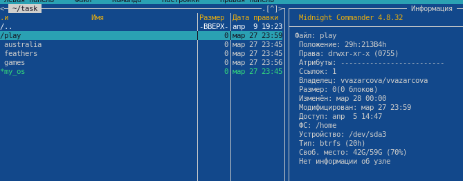{#fig:7 width=70%}

4. Выполните основные команды меню левой (или правой) панели. Оцените степень подробности вывода информации о файлах 

5. Используя возможности подменю Файл, выполните:

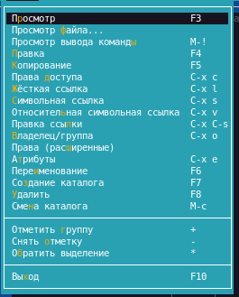{#fig:8 width=70%}

## Выполнение лабораторной работы

- просмотр содержимого текстового файла;

- редактирование содержимого текстового файла (без сохранения результатов
редактирования) 

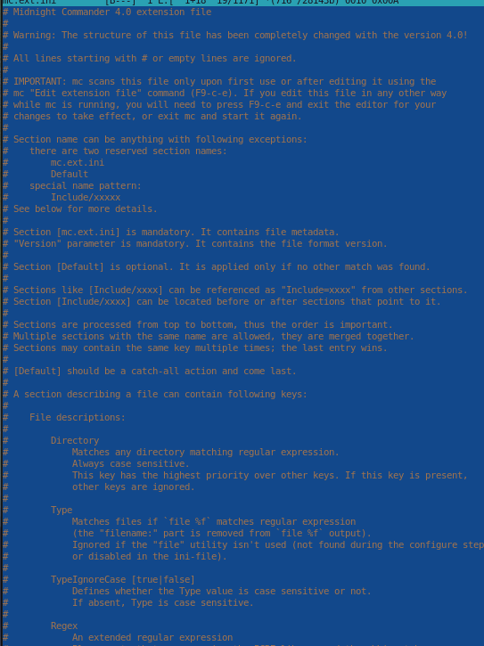{#fig:9 width=70%}

## Выполнение лабораторной работы

- создание каталога;

- копирование файлов в созданный каталог 

{#fig:10 width=70%}

## Выполнение лабораторной работы

6. С помощью соответствующих средств подменю Команда осуществите:

- поиск в файловой системе файла с заданными условиями (например, файла с расширением .c или .cpp, содержащего строку main)

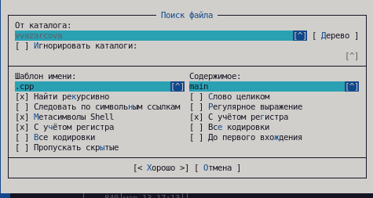{#fig:11 width=70%}

## Выполнение лабораторной работы

- выбор и повторение одной из предыдущих команд 

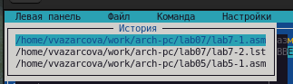{#fig:12 width=70%}

## Выполнение лабораторной работы

- переход в домашний каталог 

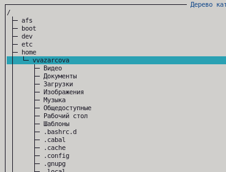{#fig:13 width=70%}

## Выполнение лабораторной работы

- анализ файла меню и файла расширений

## Выполнение лабораторной работы

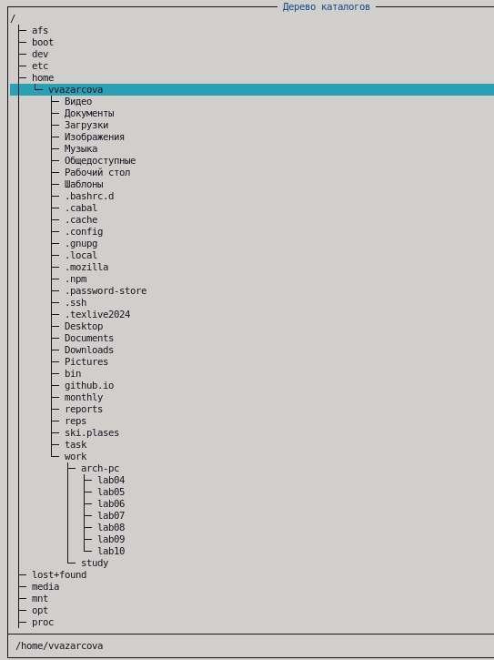{#fig:14 width=70%}

## Выполнение лабораторной работы

{#fig:15 width=70%}

## Выполнение лабораторной работы

7. Вызовите подменю Настройки. Освойте операции, определяющие структуру экрана mc (Full screen, Double Width, Show Hidden Files и т.д.)

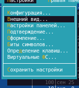{#fig:16 width=70%}

## Задание по встроенному редактору MC

1. Создайте текстовой файл text.txt

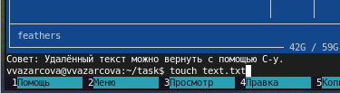{#fig:17 width=70%}

## Выполнение лабораторной работы

2. Откройте этот файл с помощью встроенного в mc редактора.

3. Вставьте в открытый файл небольшой фрагмент текста, скопированный из любого другого файла или Интернета

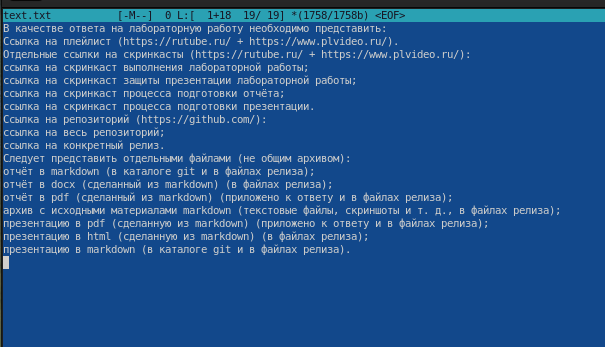{#fig:18 width=70%}

## Выполнение лабораторной работы

4. Проделайте с текстом следующие манипуляции, используя горячие клавиши:

- Удалите строку текста.

- Выделите фрагмент текста и скопируйте его на новую строку.

- Выделите фрагмент текста и перенесите его на новую строку.

- Сохраните файл.

- Отмените последнее действие.

- Перейдите в конец файла (нажав комбинацию клавиш) и напишите некоторый текст.

- Перейдите в начало файла (нажав комбинацию клавиш) и напишите некоторый
текст.

- Сохраните и закройте файл.

## Выполнение лабораторной работы

5. Откройте файл с исходным текстом на некотором языке программирования (например C или Java) 

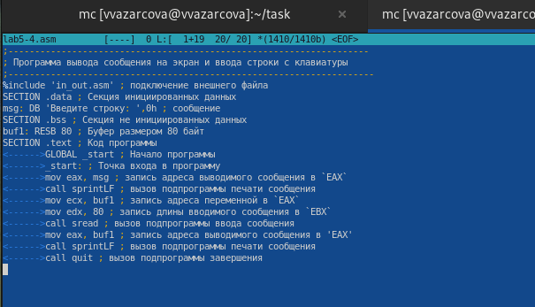{#fig:19 width=70%}

## Выполнение лабораторной работы

6. Используя меню редактора, включите подсветку синтаксиса, если она не включена, или выключите, если она включена 

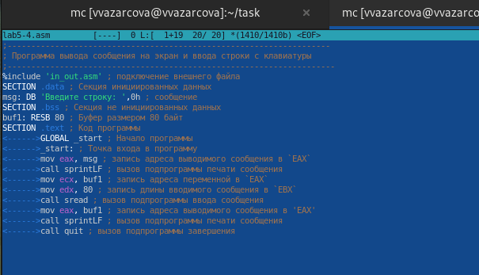{#fig:20 width=70%}

# Выводы

Мне удалось: 

- Освоить основные возможности командной оболочки Midnight Commander

- Приобрести навыки практической работы по просмотру каталогов и файлов и манипуляций с ними.

## Итоговый слайд

Если вам понравилось - посмотрите остальные мои презентации!

