---
## Front matter
title: "Отчёт по лабораторной работе №9"
subtitle: "Дисциплина: Операционные Системы"
author: "Азарцова Вероника Валерьевна"

## Generic otions
lang: ru-RU
toc-title: "Содержание"

## Bibliography
bibliography: bib/cite.bib
csl: pandoc/csl/gost-r-7-0-5-2008-numeric.csl

## Pdf output format
toc: true # Table of contents
toc-depth: 2
lof: true # List of figures
lot: true # List of tables
fontsize: 12pt
linestretch: 1.5
papersize: a4
documentclass: scrreprt
## I18n polyglossia
polyglossia-lang:
  name: russian
  options:
	- spelling=modern
	- babelshorthands=true
polyglossia-otherlangs:
  name: english
## I18n babel
babel-lang: russian
babel-otherlangs: english
## Fonts
mainfont: IBM Plex Serif
romanfont: IBM Plex Serif
sansfont: IBM Plex Sans
monofont: IBM Plex Mono
mathfont: STIX Two Math
mainfontoptions: Ligatures=Common,Ligatures=TeX,Scale=0.94
romanfontoptions: Ligatures=Common,Ligatures=TeX,Scale=0.94
sansfontoptions: Ligatures=Common,Ligatures=TeX,Scale=MatchLowercase,Scale=0.94
monofontoptions: Scale=MatchLowercase,Scale=0.94,FakeStretch=0.9
mathfontoptions:
## Biblatex
biblatex: true
biblio-style: "gost-numeric"
biblatexoptions:
  - parentracker=true
  - backend=biber
  - hyperref=auto
  - language=auto
  - autolang=other*
  - citestyle=gost-numeric
## Pandoc-crossref LaTeX customization
figureTitle: "Рис."
tableTitle: "Таблица"
listingTitle: "Листинг"
lofTitle: "Список иллюстраций"
lotTitle: "Список таблиц"
lolTitle: "Листинги"
## Misc options
indent: true
header-includes:
  - \usepackage{indentfirst}
  - \usepackage{float} # keep figures where there are in the text
  - \floatplacement{figure}{H} # keep figures where there are in the text
---

# Цель работы

Освоение основных возможностей командной оболочки Midnight Commander. Приобретение навыков практической работы по просмотру каталогов и файлов; манипуляций с ними.

# Задание

1. Изучить теоретическое введение
2. Выполнить задание по MC
3. Выполнить задание по встроенному редактору MC

# Теоретическое введение

Командная оболочка — интерфейс взаимодействия пользователя с операционной системой и программным обеспечением посредством команд.  
Midnight Commander (или mc) — псевдографическая командная оболочка для UNIX/Linux систем. Для запуска mc необходимо в командной строке набрать mc и нажать Enter. Рабочее пространство mc имеет две панели, отображающие по умолчанию списки файлов двух каталогов.

# Выполнение лабораторной работы

## Задание по MC

1. Изучите информацию о mc, вызвав в командной строке man mc (рис. [-@fig:1]).

{#fig:1 width=70%}

2. Запустите из командной строки mc, изучите его структуру и меню (рис. [-@fig:2]).

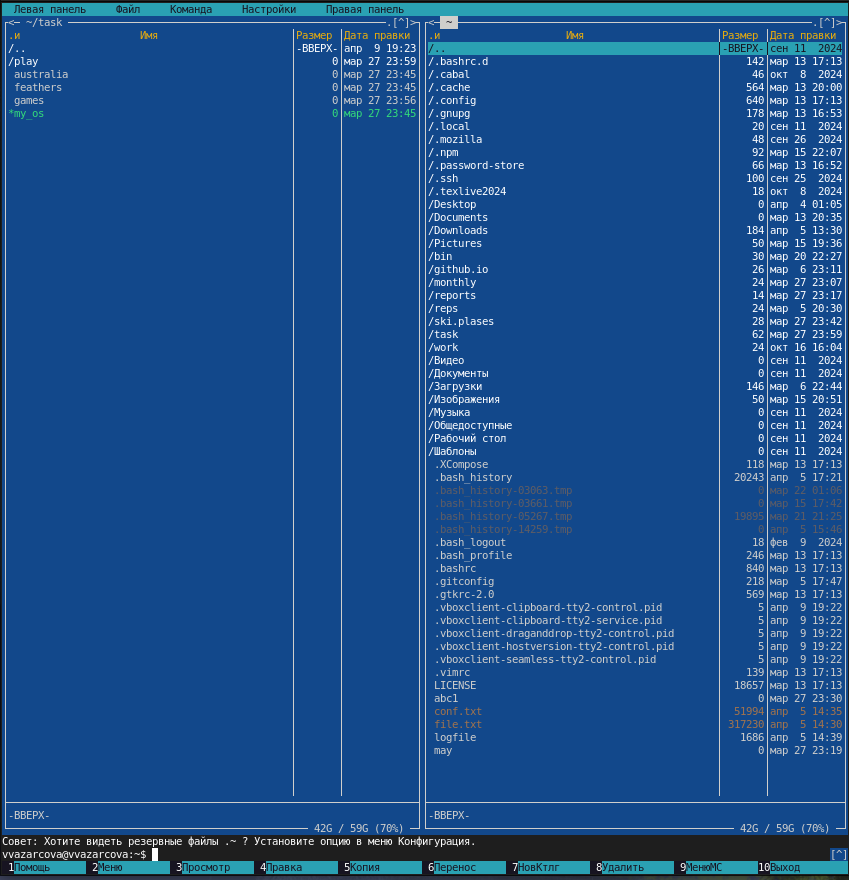{#fig:2 width=70%}

3. Выполните несколько операций в mc, используя управляющие клавиши (операции с панелями; выделение/отмена выделения файлов, копирование/перемещение файлов, получение информации о размере и правах доступа на файлы и/или каталоги и т.п.) (рис. [-@fig:3], рис. [-@fig:4], рис. [-@fig:5], рис. [-@fig:6], рис. [-@fig:7]).

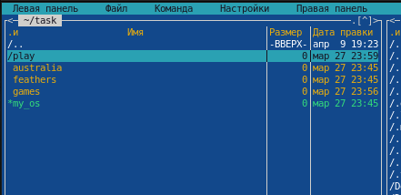{#fig:3 width=70%}

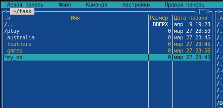{#fig:4 width=70%}

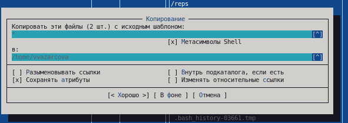{#fig:5 width=70%}

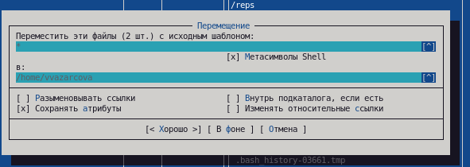{#fig:6 width=70%}

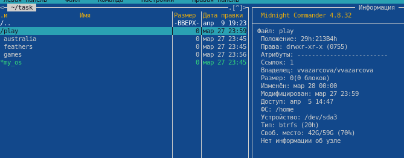{#fig:7 width=70%}

4. Выполните основные команды меню левой (или правой) панели. Оцените степень подробности вывода информации о файлах 

5. Используя возможности подменю Файл (рис. [-@fig:8]), выполните:

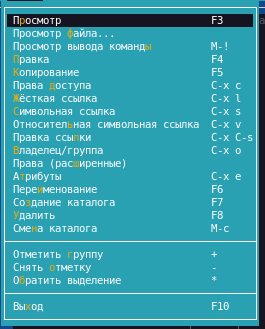{#fig:8 width=70%}

- просмотр содержимого текстового файла;

- редактирование содержимого текстового файла (без сохранения результатов
редактирования) (рис. [-@fig:9]).

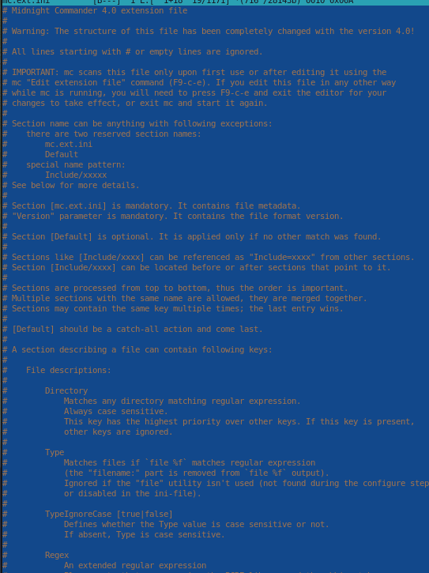{#fig:9 width=70%}

- создание каталога;

- копирование файлов в созданный каталог (рис. [-@fig:10]). 

{#fig:10 width=70%}

6. С помощью соответствующих средств подменю Команда осуществите:

- поиск в файловой системе файла с заданными условиями (например, файла с расширением .c или .cpp, содержащего строку main) (рис. [-@fig:11]).

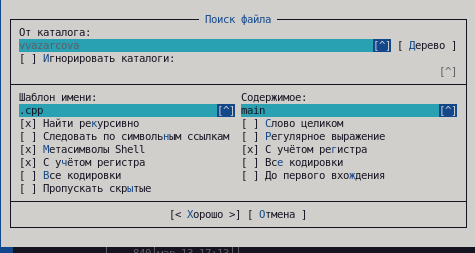{#fig:11 width=70%}

- выбор и повторение одной из предыдущих команд (рис. [-@fig:12]).

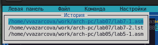{#fig:12 width=70%}

- переход в домашний каталог (рис. [-@fig:13]).

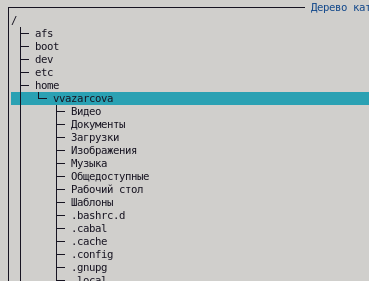{#fig:13 width=70%}

- анализ файла меню и файла расширений (рис. [-@fig:14], рис. [-@fig:15]).

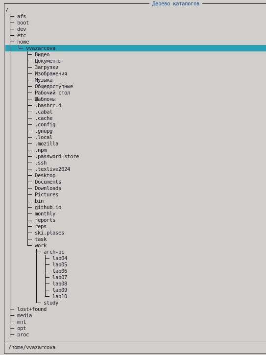{#fig:14 width=70%}

{#fig:15 width=70%}

7. Вызовите подменю Настройки. Освойте операции, определяющие структуру экрана mc (Full screen, Double Width, Show Hidden Files и т.д.) (рис. [-@fig:16]).

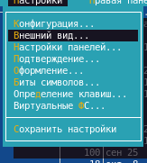{#fig:16 width=70%}

## Задание по встроенному редактору MC

1. Создайте текстовой файл text.txt (рис. [-@fig:17]).

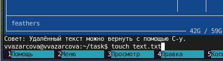{#fig:17 width=70%}

2. Откройте этот файл с помощью встроенного в mc редактора.

3. Вставьте в открытый файл небольшой фрагмент текста, скопированный из любого другого файла или Интернета (рис. [-@fig:18]).

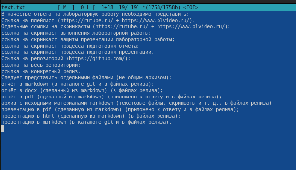{#fig:18 width=70%}

4. Проделайте с текстом следующие манипуляции, используя горячие клавиши:

- Удалите строку текста.

- Выделите фрагмент текста и скопируйте его на новую строку.

- Выделите фрагмент текста и перенесите его на новую строку.

- Сохраните файл.

- Отмените последнее действие.

- Перейдите в конец файла (нажав комбинацию клавиш) и напишите некоторый текст.

- Перейдите в начало файла (нажав комбинацию клавиш) и напишите некоторый
текст.

- Сохраните и закройте файл.

5. Откройте файл с исходным текстом на некотором языке программирования (например C или Java) (рис. [-@fig:19]).

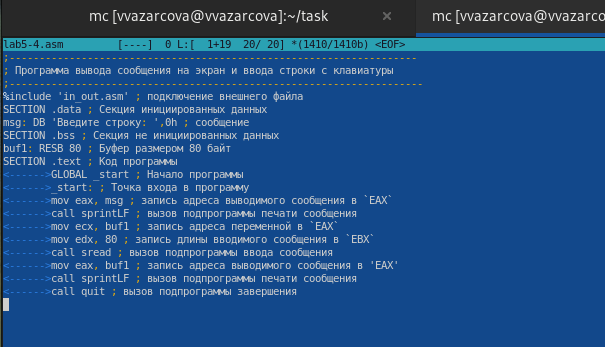{#fig:19 width=70%}

6. Используя меню редактора, включите подсветку синтаксиса, если она не включена, или выключите, если она включена (рис. [-@fig:20]).

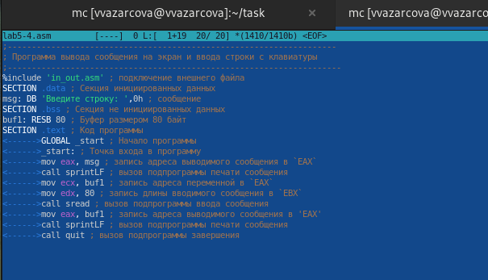{#fig:20 width=70%}

## Контрольные вопросы

1. Какие режимы работы есть в mc. Охарактеризуйте их.

Панели могут дополнительно быть переведены в один из двух режимов: Информация или Дерево. В режиме Информация на панель выводятся сведения о файле и текущей файловой системе, расположенных на активной панели. В режиме Дерево на одной из панелей выводится структура дерева каталогов.

2. Какие операции с файлами можно выполнить как с помощью команд shell, так и с помощью меню (комбинаций клавиш) mc? Приведите несколько примеров.

В разделе Командная строка оболочки (Shell) перечисляются команды и комбинации клавиш, которые используются для ввода и редактирования команд в командной строке оболочки. Большая часть этих команд служит для переноса имен файлов и/или имен каталогов в командную строку (чтобы уменьшить трудоемкость ввода) или для доступа к истории команд. Клавиши редактирования строк ввода используются как при редактировании командной строки, так и других строк ввода, появляющихся в различных запросах программы.
 Как с помощью меню так и с помощью команд shell можно переносить, копировать и получать информацию о файоах и каталогах.

3. Опишите структура меню левой (или правой) панели mc, дайте характеристику командам.

В меню каждой (левой или правой) панели можно выбрать Формат списка :

    стандартный — выводит список файлов и каталогов с указанием размера и времени правки;
    ускоренный — позволяет задать число столбцов, на которые разбивается панель при выводе списка имён файлов или каталогов без дополнительной информации;
    расширенный — помимо названия файла или каталога выводит сведения о правах доступа, владельце, группе, размере, времени правки;
    определённый пользователем — позволяет вывести те сведения о файле или каталоге, которые задаст сам пользователь.

4. Опишите структура меню Файл mc, дайте характеристику командам.

В меню Файл содержит перечень команд, которые могут быть применены к одному или нескольким файлам или каталогам.

Команды меню Файл :

    Просмотр ( F3 ) — позволяет посмотреть содержимое текущего (или выделенного) файла без возможности редактирования.
    Просмотр вывода команды ( М + ! ) — функция запроса команды с параметрами (аргумент к текущему выбранному файлу).
    Правка ( F4 ) — открывает текущий (или выделенный) файл для его редактирования.
    Копирование ( F5 ) — осуществляет копирование одного или нескольких файлов или каталогов в указанное пользователем во всплывающем окне место.
    Права доступа ( Ctrl-x c ) — позволяет указать (изменить) права доступа к одному или нескольким файлам или каталогам .
    Жёсткая ссылка ( Ctrl-x l ) — позволяет создать жёсткую ссылку к текущему (или выделенному) файлу.
    Символическая ссылка ( Ctrl-x s ) — позволяет создать символическую ссылку к текущему (или выделенному) файлу.
    Владелец/группа ( Ctrl-x o ) — позволяет задать (изменить) владельца и имя группы для одного или нескольких файлов или каталогов.
    Права (расширенные) — позволяет изменить права доступа и владения для одного или нескольких файлов или каталогов.
    Переименование ( F6 ) — позволяет переименовать (или переместить) один или несколько файлов или каталогов.
    Создание каталога ( F7 ) — позволяет создать каталог.
    Удалить ( F8 ) — позволяет удалить один или несколько файлов или каталогов.
    Выход ( F10 ) — завершает работу mc.

5. Опишите структура меню Команда mc, дайте характеристику командам.

В меню Команда содержатся более общие команды для работы с mc. Команды меню Команда :

    Дерево каталогов — отображает структуру каталогов системы.
    Поиск файла — выполняет поиск файлов по заданным параметрам.
    Переставить панели — меняет местами левую и правую панели.
    Сравнить каталоги ( Ctrl-x d ) — сравнивает содержимое двух каталогов.
    Размеры каталогов — отображает размер и время изменения каталога (по умолчанию в mc размер каталога корректно не отображается).
    История командной строки — выводит на экран список ранее выполненных в оболочке команд.
    Каталоги быстрого доступа ( Ctrl-\ ) — пр вызове выполняется быстрая смена текущего каталога на один из заданного списка.
    Восстановление файлов — позволяет восстановить файлы на файловых системах ext2 и ext3.
    Редактировать файл расширений — позволяет задать с помощью определённого синтаксиса действия при запуске файлов с определённым расширением (например, какое программного обеспечение запускать для открытия или редактирования файлов с расширением doc или docx).
    Редактировать файл меню — позволяет отредактировать контекстное меню пользователя, вызываемое по клавише F2 .
    Редактировать файл расцветки имён — позволяет подобрать оптимальную для пользователя расцветку имён файлов в зависимости от их типа.

6. Опишите структура меню Настройки mc, дайте характеристику командам.

Меню Настройки содержит ряд дополнительных опций по внешнему виду и функциональности mc. Меню Настройки содержит: – Конфигурация — позволяет скорректировать настройки работы с панелями. – Внешний вид и Настройки панелей — определяет элементы (строка меню, командная строка, подсказки и прочее), отображаемые при вызове mc, а также геометрию расположения панелей и цветовыделение. – Биты символов — задаёт формат обработки информации локальным терминалом. – Подтверждение — позволяет установить или убрать вывод окна с запросом подтверждения действий при операциях удаления и перезаписи файлов, а также при выходе из программы. – Распознание клавиш — диалоговое окно используется для тестирования функциональных клавиш, клавиш управления курсором и прочее. – Виртуальные ФС –– настройки виртуальной файловой системы: тайм-аут, пароль и прочее.

7. Назовите и дайте характеристику встроенным командам mc.

F1 Вызов контекстно-зависимой подсказки; F2 Вызов пользовательского меню с возможностью создания и/или дополнения дополнительных функций; F3 Просмотр содержимого файла, на который указывает подсветка в активной панели (без возможности редактирования); F4 Вызов встроенного в mc редактора для изменения содержания файла, на который указывает подсветка в активной панели; F5 Копирование одного или нескольких файлов, отмеченных в первой (активной) панели, в каталог, отображаемый на второй панели; F6 Перенос одного или нескольких файлов, отмеченных в первой (активной) панели, в каталог, отображаемый на второй панели; F7 Создание подкаталога в каталоге, отображаемом в активной панели; F8 Удаление одного или нескольких файлов (каталогов), отмеченных в первой (активной) панели файлов; F9 Вызов меню mc; F10 Выход из mc;

8. Назовите и дайте характеристику командам встроенного редактора mc.

Ctrl-y удалить строку; Ctrl-u отмена последней операции; Ins вставка/замена; F7 поиск (можно использовать регулярные выражения); -F7 повтор последней операции поиска; F4 замена; F3 первое нажатие — начало выделения, второе — окончание выделения; F5 копировать выделенный фрагмент; F6 переместить выделенный фрагмент; F8 удалить выделенный фрагмент; F2 записать изменения в файл; F10 выйти из редактора. 9. Дайте характеристику средствам mc, которые позволяют создавать меню, определяемые пользователем.

Можете сохранить часто используемые команды панелизации под отдельными информативными именами, чтобы иметь возможность их быстро вызвать по этим именам. Для этого нужно набрать команду в строке ввода (строка "Команда") и нажать кнопку Добавить. После этого потребуется ввести имя, по которому мы будем вызывать команду. В следующий раз вам достаточно будет выбрать нужное имя из списка, а не вводить всю команду заново.

9. Файл ~/.mc/menu: Основа конфигурации: Главный файл, определяющий структуру и содержание пользовательских меню. Именно здесь вы прописываете пункты меню, их описания и команды, которые будут выполняться. Текстовый формат: Файл представляет собой простой текстовый файл, что делает его легко редактируемым в любом текстовом редакторе. Структура: Файл состоит из секций, каждая из которых определяет отдельное меню. Каждая секция начинается с заголовка, заключенного в квадратные скобки (например, [global] или [extension.txt]). Внутри секции определяются пункты меню.

 Синтаксис пунктов меню: Описание: Каждая строка, начинающаяся не с пробела и не с квадратной скобки, считается описанием пункта меню. Отображается в меню. Используйте | для разделения описания на несколько строк, которые будут показаны вместе. Команда: Следующая строка, начинающаяся с пробела (или табуляции), считается командой, которая будет выполнена при выборе этого пункта меню.
 Переменные окружения и подстановки: Поддерживаются различные переменные окружения (например, $PWD - текущий каталог, $SELECTED - выбранные файлы) и подстановки, позволяющие динамически формировать команды. Встроенные функции mc: Доступны встроенные функции mc, которые могут выполнять различные действия, такие как запуск редактора, просмотр файла и т.д. Пример: edit %f откроет выбранный файл в редакторе.
 
 Контекстная чувствительность меню: Секции меню для разных типов файлов: Можно создавать секции меню, специфичные для определённых расширений файлов (например, [extension.sh] для shell-скриптов). В этих секциях определяются действия, которые будут доступны только при выборе файлов с указанным расширением. Секция [global]: Определяет пункты меню, доступные всегда, независимо от выбранного файла. Совместное использование: Если выбрано несколько файлов, меню, специфичные для каждого из них, объединяются. Если есть конфликты (одинаковое описание), пункт меню будет выполнен для первого подходящего типа файла.

Гибкость и настраиваемость: Запуск внешних программ: Можно запускать любые внешние программы и скрипты из меню. Параметры для команд: Можно передавать параметры в запускаемые команды, используя переменные и подстановки.   Создание подменю: Хотя в самом файле .mc/menu нет явной структуры для подменю, можно эмулировать их, запуская скрипты, которые отображают диалоговые окна выбора или модифицируют ~/.mc/menu на лету. Разделение конфигураций: Можно использовать несколько файлов меню (например, ~/.mc/menu.personal), а затем подключать их из основного файла.

10. Дайте характеристику средствам mc, которые позволяют выполнять действия, определяемые пользователем, над текущим файлом.

Панель в mc отображает список файлов текущего каталога. Абсолютный путь к этому каталогу отображается в заголовке панели. У активной панели заголовок и одна из её строк подсвечиваются. Управление панелями

# Выводы

Подводя итоги проделанной работе, мне удалось освоить основные возможности командной оболочки Midnight Commander и приобрести навыки практической работы по просмотру каталогов и файлов и манипуляций с ними.

# Список литературы{.unnumbered}

::: {#refs}
:::

1. GDB: The GNU Project Debugger. — URL: https://www.gnu.org/software/gdb/.
2. GNU Bash Manual. — 2016. — URL: https://www.gnu.org/software/bash/manual/.
3. Midnight Commander Development Center. — 2021. — URL: https://midnight-commander.org/.
4. NASM Assembly Language Tutorials. — 2021. — URL: https://asmtutor.com/.
5. Newham C. Learning the bash Shell: Unix Shell Programming. — O’Reilly Media, 2005. —354 с. — (In a Nutshell). — ISBN 0596009658. — URL: http://www.amazon.com/Learningbash-Shell-Programming-Nutshell/dp/0596009658.
6. Robbins A. Bash Pocket Reference. — O’Reilly Media, 2016. — 156 с. — ISBN 978-1491941591.
7. The NASM documentation. — 2021. — URL: https://www.nasm.us/docs.php.
8. Zarrelli G. Mastering Bash. — Packt Publishing, 2017. — 502 с. — ISBN 9781784396879.
9. Колдаев В. Д., Лупин С. А. Архитектура ЭВМ. — М. : Форум, 2018.
