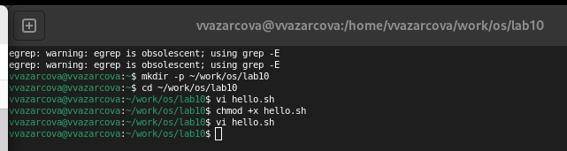

---
## Front matter
lang: ru-RU
title: Лабораторная работа №10
subtitle: Дисциплина - Операционные Системы
author:
  - Азарцова В. В.
institute:
  - Российский университет дружбы народов, Москва, Россия
  - Преподаватель Кулябов Д. С.
date: 19 апреля 2025

## i18n babel
babel-lang: russian
babel-otherlangs: english

## Formatting pdf
toc: false
toc-title: Содержание
slide_level: 2
aspectratio: 169
section-titles: true
theme: metropolis
header-includes:
 - \metroset{progressbar=frametitle,sectionpage=progressbar,numbering=fraction}
---

# Информация

## Докладчик

:::::::::::::: {.columns align=center}
::: {.column width="70%"}

  * Азарцова Вероника Валерьевна
  * НКАбд-01-24, студ. билет №1132246751
  * Российский университет дружбы народов
  * [1132246751@pfur.ru](mailto:1132246751@pfur.ru)
  * <https://github.com/vvazarcova>

:::
::::::::::::::

## Цели работы

Целью данной лабораторной работы было ознакомиться с операционной системой Linux и получить практические навыки работы с редактором vi, установленным по умолчанию практически во всех дистрибутивах.

## Задачи

1. Создайте каталог с именем ~/work/os/lab06.
2. Перейдите во вновь созданный каталог.
3. Вызовите vi и создайте файл hello.sh
4. Нажмите клавишу i и вводите следующий текст.
5. Нажмите клавишу Esc для перехода в командный режим после завершения ввода текста.
6. Нажмите : для перехода в режим последней строки и внизу вашего экрана появится приглашение в виде двоеточия.
7. Нажмите w (записать) и q (выйти), а затем нажмите клавишу Enter для сохранения вашего текста и завершения работы.
8. Сделайте файл исполняемым 

## Задачи 2

1. Вызовите vi на редактирование файла 1 vi ~/work/os/lab06/hello.sh
2. Установите курсор в конец слова HELL второй строки.
3. Перейдите в режим вставки и замените на HELLO. Нажмите Esc для возврата в командный режим.
4. Установите курсор на четвертую строку и сотрите слово LOCAL.
5. Перейдите в режим вставки и наберите следующий текст: local, нажмите Esc для возврата в командный режим.
6. Установите курсор на последней строке файла. Вставьте после неё строку, содержащую следующий текст: echo $HELLO.
7. Нажмите Esc для перехода в командный режим.
8. Удалите последнюю строку.
9. Введите команду отмены изменений u для отмены последней команды.
10. Введите символ : для перехода в режим последней строки. Запишите произведённые изменения и выйдите из vi.

## Теоретическое введение

В большинстве дистрибутивов Linux в качестве текстового редактора по умолчанию устанавливается интерактивный экранный редактор vi (Visual display editor). Редактор vi имеет три режима работы:

- командный режим — предназначен для ввода команд редактирования и навигации по редактируемому файлу;
- режим вставки — предназначен для ввода содержания редактируемого файла;
- режим последней (или командной) строки — используется для записи изменений в файл и выхода из редактора. Для вызова редактора vi необходимо указать команду vi и имя редактируемого файла:  
vi <имя_файла>

## Теоретическое введение

При этом в случае отсутствия файла с указанным именем будет создан такой файл. Переход в командный режим осуществляется нажатием клавиши Esc. Для выхода из редактора vi необходимо перейти в режим последней строки: находясь в командном режиме, нажать Shift-; (по сути символ : — двоеточие), затем:

- набрать символы wq, если перед выходом из редактора требуется записать изменения в файл;

- набрать символ q (или q!), если требуется выйти из редактора без сохранения.

# Выполнение лабораторной работы

1. Создайте каталог с именем ~/work/os/lab06.

2. Перейдите во вновь созданный каталог.

3. Вызовите vi и создайте файл hello.sh

{#fig:1 width=70%}

## Выполнение лабораторной работы

4. Нажмите клавишу i и вводите следующий текст.
5. Нажмите клавишу Esc для перехода в командный режим после завершения ввода текста.
6. Нажмите : для перехода в режим последней строки и внизу вашего экрана появится приглашение в виде двоеточия.
7. Нажмите w (записать) и q (выйти), а затем нажмите клавишу Enter для сохранения вашего текста и завершения работы.

{#fig:2 width=70%}

## Выполнение лабораторной работы

Сделайте файл исполняемым 

1. Вызовите vi на редактирование файла 1 vi ~/work/os/lab06/hello.sh

{#fig:3 width=70%}

## Выполнение лабораторной работы

2. Установите курсор в конец слова HELL второй строки.
3. Перейдите в режим вставки и замените на HELLO. Нажмите Esc для возврата в командный режим.
4. Установите курсор на четвертую строку и сотрите слово LOCAL.
5. Перейдите в режим вставки и наберите следующий текст: local, нажмите Esc для возврата в командный режим.
6. Установите курсор на последней строке файла. Вставьте после неё строку, содержащую следующий текст: echo $HELLO.
7. Нажмите Esc для перехода в командный режим.
8. Удалите последнюю строку.
9. Введите команду отмены изменений u для отмены последней команды.
10. Введите символ : для перехода в режим последней строки. Запишите произведённые изменения и выйдите из vi.

## Выполнение лабораторной работы

{#fig:4 width=70%}

# Выводы

Мне удалось:  

- Ознакомиться с операционной системой Linux

- Получить практические навыки работы с редактором vi.

## Итоговый слайд

Если вам понравилось - посмотрите остальные мои презентации!

