---
## Front matter
lang: ru-RU
title: Лабораторная работа №11
subtitle: Дисциплина - Операционные Системы
author:
  - Азарцова В. В.
institute:
  - Российский университет дружбы народов, Москва, Россия
  - Преподаватель Кулябов Д. С.
date: 26 апреля 2025

## i18n babel
babel-lang: russian
babel-otherlangs: english

## Formatting pdf
toc: false
toc-title: Содержание
slide_level: 2
aspectratio: 169
section-titles: true
theme: metropolis
header-includes:
 - \metroset{progressbar=frametitle,sectionpage=progressbar,numbering=fraction}
---

# Информация

## Докладчик

:::::::::::::: {.columns align=center}
::: {.column width="70%"}

  * Азарцова Вероника Валерьевна
  * НКАбд-01-24, студ. билет №1132246751
  * Российский университет дружбы народов
  * [1132246751@pfur.ru](mailto:1132246751@pfur.ru)
  * <https://github.com/vvazarcova>

:::
::::::::::::::

## Цели работы

Целью данной лабораторной работы было познакомиться с операционной системой Linux. Получить практические навыки работы с редактором Emacs.

## Задачи

Задачи лабораторной работы: 

1. Ознакомиться с теоретическим материалом.

2. Ознакомиться с редактором emacs.

3. Выполнить упражнения.

4. Ответить на контрольные вопросы.

## Теоретическое введение

Emacs — один из наиболее мощных и широко распространённых редакторов, используемых в мире UNIX, написанный на языке высокого уровня Elisp.

# Выполнение лабораторной работы

1. Устанавливаю emacs.

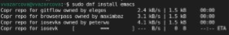{#fig:1 width=70%}

## Выполнение лабораторной работы

Открываю emacs.

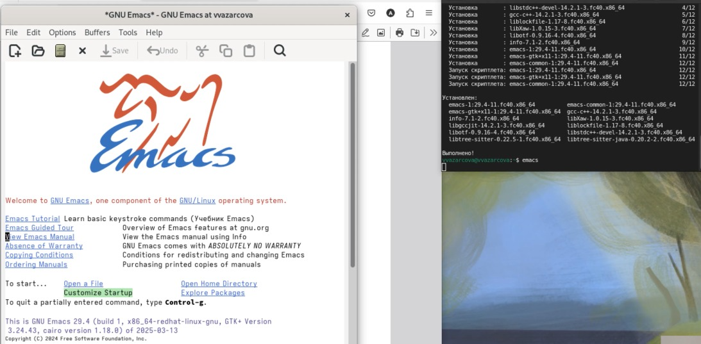{#fig:2 width=70%}

## Выполнение лабораторной работы

2. Создаю файл lab11.sh.

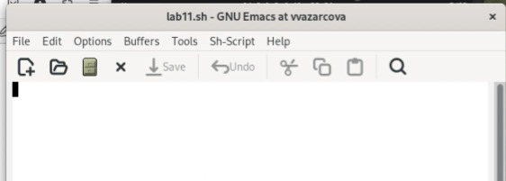{#fig:3 width=70%}

## Выполнение лабораторной работы

3. Набираю нужный текст.

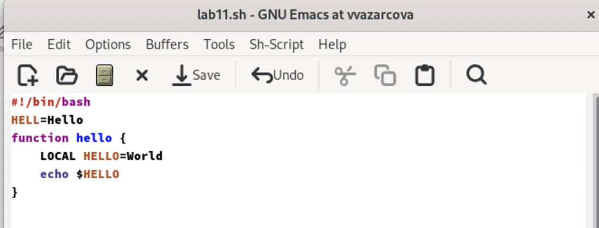{#fig:4 width=70%}

4. Сохраняю файл.

## Выполнение лабораторной работы

5. Проделываю с текстом стандартные процедуры редактирования, осуществляя каждое действие комбинацией клавиш:

    1. Вырезать одной командой целую строку (С-k).
    
    2. Вставить эту строку в конец файла (C-y).
    
    4. Скопировать область в буфер обмена (M-w).
    
    5. Вставить область в конец файла.
    
    6. Вновь выделить эту область и на этот раз вырезать её (C-w).
    
    7. Отмените последнее действие (C-/).

## Выполнение лабораторной работы

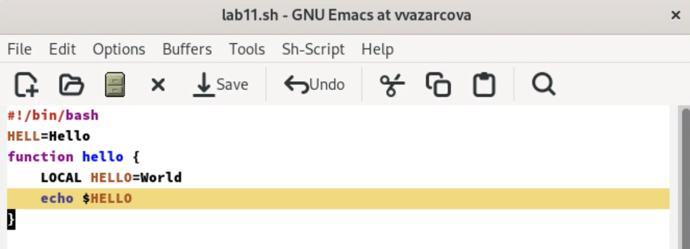{#fig:5 width=70%}

## Выполнение лабораторной работы

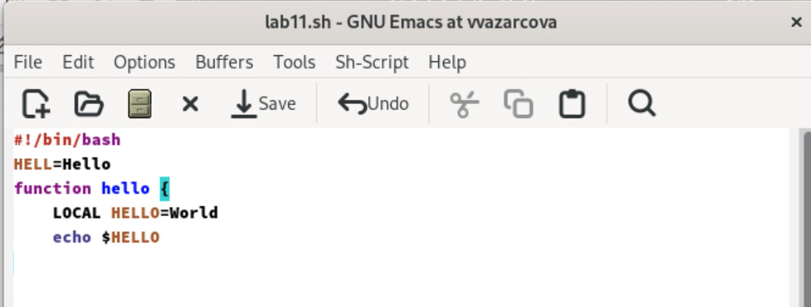{#fig:6 width=70%}

## Выполнение лабораторной работы

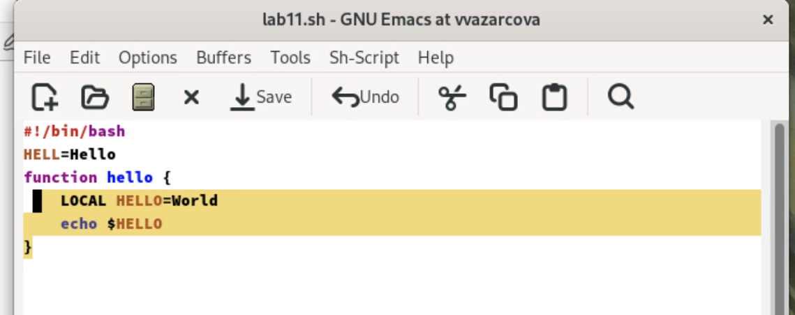{#fig:7 width=70%}

## Выполнение лабораторной работы

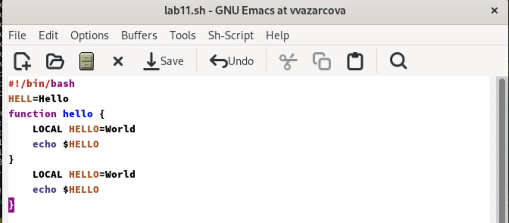{#fig:8 width=70%}

## Выполнение лабораторной работы

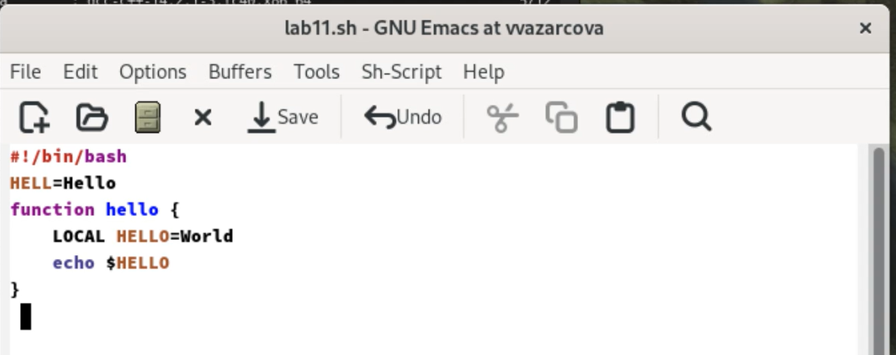{#fig:9 width=70%}

## Выполнение лабораторной работы

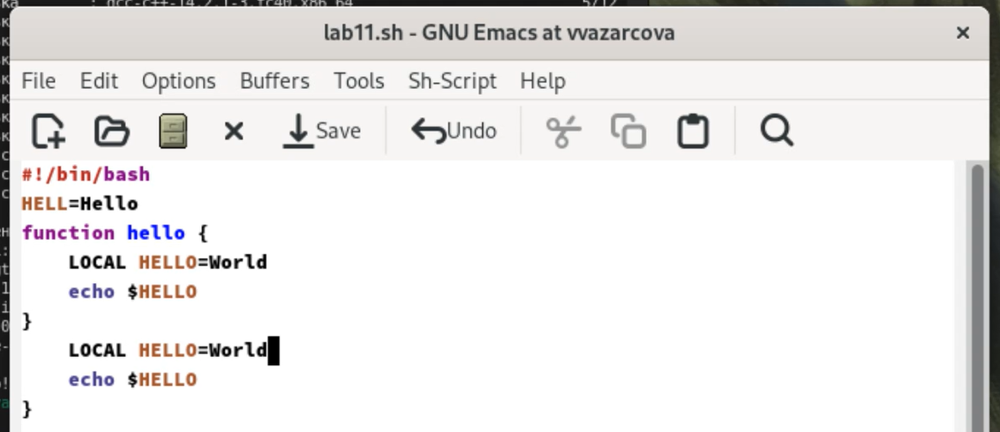{#fig:10 width=70%}

## Выполнение лабораторной работы

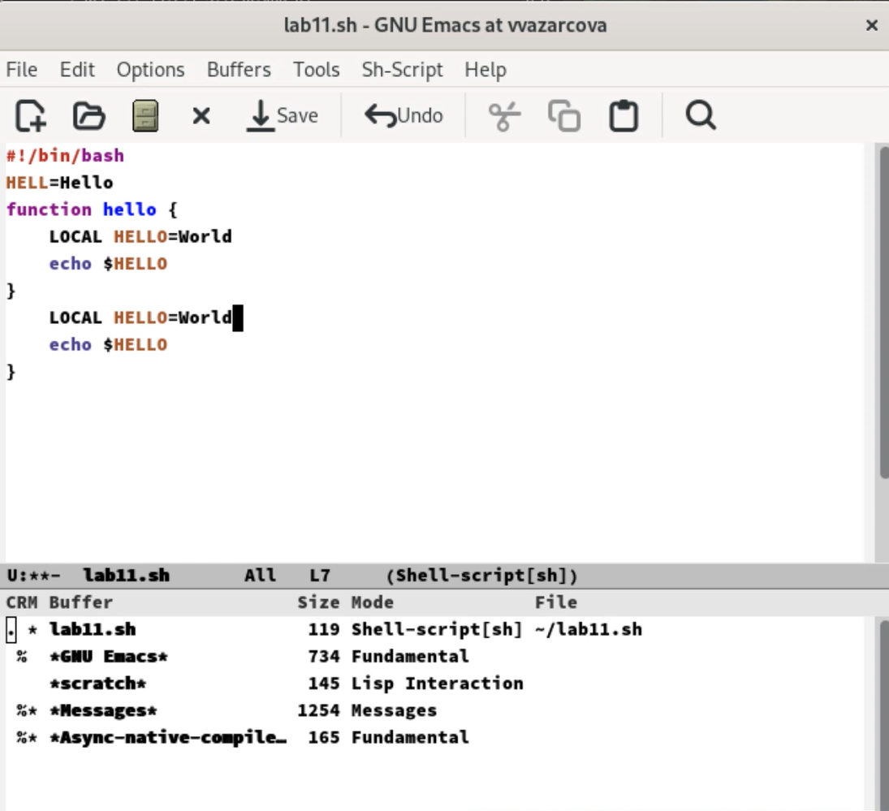{#fig:11 width=70%}

## Выполнение лабораторной работы

6. Учусь пользоваться командами по перемещению курсора.

7. Управление буферами:

    1. Вывести список активных буферов на экран (C-x C-b).

    2. Переместитесь во вновь открытое окно (C-x) o со списком открытых буферов
    и переключитесь на другой буфер.
    
    3. Закройте это окно (C-x 0).
    
    4. Теперь вновь переключайтесь между буферами, но уже без вывода их списка на экран (C-x b).
    
## Выполнение лабораторной работы

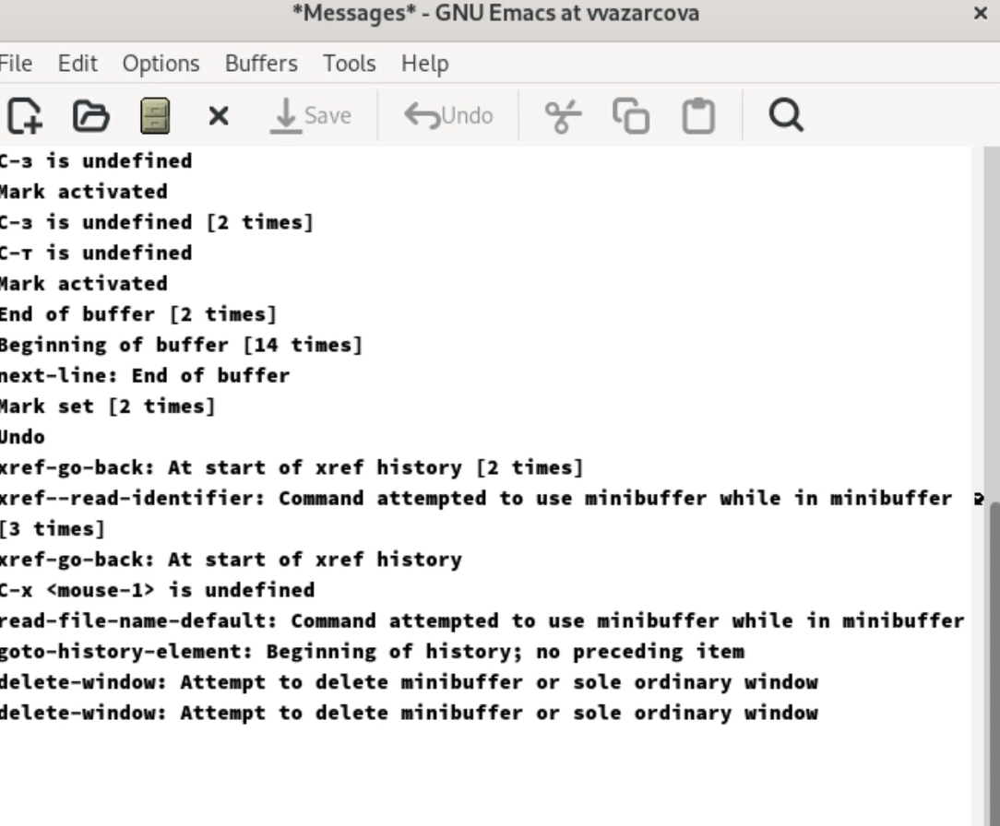{#fig:12 width=70%}

## Выполнение лабораторной работы

8. Управление окнами:

    1. Поделите фрейм на 4 части: разделите фрейм на два окна по вертикали (C-x 3), а затем каждое из этих окон на две части по горизонтали (C-x 2)

    2. В каждом из четырёх созданных окон откройте новый буфер (файл) и введите
несколько строк текста.

## Выполнение лабораторной работы

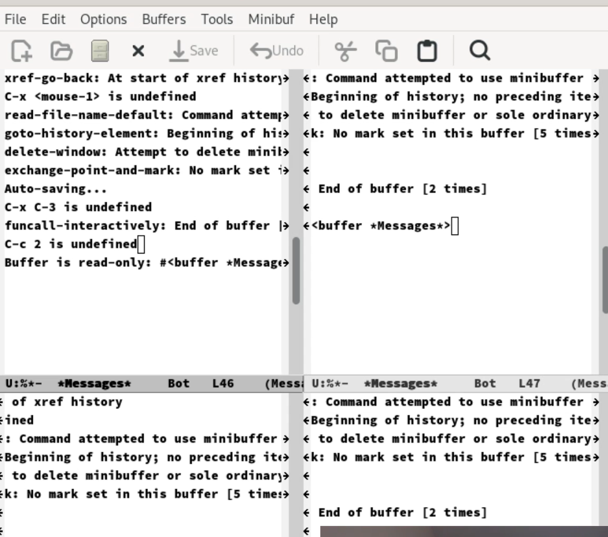{#fig:13 width=70%}

## Выполнение лабораторной работы

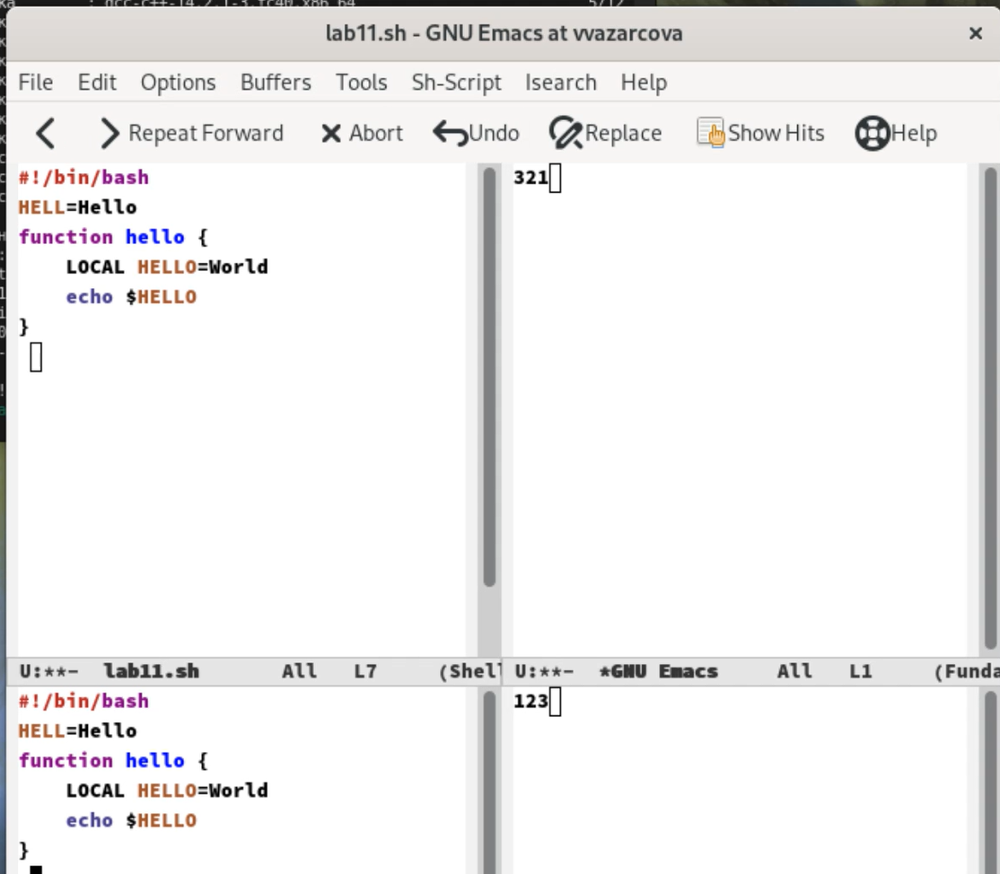{#fig:14 width=70%}

## Выполнение лабораторной работы

9. Режим поиска:

    1. Переключитесь в режим поиска (C-s) и найдите несколько слов, присутствующих в тексте.

    2. Переключайтесь между результатами поиска, нажимая C-s.

    3. Выйдите из режима поиска, нажав C-g.

    4. Перейдите в режим поиска и замены (M-%), введите текст, который следует найти и заменить, нажмите Enter , затем введите текст для замены. После того кк будут подсвечены результаты поиска, нажмите ! для подтверждения замены.

    5. Испробуйте другой режим поиска, нажав M-s o. Объясните, чем он отличается от обычного режима? Ответ - это режим поиска построчно.

## Выполнение лабораторной работы

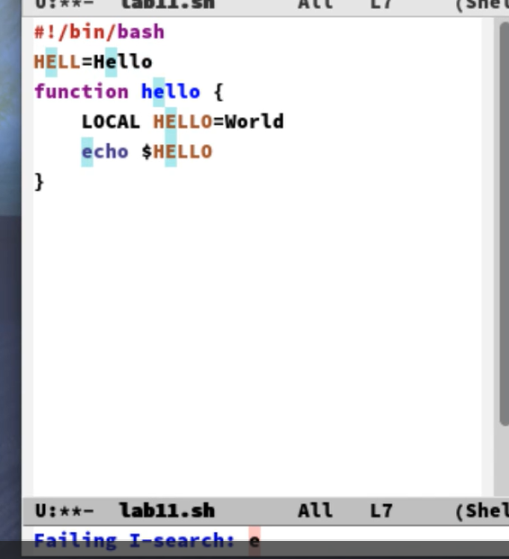{#fig:15 width=70%}

# Выводы

Подводя итоги проведенной работе, я познакомилась с операционной системой Linux поглубже и получила практические навыки работы с редактором Emacs.

## Итоговый слайд

Если вам понравилось - посмотрите остальные мои презентации!

