---
## Front matter
title: "Отчёт по лабораторной работе №11"
subtitle: "Дисциплина: Операционные Системы"
author: "Азарцова Вероника Валерьевна"

## Generic otions
lang: ru-RU
toc-title: "Содержание"

## Bibliography
bibliography: bib/cite.bib
csl: pandoc/csl/gost-r-7-0-5-2008-numeric.csl

## Pdf output format
toc: true # Table of contents
toc-depth: 2
lof: true # List of figures
lot: true # List of tables
fontsize: 12pt
linestretch: 1.5
papersize: a4
documentclass: scrreprt
## I18n polyglossia
polyglossia-lang:
  name: russian
  options:
	- spelling=modern
	- babelshorthands=true
polyglossia-otherlangs:
  name: english
## I18n babel
babel-lang: russian
babel-otherlangs: english
## Fonts
mainfont: IBM Plex Serif
romanfont: IBM Plex Serif
sansfont: IBM Plex Sans
monofont: IBM Plex Mono
mathfont: STIX Two Math
mainfontoptions: Ligatures=Common,Ligatures=TeX,Scale=0.94
romanfontoptions: Ligatures=Common,Ligatures=TeX,Scale=0.94
sansfontoptions: Ligatures=Common,Ligatures=TeX,Scale=MatchLowercase,Scale=0.94
monofontoptions: Scale=MatchLowercase,Scale=0.94,FakeStretch=0.9
mathfontoptions:
## Biblatex
biblatex: true
biblio-style: "gost-numeric"
biblatexoptions:
  - parentracker=true
  - backend=biber
  - hyperref=auto
  - language=auto
  - autolang=other*
  - citestyle=gost-numeric
## Pandoc-crossref LaTeX customization
figureTitle: "Рис."
tableTitle: "Таблица"
listingTitle: "Листинг"
lofTitle: "Список иллюстраций"
lotTitle: "Список таблиц"
lolTitle: "Листинги"
## Misc options
indent: true
header-includes:
  - \usepackage{indentfirst}
  - \usepackage{float} # keep figures where there are in the text
  - \floatplacement{figure}{H} # keep figures where there are in the text
---

# Цель работы

Цель данной лабораторной работы - познакомиться с операционной системой Linux. Получить практические навыки работы с редактором Emacs.

# Задание

1. Ознакомиться с теоретическим материалом.

2. Ознакомиться с редактором emacs.

3. Выполнить упражнения.

4. Ответить на контрольные вопросы.

# Теоретическое введение

Emacs представляет собой мощный экранный редактор текста, написанный на языке
высокого уровня Elisp.

# Выполнение лабораторной работы

1. Устанавливаю emacs (рис. [-@fig:1]).

{#fig:1 width=70%}

Открываю emacs (рис. [-@fig:2]).

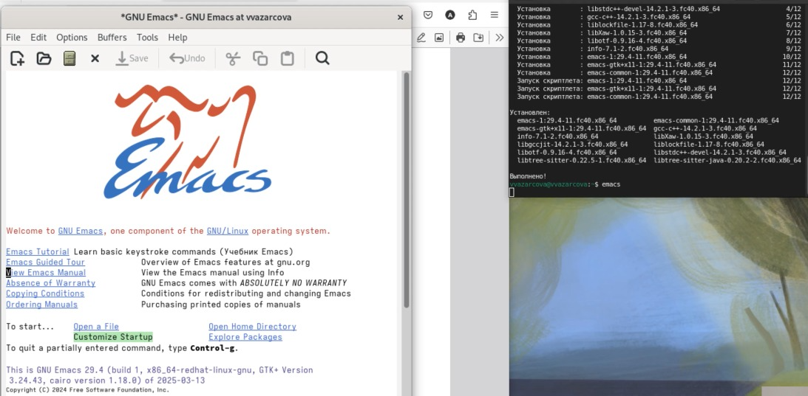{#fig:2 width=70%}

2. Создаю файл lab11.sh (рис. [-@fig:3]).

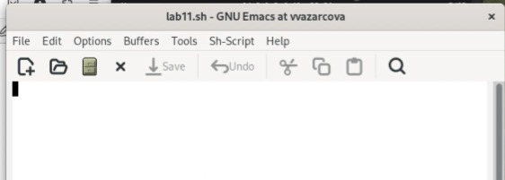{#fig:3 width=70%}

3. Набираю нужный текст (рис. [-@fig:4]).

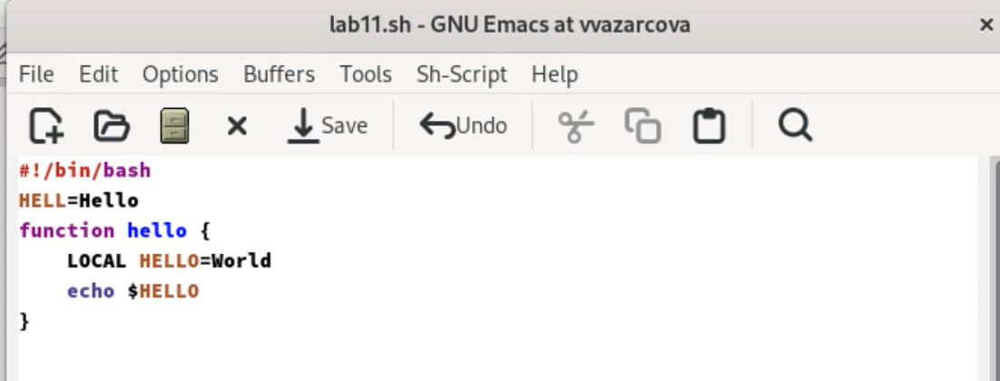{#fig:4 width=70%}

4. Сохраняю файл.

5. Проделываю с текстом стандартные процедуры редактирования, осуществляя каждое действие комбинацией клавиш:

    1. Вырезать одной командой целую строку (С-k).
    
    2. Вставить эту строку в конец файла (C-y).
    
    4. Скопировать область в буфер обмена (M-w).
    
    5. Вставить область в конец файла.
    
    6. Вновь выделить эту область и на этот раз вырезать её (C-w).
    
    7. Отмените последнее действие (C-/).

(рис. [-@fig:5]), (рис. [-@fig:6]), (рис. [-@fig:7]), (рис. [-@fig:8]), (рис. [-@fig:9]), (рис. [-@fig:10]), (рис. [-@fig:11]).

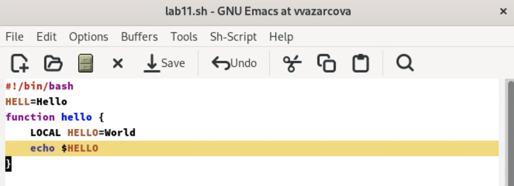{#fig:5 width=70%}

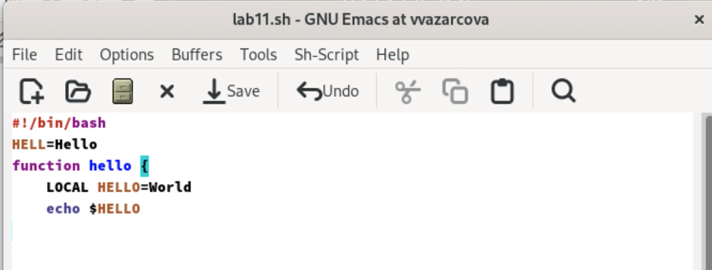{#fig:6 width=70%}

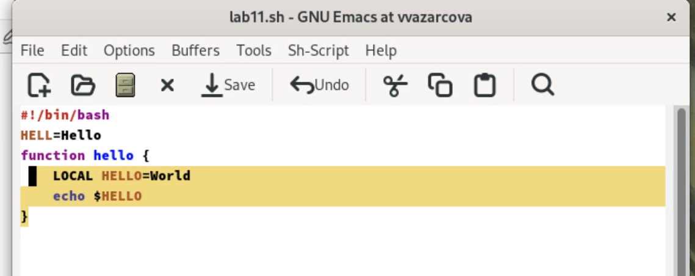{#fig:7 width=70%}

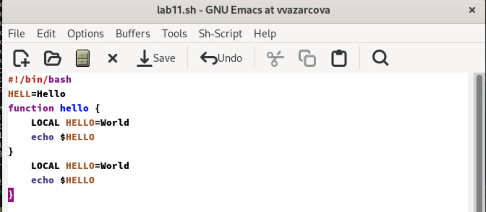{#fig:8 width=70%}

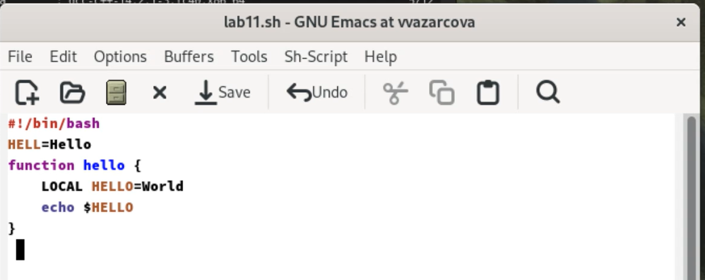{#fig:9 width=70%}

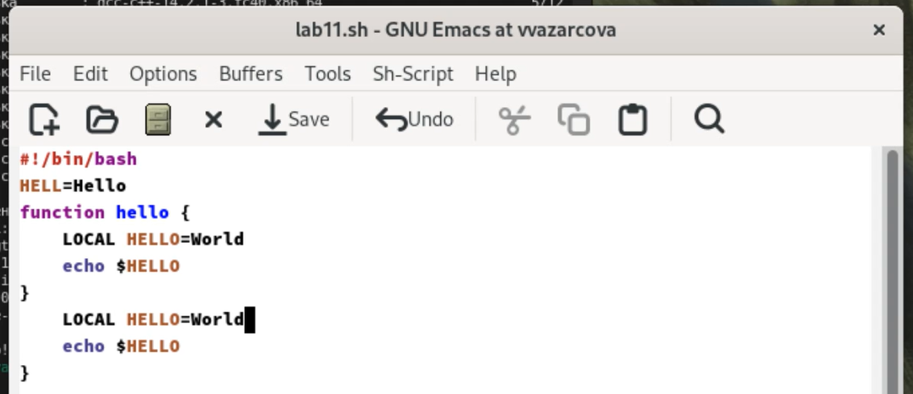{#fig:10 width=70%}

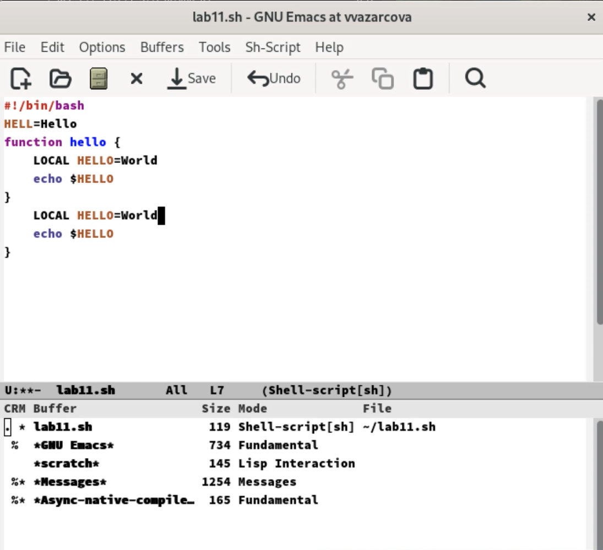{#fig:11 width=70%}

6. Учусь пользоваться командами по перемещению курсора.

7. Управление буферами:

    1. Вывести список активных буферов на экран (C-x C-b).

    2. Переместитесь во вновь открытое окно (C-x) o со списком открытых буферов
    и переключитесь на другой буфер.
    
    3. Закройте это окно (C-x 0).
    
    4. Теперь вновь переключайтесь между буферами, но уже без вывода их списка на экран (C-x b).
    
(рис. [-@fig:12]).

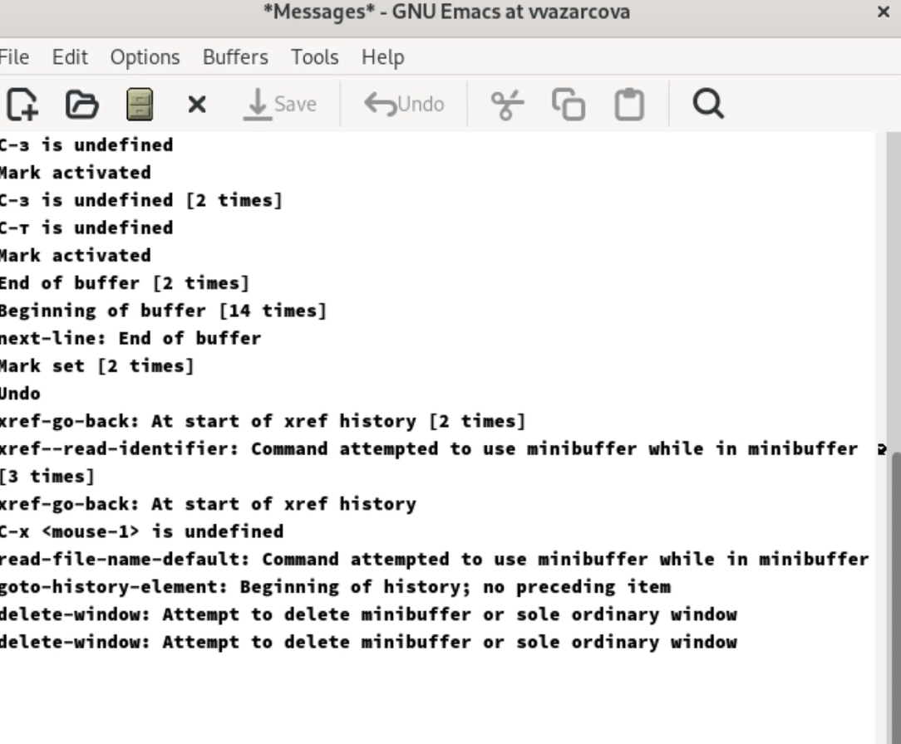{#fig:12 width=70%}

8. Управление окнами:

    1. Поделите фрейм на 4 части: разделите фрейм на два окна по вертикали (C-x 3), а затем каждое из этих окон на две части по горизонтали (C-x 2)

    2. В каждом из четырёх созданных окон откройте новый буфер (файл) и введите
несколько строк текста.

(рис. [-@fig:13]), (рис. [-@fig:14]).

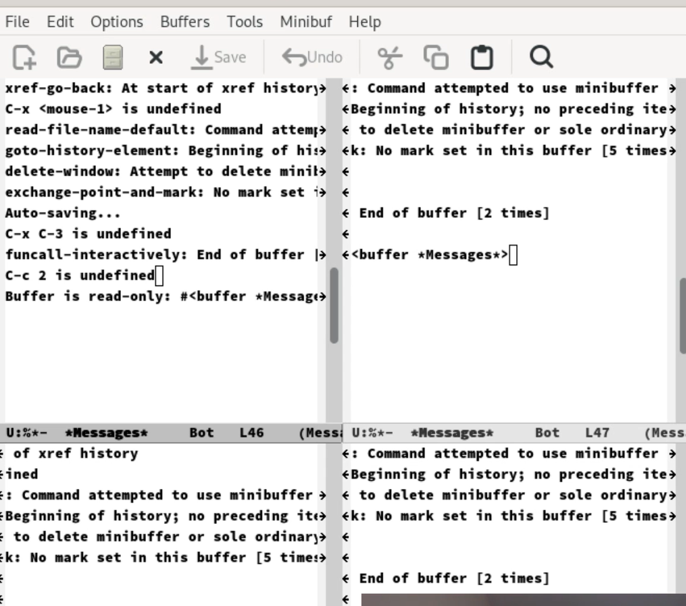{#fig:13 width=70%}

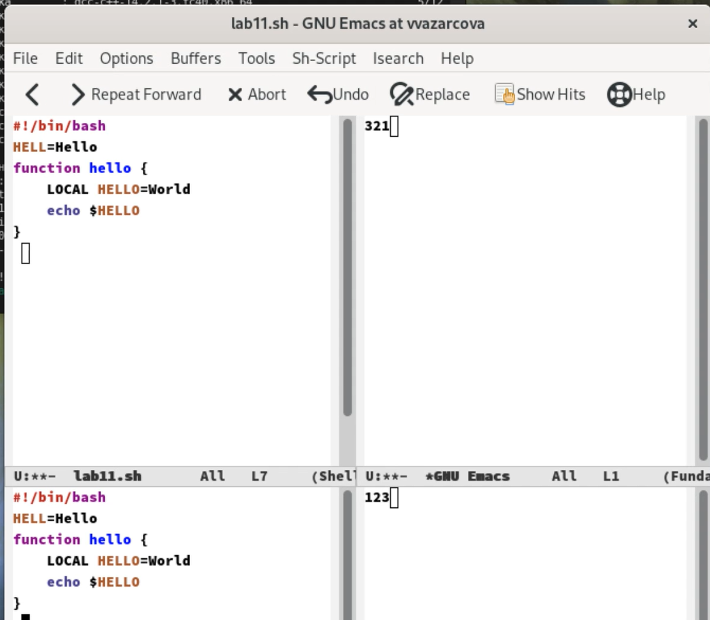{#fig:14 width=70%}

9. Режим поиска:

    1. Переключитесь в режим поиска (C-s) и найдите несколько слов, присутствующих в тексте.

    2. Переключайтесь между результатами поиска, нажимая C-s.

    3. Выйдите из режима поиска, нажав C-g.

    4. Перейдите в режим поиска и замены (M-%), введите текст, который следует найти и заменить, нажмите Enter , затем введите текст для замены. После того как будут подсвечены результаты поиска, нажмите ! для подтверждения замены.

    5. Испробуйте другой режим поиска, нажав M-s o. Объясните, чем он отличается от обычного режима? Ответ - это режим поиска построчно.

(рис. [-@fig:15]).

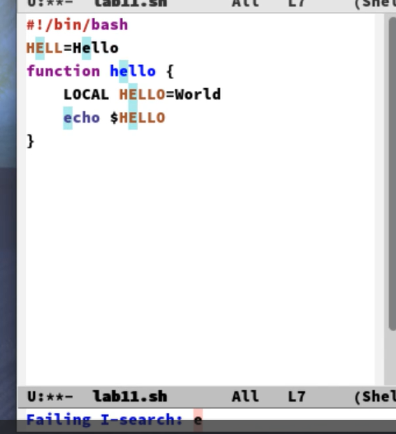{#fig:15 width=70%}

# Контрольные вопросы

1. Кратко охарактеризуйте редактор emacs.

Emacs — один из наиболее мощных и широко распространённых редакторов, используемых в мире UNIX. Написан на языке высокого уровня Lisp.

2. Какие особенности данного редактора могут сделать его сложным для освоения новичком?

Большое разнообразие сложных комбинаций клавиш, которые необходимы для редактирования файла и в принципе для работа с Emacs.

3. Своими словами опишите, что такое буфер и окно в терминологии emacs’а.

Буфер - это объект в виде текста. Окно - это прямоугольная область, в которой отображен буфер.

4. Можно ли открыть больше 10 буферов в одном окне?

Да, можно.

5. Какие буферы создаются по умолчанию при запуске emacs?

Emacs использует буферы с именами, начинающимися с пробела, для внутренних целей. Отчасти он обращается с буферами с такими именами особенным образом -- например, по умолчанию в них не записывается информация для отмены изменений.

6. Какие клавиши вы нажмёте, чтобы ввести следующую комбинацию C-c | и C-c C-|?

Ctrl + c, а потом | и Ctrl + c Ctrl + |

7. Как поделить текущее окно на две части?

С помощью команды Ctrl + x 3 (по вертикали) и Ctrl + x 2 (по горизонтали).

8. В каком файле хранятся настройки редактора emacs?

Настройки emacs хранятся в файле . emacs, который хранится в домашней дирректории пользователя. Кроме этого файла есть ещё папка . emacs.

9. Какую функцию выполняет клавиша и можно ли её переназначить?

Выполняет фугкцию стереть, думаю можно переназначить.

10. Какой редактор вам показался удобнее в работе vi или emacs? Поясните почему.

Для меня удобнее был редактор Emacs, так как у него есть более привычный интерфейс. 

# Выводы

Подводя итоги проведенной работе, я познакомилась с операционной системой Linux поглубже и получила практические навыки работы с редактором Emacs.

# Список литературы{.unnumbered}

::: {#refs}
:::

1. GDB: The GNU Project Debugger. — URL: https://www.gnu.org/software/gdb/.
2. GNU Bash Manual. — 2016. — URL: https://www.gnu.org/software/bash/manual/.
3. Midnight Commander Development Center. — 2021. — URL: https://midnight-commander.org/.
4. NASM Assembly Language Tutorials. — 2021. — URL: https://asmtutor.com/.
5. Newham C. Learning the bash Shell: Unix Shell Programming. — O’Reilly Media, 2005. —354 с. — (In a Nutshell). — ISBN 0596009658. — URL: http://www.amazon.com/Learningbash-Shell-Programming-Nutshell/dp/0596009658.
6. Robbins A. Bash Pocket Reference. — O’Reilly Media, 2016. — 156 с. — ISBN 978-1491941591.
7. The NASM documentation. — 2021. — URL: https://www.nasm.us/docs.php.
8. Zarrelli G. Mastering Bash. — Packt Publishing, 2017. — 502 с. — ISBN 9781784396879.
9. Колдаев В. Д., Лупин С. А. Архитектура ЭВМ. — М. : Форум, 2018.
