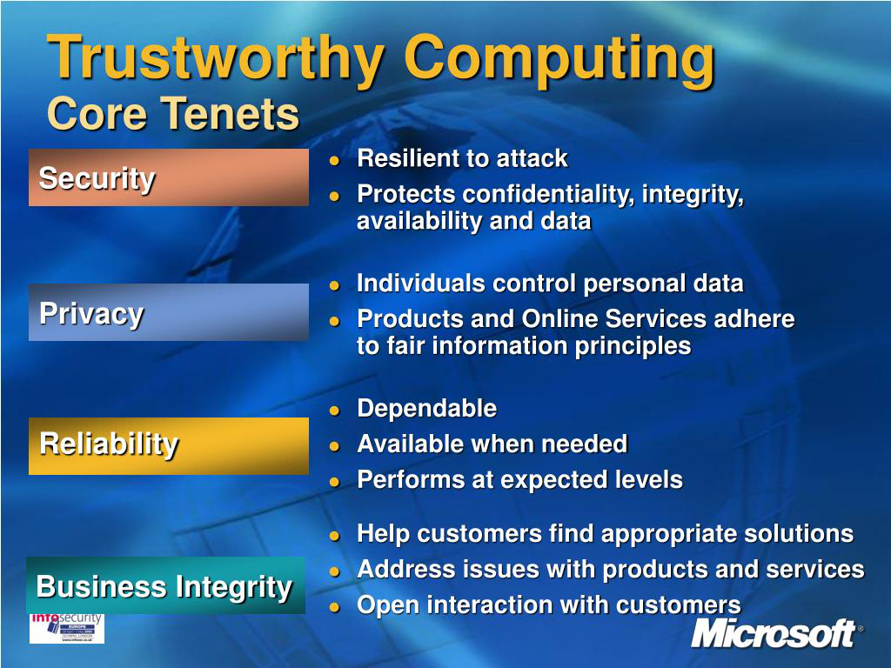
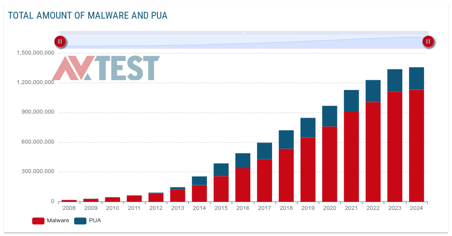

---
## Front matter
lang: ru-RU
title: Trustworthy computing initiative
subtitle: Дисциплина - Операционные Системы
author:
  - Азарцова В. В.
institute:
  - Российский университет дружбы народов, Москва, Россия
  - Преподаватель Кулябов Д. С.
date: 15 марта 2025

## i18n babel
babel-lang: russian
babel-otherlangs: english

## Formatting pdf
toc: false
toc-title: Содержание
slide_level: 2
aspectratio: 169
section-titles: true
theme: metropolis
header-includes:
 - \metroset{progressbar=frametitle,sectionpage=progressbar,numbering=fraction}
---

## Докладчик

:::::::::::::: {.columns align=center}
::: {.column width="40%"}

  * Азарцова Вероника Валерьевна
  * НКАбд-01-24, студ. билет №1132246751
  * Российский университет дружбы народов
  * [1132246751@pfur.ru](mailto:1132246751@pfur.ru)
  * <https://github.com/vvazarcova>

:::
::: {.column width="60%"}

{#fig:1 width=50%}

:::
::::::::::::::

# Trustworthy Computing Initiative и  значение для безопасности UNIX-систем

## Введение

Trustworthy Computing (TWC) - подход к созданию безопасных компьютерных систем, разработанный Microsoft в 2002 году.

{#fig:2 width=50%}

## Актуальность и новизна

UNIX-системы используют:

- Корпоративные сервера
- Банковские системы
- Научные вычисления

## Актуальность и новизна

Но они уязвимы к атакам:

{#fig:3 width=60%}

# Главные принципы TWC

## Главные принципы TWC

**Безопасность (Security)**

1. Дискреционный (DAC) контроль доступа
2. Мандатный (MAC) контроль доступа, SELinux
3. Firewall

## Главные принципы TWC

**Конфиденциальность (Privacy)**

1. Шифрование данных - LUKS, GPG и OpenSSL
2. Контроль доступа - chmod и chown

## Главные принципы TWC

**Надежность (Reliability)**

1. Стабильная работа
2. Минимизация сбоев

##  Главные принципы TWC

**Честность бизнеса (Business integrity)**

1. Открытый исходный код
2. Стандарты и сертификация

## Вывод и практическое применение

Принципы Trustworthy Computing действительно делают UNIX-системы безопаснее. Для максимальной эффективности слушающим следует:

1. Следить за обновлениями
2. Настраивать права доступа
3. Применять TWC при разработке

## Источники

1. Публикация "Trustworthy Computing", Vijay Varadharajan, 2004 год (https://www.researchgate.net/publication/225171720_Trustworthy_Computing).

2. "Празднование двадцатилетия Trustworthy Computing", Аанчал Гупта, корпоративный вице-президент и заместитель директора по информационной безопасности Microsoft, 2022 год (https://www.microsoft.com/en-us/security/blog/2022/01/21/celebrating-20-years-of-trustworthy-computing/).

3. "Trustworthy Computing. Microsoft White Paper", Крэг Мунди, старший вице-президент по передовым стратегиям и курсам Microsoft (https://web.archive.org/web/20150626122214/http://download.microsoft.com/documents/australia/about/trustworthy_comp.doc)

4. Электронное письмо "Trustworthy Computing", Билл Гейтс, генеральный директор Microsoft, архив. 2002 год (https://web.archive.org/web/20150626172158/http://archive.wired.com/techbiz/media/news/2002/01/49826).

