---
## Front matter
lang: ru-RU
title: Индивидуальный проект. Этап №1
subtitle: Дисциплина - Операционные Системы
author:
  - Азарцова В. В.
institute:
  - Российский университет дружбы народов, Москва, Россия
  - Преподаватель Кулябов Д. С.
date: 6 марта 2025

## i18n babel
babel-lang: russian
babel-otherlangs: english

## Formatting pdf
toc: false
toc-title: Содержание
slide_level: 2
aspectratio: 169
section-titles: true
theme: metropolis
header-includes:
 - \metroset{progressbar=frametitle,sectionpage=progressbar,numbering=fraction}
---

# Информация

## Докладчик

:::::::::::::: {.columns align=center}
::: {.column width="70%"}

  * Азарцова Вероника Валерьевна
  * НКАбд-01-24, студ. билет №1132246751
  * Российский университет дружбы народов
  * [1132246751@pfur.ru](mailto:1132246751@pfur.ru)
  * <https://github.com/vvazarcova>

:::
::::::::::::::

## Цели работы

Научиться размещать заготовку сайта на Github pages.

## Задачи

1. Установить необходимое программное обеспечение.
2. Скачать шаблон темы сайта.
3. Разместить его на хостинге git.
3. Установить параметр для URLs сайта.
5. Разместить заготовку сайта на Github pages.

## Теоретическое введение

Hugo Blox Builder — это фреймворк без кода для создания любого типа веб-сайта с использованием виджетов.  
Он позволяет писать контент, используя стандартизированный Markdown вместе с пакетными расширениями для математики и диаграмм, и редактируйте в CMS с открытым исходным кодом или через редактор, такой как онлайн-редактор GitHub, Jupyter Notebook или RStudio.  

# Выполнение этапа проекта

Скачиваю последнюю версию установщика Hugo для Linux с официального репозитория.

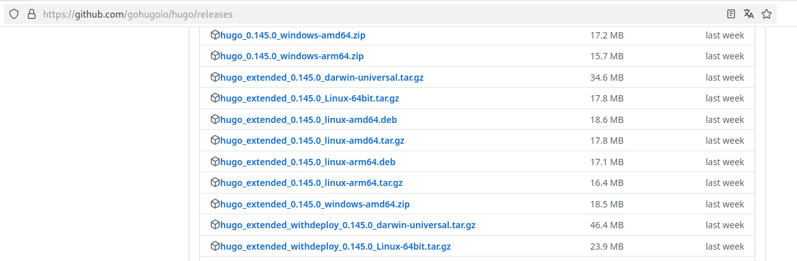{#fig:1 width=70%}

## Выполнение этапа проекта

Распаковываю файл, создаю папку bin и переношу туда исполняемый файл.

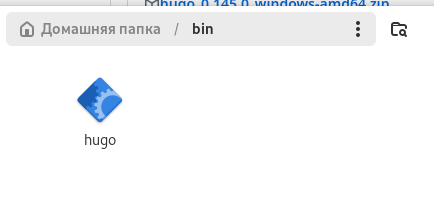{#fig:2 width=70%}

## Выполнение этапа проекта

Перехожу на официальный репозиторий шаблона Hugo Academic CV.

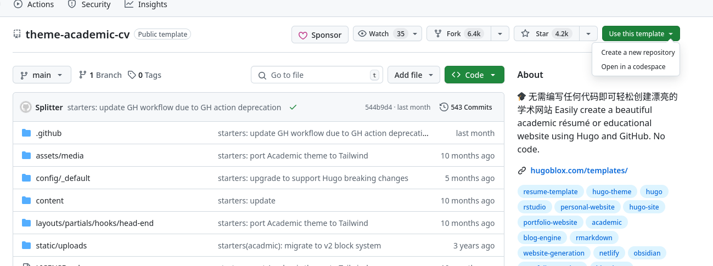{#fig:3 width=70%}

## Выполнение этапа проекта

Создаю новый репозиторий на основе данного шаблона и называю его blog.

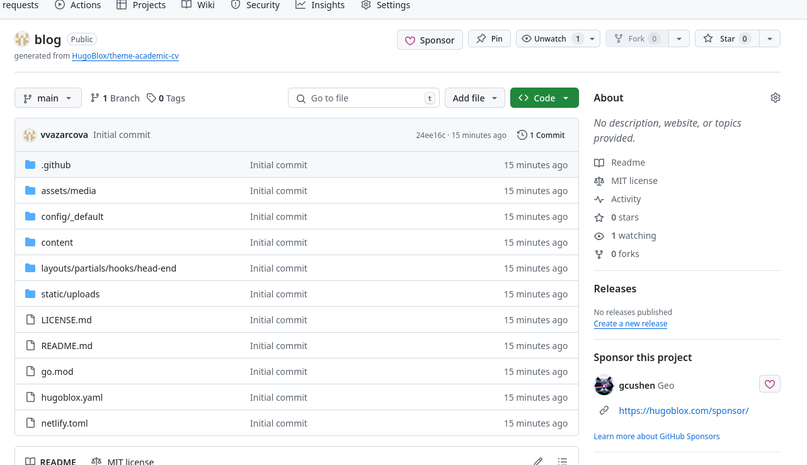{#fig:4 width=70%}

## Выполнение этапа проекта

Копирую репозиторий blog на моё устройство в каталог bin с помощью SSH ключа.

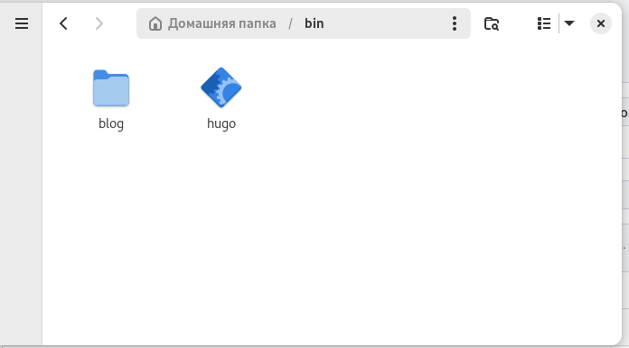{#fig:5 width=70%}

## Выполнение этапа проекта

Устанавливаю Hugo с помощью команды dnf install.

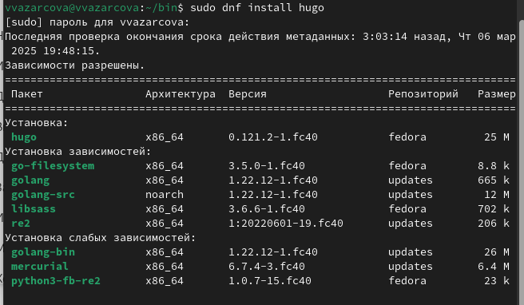{#fig:6 width=70%}

## Выполнение этапа проекта

Запускаю установщик, скачанный в первом шаге.

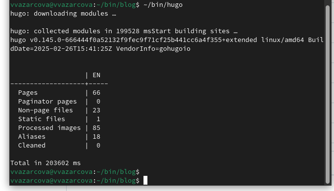{#fig:7 width=70%}

## Выполнение этапа проекта

Перехожу в каталог репозитория blog и удаляю каталог public.

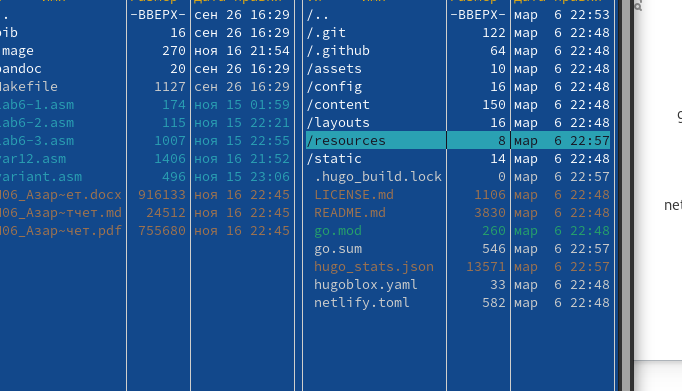{#fig:8 width=70%}

## Выполнение этапа проекта

Создаю новый пустой репозиторий github.io.

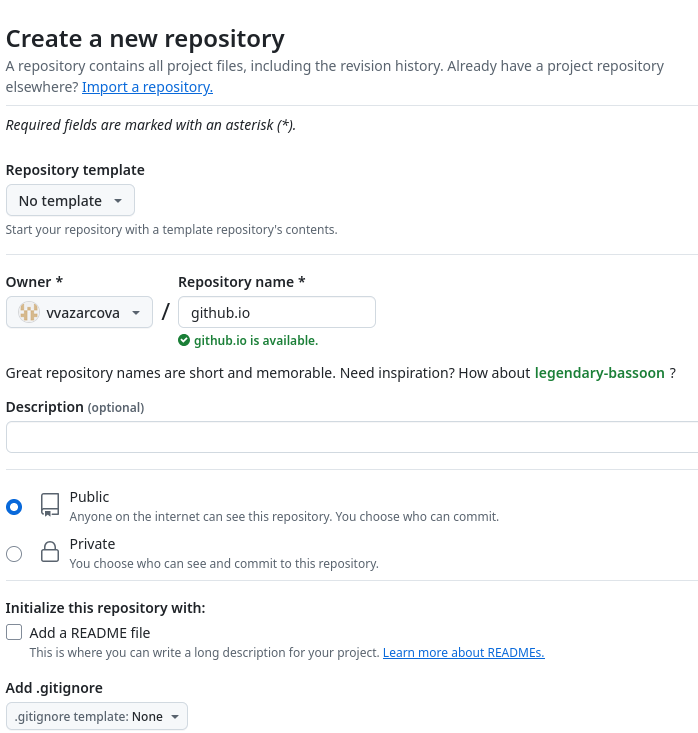{#fig:9 width=70%}

## Выполнение этапа проекта

Клонирую его в домашний каталог.

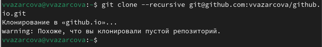{#fig:10 width=70%}

## Выполнение этапа проекта

Перехожу в новый каталог github.io и переключаюсь на ветку main.

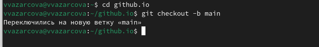{#fig:11 width=70%}

## Выполнение этапа проекта

В том же каталоге, создаю файл README.md, добавляю его в коммит и отправляю на сервер.

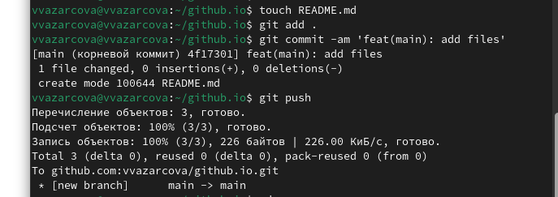{#fig:12 width=70%}

## Выполнение этапа проекта

Перехожу в каталог blog, и добавляю github.io как субмодуль к репозиторию blog.

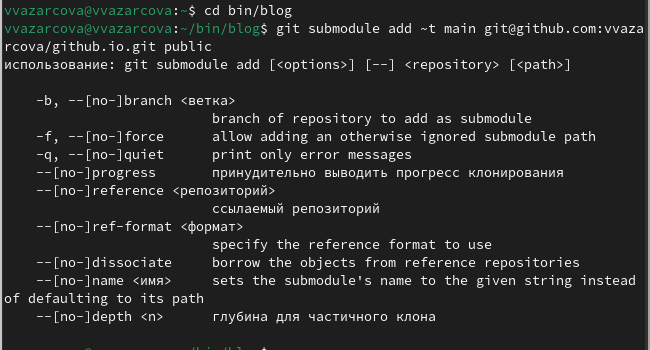{#fig:13 width=70%}

## Выполнение этапа проекта

Снова запускаю установщик и скачиваю сайт.

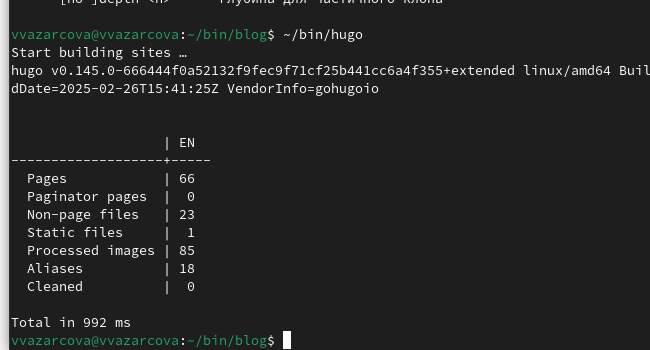{#fig:14 width=70%}

## Выполнение этапа проекта

Перехожу в созданный заново каталог public и добавляю его и его содержимое в коммит.

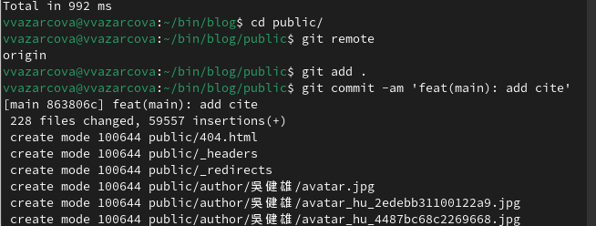{#fig:15 width=70%}

## Выполнение этапа проекта

Отправляю файлы на сервер.

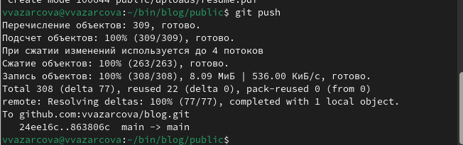{#fig:16 width=70%}

# Выводы

Мне удалось:

- научиться размещать сайт на Github с помощью шаблона Hugo Academic
- скачать нужные для этого файлы в свой репозиторий

## Итоговый слайд

Если вам понравилось - посмотрите остальные мои презентации!

