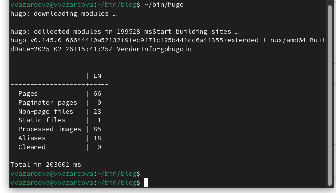

---
## Front matter
title: "Индивидуальный проект, этап 1"
subtitle: "Дисциплина - Операционные Системы"
author: "Азарцова Вероника Валерьевна"

## Generic otions
lang: ru-RU
toc-title: "Содержание"

## Bibliography
bibliography: bib/cite.bib
csl: pandoc/csl/gost-r-7-0-5-2008-numeric.csl

## Pdf output format
toc: true # Table of contents
toc-depth: 2
lof: true # List of figures
lot: true # List of tables
fontsize: 12pt
linestretch: 1.5
papersize: a4
documentclass: scrreprt
## I18n polyglossia
polyglossia-lang:
  name: russian
  options:
	- spelling=modern
	- babelshorthands=true
polyglossia-otherlangs:
  name: english
## I18n babel
babel-lang: russian
babel-otherlangs: english
## Fonts
mainfont: IBM Plex Serif
romanfont: IBM Plex Serif
sansfont: IBM Plex Sans
monofont: IBM Plex Mono
mathfont: STIX Two Math
mainfontoptions: Ligatures=Common,Ligatures=TeX,Scale=0.94
romanfontoptions: Ligatures=Common,Ligatures=TeX,Scale=0.94
sansfontoptions: Ligatures=Common,Ligatures=TeX,Scale=MatchLowercase,Scale=0.94
monofontoptions: Scale=MatchLowercase,Scale=0.94,FakeStretch=0.9
mathfontoptions:
## Biblatex
biblatex: true
biblio-style: "gost-numeric"
biblatexoptions:
  - parentracker=true
  - backend=biber
  - hyperref=auto
  - language=auto
  - autolang=other*
  - citestyle=gost-numeric
## Pandoc-crossref LaTeX customization
figureTitle: "Рис."
tableTitle: "Таблица"
listingTitle: "Листинг"
lofTitle: "Список иллюстраций"
lotTitle: "Список таблиц"
lolTitle: "Листинги"
## Misc options
indent: true
header-includes:
  - \usepackage{indentfirst}
  - \usepackage{float} # keep figures where there are in the text
  - \floatplacement{figure}{H} # keep figures where there are in the text
---

# Цель этапа проекта

Научиться размещать заготовку сайта на Github pages.

# Задание

1. Установить необходимое программное обеспечение.
2. Скачать шаблон темы сайта.
3. Разместить его на хостинге git.
3. Установить параметр для URLs сайта.
5. Разместить заготовку сайта на Github pages.

# Теоретическое введение
Hugo Blox Builder — это фреймворк без кода для создания любого типа веб-сайта с использованием виджетов.  
Он позволяет писать контент, используя стандартизированный Markdown вместе с пакетными расширениями для математики и диаграмм, и редактируйте в CMS с открытым исходным кодом или через редактор, такой как онлайн-редактор GitHub, Jupyter Notebook или RStudio.  

# Выполнение первого этапа проекта

Скачиваю последнюю версию установщика Hugo для Linux с официального репозитория (рис. [-@fig:1]).

{#fig:1 width=70%}

Распаковываю файл, создаю папку bin и переношу туда исполняемый файл (рис. [-@fig:2]).

{#fig:2 width=70%}

Перехожу на официальный репозиторий шаблона Hugo Academic CV (рис. [-@fig:3]).

{#fig:3 width=70%}

Создаю новый репозиторий на основе данного шаблона и называю его blog (рис. [-@fig:4]).

{#fig:4 width=70%}

Копирую репозиторий blog на моё устройство в каталог bin с помощью SSH ключа (рис. [-@fig:5]).

{#fig:5 width=70%}

Устанавливаю Hugo с помощью команды dnf install (рис. [-@fig:6]).

{#fig:6 width=70%}

Запускаю установщик, скачанный в первом шаге (рис. [-@fig:7]).

{#fig:7 width=70%}

Перехожу в каталог репозитория blog и удаляю каталог public (рис. [-@fig:8]).

{#fig:8 width=70%}

Создаю новый пустой репозиторий github.io (рис. [-@fig:9]).

{#fig:9 width=70%}

Клонирую его в домашний каталог (рис. [-@fig:10]).

{#fig:10 width=70%}

Перехожу в новый каталог github.io и переключаюсь на ветку main (рис. [-@fig:11]).

{#fig:11 width=70%}

В том же каталоге, создаю файл README.md, добавляю его в коммит и отправляю на сервер (рис. [-@fig:12]).

{#fig:12 width=70%}

Перехожу в каталог blog, и добавляю github.io как субмодуль к репозиторию blog (рис. [-@fig:13]).

{#fig:13 width=70%}

Снова запускаю установщик и скачиваю сайт (рис. [-@fig:14]).

{#fig:14 width=70%}

Перехожу в созданный заново каталог public и добавляю его и его содержимое в коммит (рис. [-@fig:15]).

{#fig:15 width=70%}

Отправляю файлы на сервер (рис. [-@fig:16]).

{#fig:16 width=70%}

# Выводы

Подводя итоги проведенной проектной работе, я научилась размещать сайт на Github с помощью шаблона Hugo Academic и скачала нужные для этого файлы в свой репозиторий.

# Список литературы{.unnumbered}

::: {#refs}
:::

https://www.google.com/url?sa=t&rct=j&q=&esrc=s&source=web&cd=&ved=2ahUKEwiSk4Cdr_aLAxVsGRAIHRSeAXMQFnoECCEQAQ&url=https%3A%2F%2Fdocs.hugoblox.com%2F&usg=AOvVaw3yvHR4SColVprZovAc4CHP&opi=89978449 (Документация Hugo Blox)
