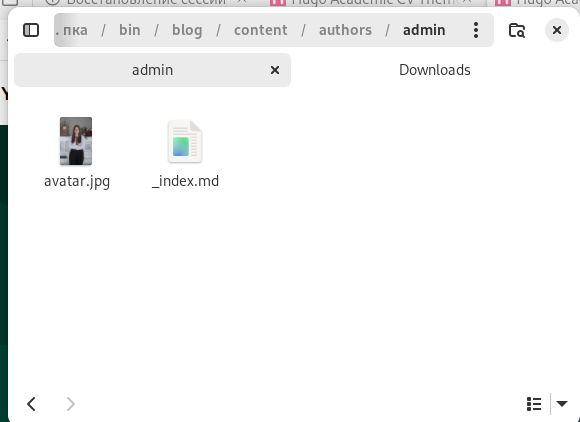
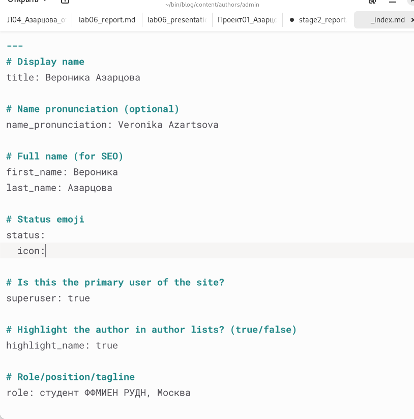
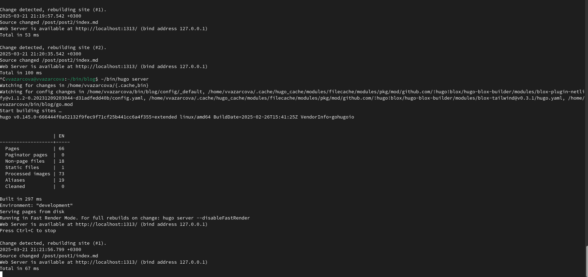
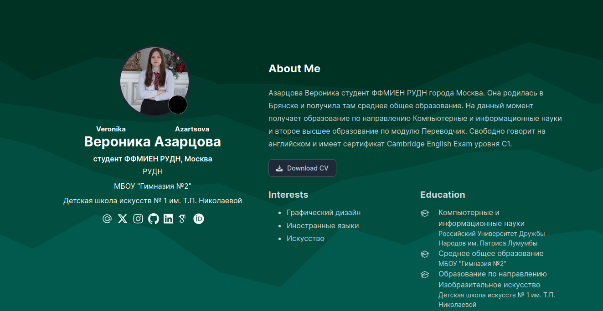
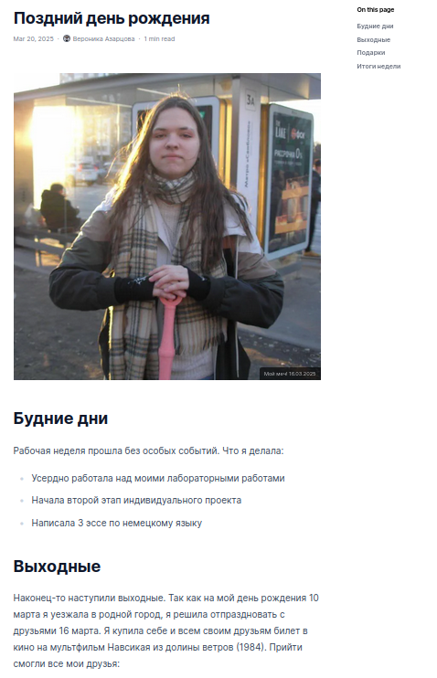
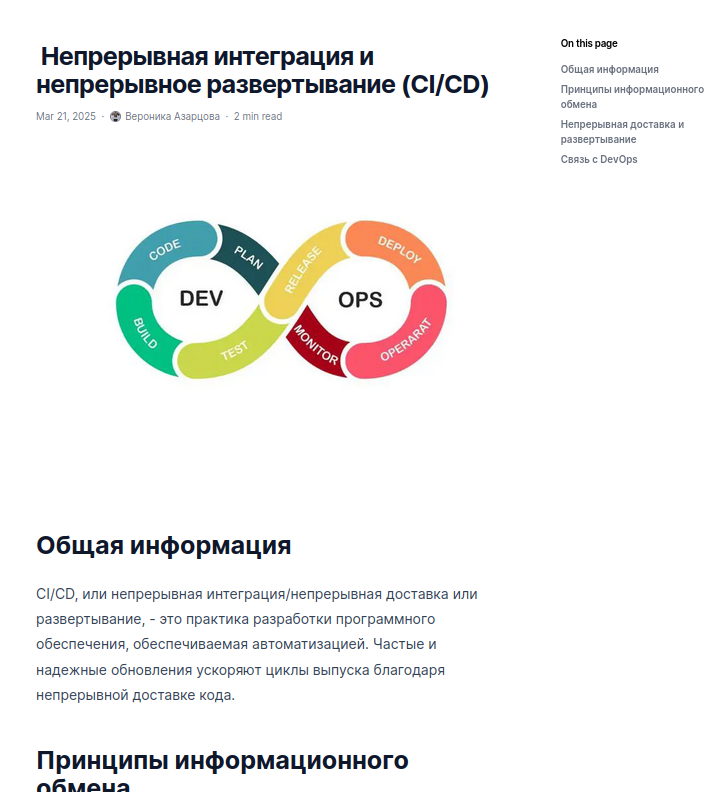

---
## Front matter
lang: ru-RU
title: Индивидуальный проект, 2 этап
subtitle: Дисциплина - Операционные Системы
author:
  - Азарцова В. В.
institute:
  - Российский университет дружбы народов, Москва, Россия
  - Преподаватель Кулябов Д. С.
date: 21 марта 2025

## i18n babel
babel-lang: russian
babel-otherlangs: english

## Formatting pdf
toc: false
toc-title: Содержание
slide_level: 2
aspectratio: 169
section-titles: true
theme: metropolis
header-includes:
 - \metroset{progressbar=frametitle,sectionpage=progressbar,numbering=fraction}
---

# Информация

## Докладчик

:::::::::::::: {.columns align=center}
::: {.column width="70%"}

  * Азарцова Вероника Валерьевна
  * НКАбд-01-24, студ. билет №1132246751
  * Российский университет дружбы народов
  * [1132246751@pfur.ru](mailto:1132246751@pfur.ru)
  * <https://github.com/vvazarcova>

:::
::::::::::::::

## Цели работы

Целью данной лабораторной работы было добавить к ранее созданному сайту данные о себе.

## Задачи

Задачи лабораторной работы: 

1. Разместить фотографию владельца сайта.
2. Разместить краткое описание владельца сайта (Biography).
3. Добавить информацию об интересах (Interests).
4. Добавить информацию об образовании (Education).
5. Сделать пост по прошедшей неделе.
6. Добавить пост на тему по выбору:
  - Управление версиями. Git.
  - Непрерывная интеграция и непрерывное развертывание (CI/CD).

## Теоретическое введение

Hugo Blox Builder — это фреймворк без кода для создания любого типа веб-сайта с использованием виджетов.  
Он позволяет писать контент, используя стандартизированный Markdown вместе с пакетными расширениями для математики и диаграмм, и редактируйте в CMS с открытым исходным кодом или через редактор, такой как онлайн-редактор GitHub, Jupyter Notebook или RStudio.  

# Выполнение лабораторной работы

Размещаю фотографию владельца сайта, перенеся файл моего фото в каталог blog/content/authors/admin и переименовав её в avatar.jpg.

{#fig:1 width=70%}

## Выполнение лабораторной работы

Начинаю редактировать файл _index.md в той же папке чтобы разместить краткое описание владельца сайта, информацию об интересах и информацию об образовании.

{#fig:2 width=70%}

## Выполнение лабораторной работы

Запускаю сайт через терминал.

{#fig:3 width=70%}

## Выполнение лабораторной работы

Проверяю изменения на сайте, всё выглядит правильно.

{#fig:4 width=70%}

## Выполнение лабораторной работы

Перехожу в каталог blog/content/posts, копирую пост-пример и редактирую его, чтобы создать первый пост на тему Моя неделя. Запускаю сайт и смотрю изменения.

{#fig:5 width=70%}

## Выполнение лабораторной работы

Аналогично создаю второй пост на тему по выбору, выбираю тему Непрерывная интеграция и непрерывное развертывание (CI/CD). Запускаю сайт и смотрю изменения.

{#fig:6 width=70%}

## Выполнение лабораторной работы

Загружаю все файлы в репозиторий на сервере и заканчиваю работу с веткой develop, обьединяя её с master.

# Выводы

Мне удалось: 

- разместить фотографию владельца сайта
- разместить краткое описание
- разместить информацию об интересах
- разместить информацию об образовании
- создать мои первые два поста для сайта

## Итоговый слайд

Если вам понравилось - посмотрите остальные мои презентации!

