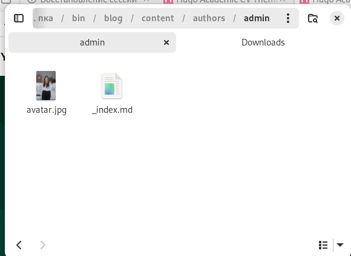
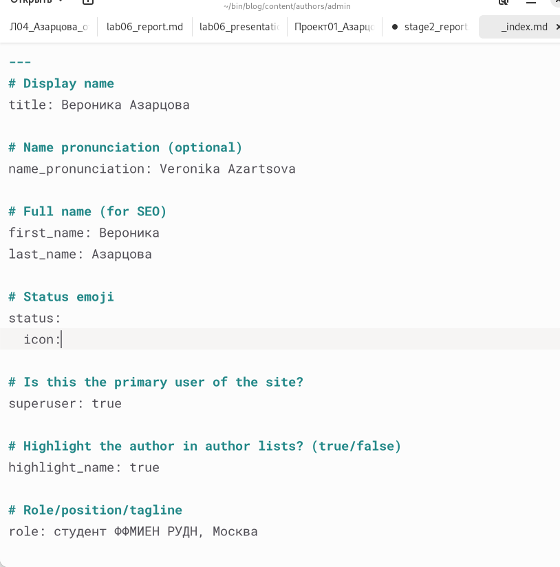
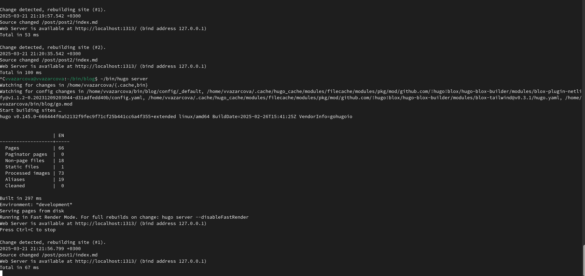
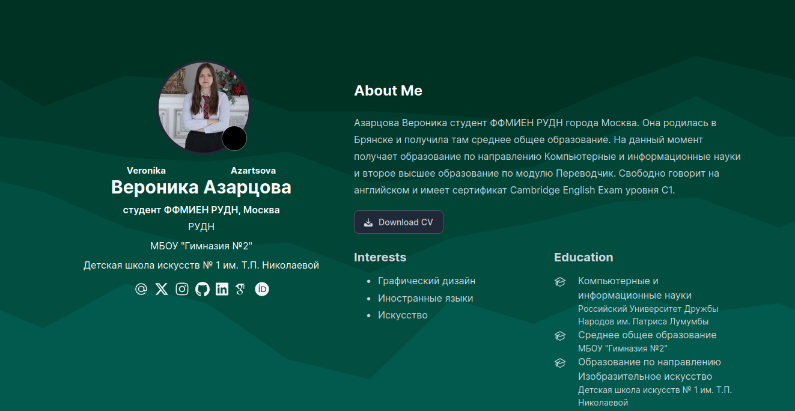
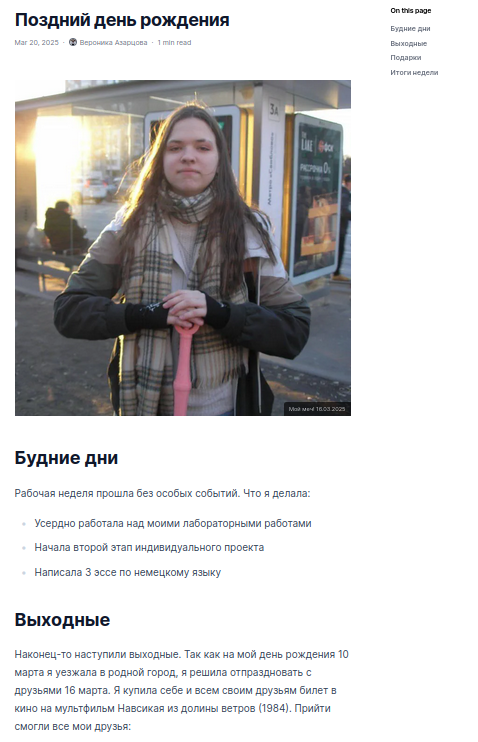
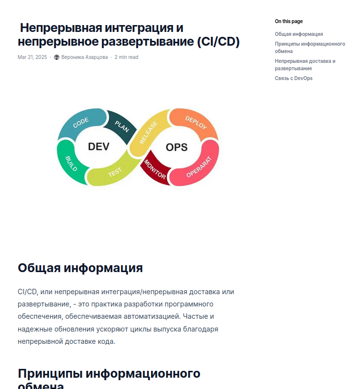

---
## Front matter
title: "Индивидуальный проект, этап 2"
subtitle: "Дисциплина - Операционные Системы"
author: "Азарцова Вероника Валерьевна"

## Generic otions
lang: ru-RU
toc-title: "Содержание"

## Bibliography
bibliography: bib/cite.bib
csl: pandoc/csl/gost-r-7-0-5-2008-numeric.csl

## Pdf output format
toc: true # Table of contents
toc-depth: 2
lof: true # List of figures
lot: true # List of tables
fontsize: 12pt
linestretch: 1.5
papersize: a4
documentclass: scrreprt
## I18n polyglossia
polyglossia-lang:
  name: russian
  options:
	- spelling=modern
	- babelshorthands=true
polyglossia-otherlangs:
  name: english
## I18n babel
babel-lang: russian
babel-otherlangs: english
## Fonts
mainfont: IBM Plex Serif
romanfont: IBM Plex Serif
sansfont: IBM Plex Sans
monofont: IBM Plex Mono
mathfont: STIX Two Math
mainfontoptions: Ligatures=Common,Ligatures=TeX,Scale=0.94
romanfontoptions: Ligatures=Common,Ligatures=TeX,Scale=0.94
sansfontoptions: Ligatures=Common,Ligatures=TeX,Scale=MatchLowercase,Scale=0.94
monofontoptions: Scale=MatchLowercase,Scale=0.94,FakeStretch=0.9
mathfontoptions:
## Biblatex
biblatex: true
biblio-style: "gost-numeric"
biblatexoptions:
  - parentracker=true
  - backend=biber
  - hyperref=auto
  - language=auto
  - autolang=other*
  - citestyle=gost-numeric
## Pandoc-crossref LaTeX customization
figureTitle: "Рис."
tableTitle: "Таблица"
listingTitle: "Листинг"
lofTitle: "Список иллюстраций"
lotTitle: "Список таблиц"
lolTitle: "Листинги"
## Misc options
indent: true
header-includes:
  - \usepackage{indentfirst}
  - \usepackage{float} # keep figures where there are in the text
  - \floatplacement{figure}{H} # keep figures where there are in the text
---

# Цель работы

Цель данной лабораторной работы - добавить к ранее созданному сайту данные о себе.

# Задание

1. Разместить фотографию владельца сайта.
2. Разместить краткое описание владельца сайта (Biography).
3. Добавить информацию об интересах (Interests).
4. Добавить информацию об образовании (Education).
5. Сделать пост по прошедшей неделе.
6. Добавить пост на тему по выбору:
  - Управление версиями. Git.
  - Непрерывная интеграция и непрерывное развертывание (CI/CD).

# Теоретическое введение

Hugo Blox Builder — это фреймворк без кода для создания любого типа веб-сайта с использованием виджетов.  
Он позволяет писать контент, используя стандартизированный Markdown вместе с пакетными расширениями для математики и диаграмм, и редактируйте в CMS с открытым исходным кодом или через редактор, такой как онлайн-редактор GitHub, Jupyter Notebook или RStudio.  

# Выполнение лабораторной работы

Размещаю фотографию владельца сайта, перенеся файл моего фото в каталог blog/content/authors/admin и переименовав её в avatar.jpg (рис. [-@fig:1]).

{#fig:1 width=70%}

Начинаю редактировать файл _index.md в той же папке чтобы разместить краткое описание владельца сайта, информацию об интересах и информацию об образовании (рис. [-@fig:2]).

{#fig:2 width=70%}

Запускаю сайт через терминал (рис. [-@fig:3]).

{#fig:3 width=70%}

Проверяю изменения на сайте, всё выглядит правильно (рис. [-@fig:4]).

{#fig:4 width=70%}

Перехожу в каталог blog/content/posts, копирую пост-пример и редактирую его, чтобы создать первый пост на тему Моя неделя. Запускаю сайт и смотрю изменения (рис. [-@fig:5]).

{#fig:5 width=70%}

Аналогично создаю второй пост на тему по выбору, выбираю тему Непрерывная интеграция и непрерывное развертывание (CI/CD). Запускаю сайт и смотрю изменения (рис. [-@fig:6]).

{#fig:6 width=70%}

Загружаю все файлы в репозиторий на сервере и заканчиваю работу с веткой develop, обьединяя её с master.

# Выводы

Подводя итоги проведенной работе, я разместила фотографию владельца сайта, краткое описание, информацию об интересах и информацию об образовании. Так же, мне удалось создать мои первые два поста для сайта.

# Список литературы{.unnumbered}

::: {#refs}
:::

https://www.google.com/url?sa=t&rct=j&q=&esrc=s&source=web&cd=&ved=2ahUKEwiSk4Cdr_aLAxVsGRAIHRSeAXMQFnoECCEQAQ&url=https%3A%2F%2Fdocs.hugoblox.com%2F&usg=AOvVaw3yvHR4SColVprZovAc4CHP&opi=89978449 (Документация Hugo Blox)
