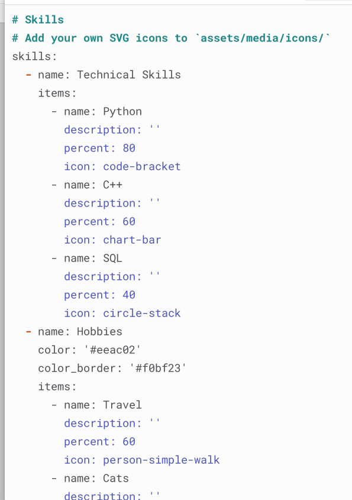
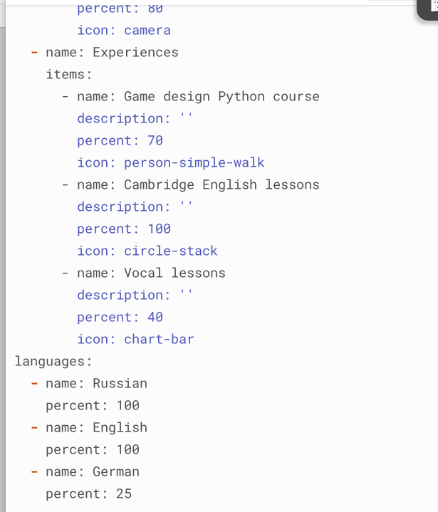
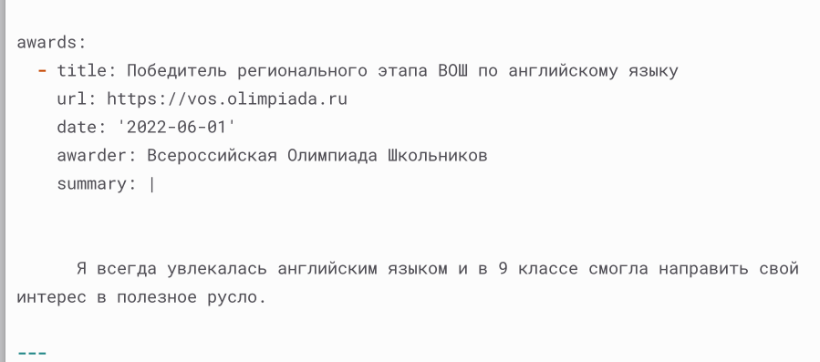
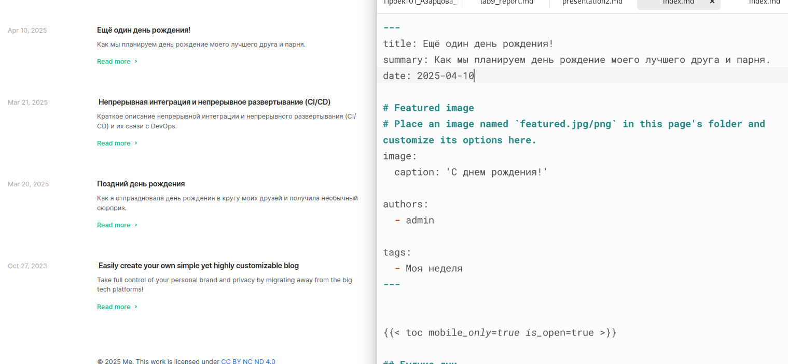
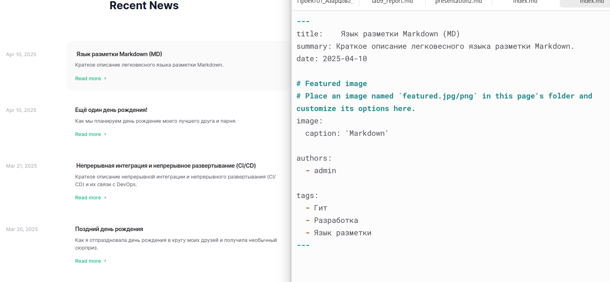

---
## Front matter
lang: ru-RU
title: Индивидуальный проект, этап 3
subtitle: Дисциплина - Операционные Системы
author:
  - Азарцова В. В.
institute:
  - Российский университет дружбы народов, Москва, Россия
  - Преподаватель Кулябов Д. С.
date: 15 марта 2025

## i18n babel
babel-lang: russian
babel-otherlangs: english

## Formatting pdf
toc: false
toc-title: Содержание
slide_level: 2
aspectratio: 169
section-titles: true
theme: metropolis
header-includes:
 - \metroset{progressbar=frametitle,sectionpage=progressbar,numbering=fraction}
---

# Информация

## Докладчик

:::::::::::::: {.columns align=center}
::: {.column width="70%"}

  * Азарцова Вероника Валерьевна
  * НКАбд-01-24, студ. билет №1132246751
  * Российский университет дружбы народов
  * [1132246751@pfur.ru](mailto:1132246751@pfur.ru)
  * <https://github.com/vvazarcova>

:::
::::::::::::::

## Цель этапа проекта

Продолжить работы с личным сайтом на Github pages.

## Задание

1. Список достижений:
   - Добавить информацию о навыках (Skills).
   - Добавить информацию об опыте (Experience).
   - Добавить информацию о достижениях (Accomplishments).

2. Сделать посты:
   - Сделать пост по прошедшей неделе
   - Добавить пост на тему по выбору: Легковесные языки разметки; Языки разметки. LaTeX; Язык разметки Markdown.

## Теоретическое введение

Hugo Blox Builder — это фреймворк без кода для создания любого типа веб-сайта с использованием виджетов.  
Он позволяет писать контент, используя стандартизированный Markdown вместе с пакетными расширениями для математики и диаграмм, и редактируйте в CMS с открытым исходным кодом или через редактор, такой как онлайн-редактор GitHub, Jupyter Notebook или RStudio.  

# Выполнение третьего этапа проекта

1. Добавляю информацию о моих навыках, опытах и достижениях в информацию об авторе.

## Выполнение третьего этапа проекта

{#fig:1 width=70%}

## Выполнение третьего этапа проекта

{#fig:2 width=70%}

## Выполнение третьего этапа проекта

{#fig:3 width=70%}

## Выполнение третьего этапа проекта

2. Пишу пост о моей прошедшей неделе.

{#fig:4 width=70%}

## Выполнение третьего этапа проекта

3. Пишу пост о легковесном языке разметки Markdown.

{#fig:5 width=70%}

# Выводы

Подводя итоги проведенной проектной работе, я разместила на свой сайт информацию о моих навыках, опытах и достижениях, и два поста: о моей неделе, и о языке разметки Markdown, тем самым закрепив мои навыки работы с Hugo.

## Итоговый слайд

Если вам понравилось - посмотрите остальные мои презентации!

