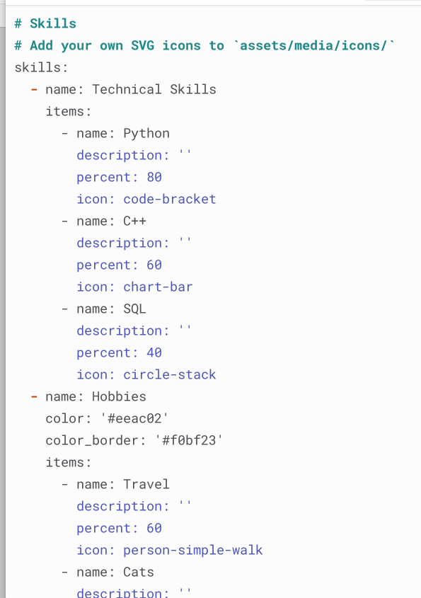
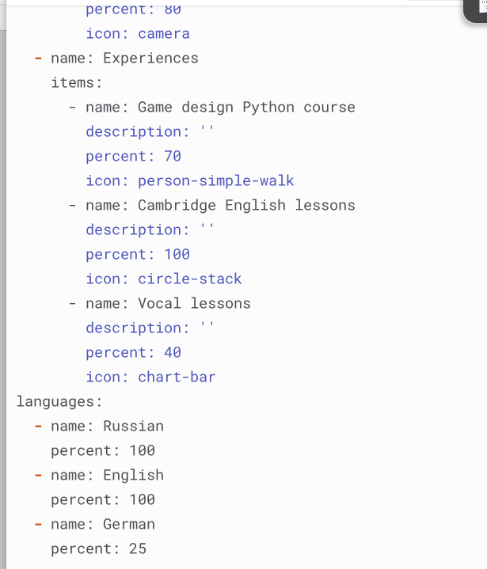
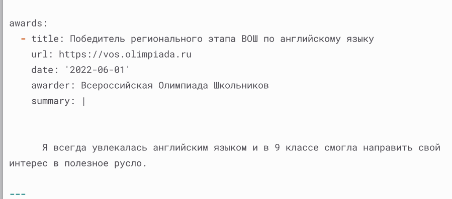
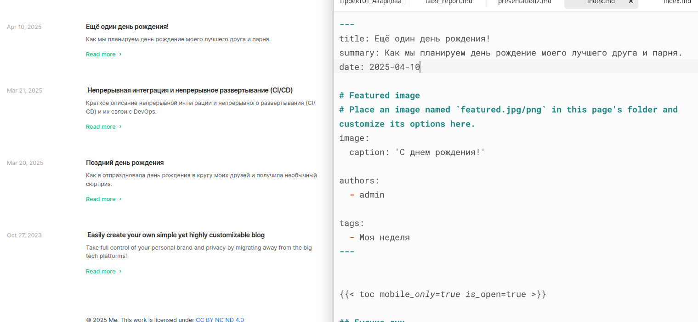
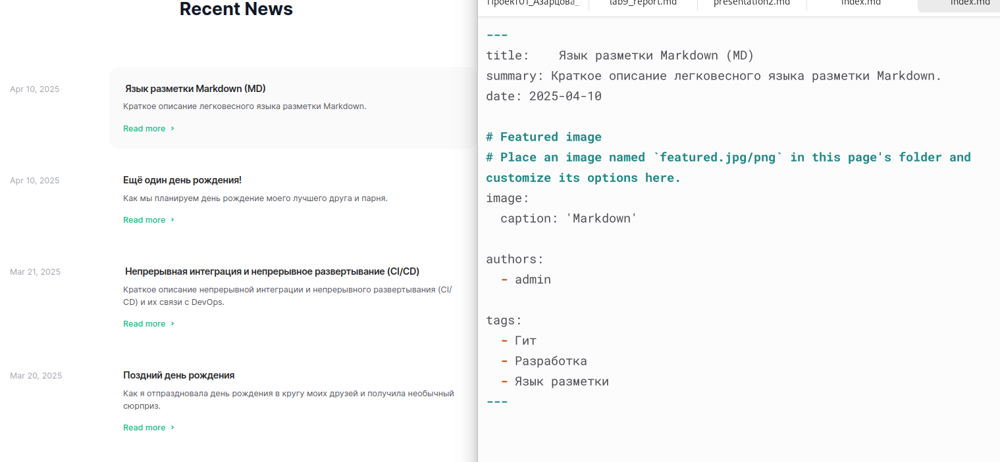

---
## Front matter
title: "Индивидуальный проект, этап 3"
subtitle: "Дисциплина - Операционные Системы"
author: "Азарцова Вероника Валерьевна"

## Generic otions
lang: ru-RU
toc-title: "Содержание"

## Bibliography
bibliography: bib/cite.bib
csl: pandoc/csl/gost-r-7-0-5-2008-numeric.csl

## Pdf output format
toc: true # Table of contents
toc-depth: 2
lof: true # List of figures
lot: true # List of tables
fontsize: 12pt
linestretch: 1.5
papersize: a4
documentclass: scrreprt
## I18n polyglossia
polyglossia-lang:
  name: russian
  options:
	- spelling=modern
	- babelshorthands=true
polyglossia-otherlangs:
  name: english
## I18n babel
babel-lang: russian
babel-otherlangs: english
## Fonts
mainfont: IBM Plex Serif
romanfont: IBM Plex Serif
sansfont: IBM Plex Sans
monofont: IBM Plex Mono
mathfont: STIX Two Math
mainfontoptions: Ligatures=Common,Ligatures=TeX,Scale=0.94
romanfontoptions: Ligatures=Common,Ligatures=TeX,Scale=0.94
sansfontoptions: Ligatures=Common,Ligatures=TeX,Scale=MatchLowercase,Scale=0.94
monofontoptions: Scale=MatchLowercase,Scale=0.94,FakeStretch=0.9
mathfontoptions:
## Biblatex
biblatex: true
biblio-style: "gost-numeric"
biblatexoptions:
  - parentracker=true
  - backend=biber
  - hyperref=auto
  - language=auto
  - autolang=other*
  - citestyle=gost-numeric
## Pandoc-crossref LaTeX customization
figureTitle: "Рис."
tableTitle: "Таблица"
listingTitle: "Листинг"
lofTitle: "Список иллюстраций"
lotTitle: "Список таблиц"
lolTitle: "Листинги"
## Misc options
indent: true
header-includes:
  - \usepackage{indentfirst}
  - \usepackage{float} # keep figures where there are in the text
  - \floatplacement{figure}{H} # keep figures where there are in the text
---

# Цель этапа проекта

Продолжить работы с личным сайтом на Github pages.

# Задание

1. Список достижений:
   - Добавить информацию о навыках (Skills).
   - Добавить информацию об опыте (Experience).
   - Добавить информацию о достижениях (Accomplishments).

2. Сделать посты:
   - Сделать пост по прошедшей неделе
   - Добавить пост на тему по выбору: Легковесные языки разметки; Языки разметки. LaTeX; Язык разметки Markdown.

# Теоретическое введение

Hugo Blox Builder — это фреймворк без кода для создания любого типа веб-сайта с использованием виджетов.  
Он позволяет писать контент, используя стандартизированный Markdown вместе с пакетными расширениями для математики и диаграмм, и редактируйте в CMS с открытым исходным кодом или через редактор, такой как онлайн-редактор GitHub, Jupyter Notebook или RStudio.  

# Выполнение первого этапа проекта

1. Добавляю информацию о моих навыках, опытах и достижениях в информацию об авторе (рис. [-@fig:1], рис. [-@fig:2], рис. [-@fig:3]).

{#fig:1 width=70%}

{#fig:2 width=70%}

{#fig:3 width=70%}

2. Пишу пост о моей прошедшей неделе (рис. [-@fig:4]).

{#fig:4 width=70%}

3. Пишу пост о легковесном языке разметки Markdown (рис. [-@fig:5]).

{#fig:5 width=70%}

# Выводы

Подводя итоги проведенной проектной работе, я разместила на свой сайт информацию о моих навыках, опытах и достижениях, и два поста: о моей неделе, и о языке разметки Markdown, тем самым закрепив мои навыки работы с Hugo.

# Список литературы{.unnumbered}

::: {#refs}
:::
