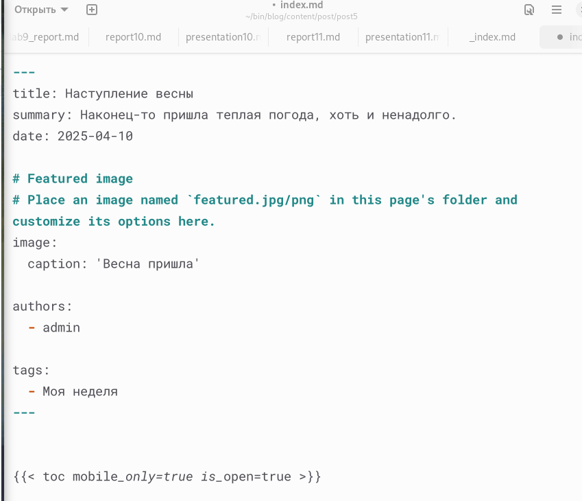

---
## Front matter
lang: ru-RU
title: Индивидуальный проект, этап 4
subtitle: Дисциплина - Операционные Системы
author:
  - Азарцова В. В.
institute:
  - Российский университет дружбы народов, Москва, Россия
  - Преподаватель Кулябов Д. С.
date: 2 мая 2025

## i18n babel
babel-lang: russian
babel-otherlangs: english

## Formatting pdf
toc: false
toc-title: Содержание
slide_level: 2
aspectratio: 169
section-titles: true
theme: metropolis
header-includes:
 - \metroset{progressbar=frametitle,sectionpage=progressbar,numbering=fraction}
---

# Информация

## Докладчик

:::::::::::::: {.columns align=center}
::: {.column width="70%"}

  * Азарцова Вероника Валерьевна
  * НКАбд-01-24, студ. билет №1132246751
  * Российский университет дружбы народов
  * [1132246751@pfur.ru](mailto:1132246751@pfur.ru)
  * <https://github.com/vvazarcova>

:::
::::::::::::::

## Цели работы

Целью данной лабораторной работы было продолжить работу с личным сайтом на Github pages.

## Задачи

1. Добавить ссылки на сайты.

2. Сделать посты:
   - Сделать пост по прошедшей неделе
   - Добавить пост на тему по выбору: Оформление отчёта; Создание презентаций; Работа с библиографией.

## Теоретическое введение

Hugo Blox Builder — это фреймворк без кода для создания любого типа веб-сайта с использованием виджетов.  
Он позволяет писать контент, используя стандартизированный Markdown вместе с пакетными расширениями для математики и диаграмм, и редактируйте в CMS с открытым исходным кодом или через редактор, такой как онлайн-редактор GitHub, Jupyter Notebook или RStudio.  

# Выполнение лабораторной работы

1. Добавляю ссылки на сайты.

- eLibrary : https://elibrary.ru/;

- Google Scholar : https://scholar.google.com/;

- ORCID : https://orcid.org/;

- Mendeley : https://www.mendeley.com/;

- ResearchGate : https://www.researchgate.net/;

- Academia.edu : https://www.academia.edu/;

- arXiv : https://arxiv.org/;

- github : https://github.com/.

## Выполнение лабораторной работы

{#fig:1 width=70%}

## Выполнение лабораторной работы

{#fig:2 width=70%}

## Выполнение лабораторной работы

2. Создаю пост о прошедшей неделе.

{#fig:3 width=70%}

## Выполнение лабораторной работы

{#fig:4 width=70%}

## Выполнение лабораторной работы

3. Создаю пост о создании презентаций.

{#fig:5 width=70%}

## Выполнение лабораторной работы

{#fig:6 width=70%}

# Выводы

Мне удалось: 

- Дополнить мой сайт ссылками 

- Создать два поста: о моей неделе, и о языке создании презентаций, тем самым закрепив мои навыки работы с Hugo.

## Итоговый слайд

Если вам понравилось - посмотрите остальные мои презентации!

